# SettleMint Blockchain Transformation Platform on Amazon Web Services (AWS)

## Table of Contents

- [Overview](#overview)
- [Architecture](#architecture)
- [Prerequisites](#prerequisites)
- [AWS Services Mapping](#aws-services-mapping)
- [Installation Guide](#installation-guide)
- [Configuration](#configuration)
- [Monitoring](#monitoring)
- [Security](#security)
- [Troubleshooting](#troubleshooting)
- [Production Considerations](#production-considerations)

## Overview

> **⚠️ IMPORTANT DISCLAIMER**
> 
> This guide is provided for **educational and demonstration purposes only**. For production deployments, official support, and enterprise implementations, please contact the **SettleMint team** directly.
> 
> **Contact SettleMint:**
> - Website: [www.settlemint.com](https://www.settlemint.com)
> - Email: support@settlemint.com
> - Documentation: [Developer Documentation](https://console.settlemint.com/documentation/)

This guide provides a comprehensive deployment strategy for **SettleMint's Blockchain Transformation Platform (BTP)** on **Amazon Web Services (AWS)**. This implementation leverages AWS's managed services and enterprise-grade infrastructure to provide a robust, scalable blockchain platform deployment.

### Key Capabilities

| Feature | Description | AWS Integration |
|---------|-------------|-----------------|
| **Multi-Blockchain Support** | Deploy Ethereum, Hyperledger Fabric, IPFS networks | EKS-based container orchestration |
| **Visual Development Environment** | Web-based IDE for smart contract development | CloudFront CDN + S3 hosting |
| **Enterprise Integration** | REST APIs and connectors for existing systems | API Gateway + Application Load Balancer |
| **Scalable Infrastructure** | Kubernetes-based with auto-scaling | EKS with Cluster Autoscaler |
| **Comprehensive Monitoring** | Built-in observability stack | CloudWatch + X-Ray integration |
| **Security-First Design** | AWS KMS integration for secrets management | AWS KMS + Secrets Manager |

### AWS Services Architecture

| Component | AWS Service | Benefits |
|-----------|-------------|----------|
| **Kubernetes** | Amazon Elastic Kubernetes Service (EKS) | Managed control plane, auto-scaling |
| **DNS Management** | Amazon Route 53 | Global DNS with health checks |
| **Key Management** | AWS Key Management Service (KMS) | Hardware security modules |
| **Container Registry** | Amazon Elastic Container Registry (ECR) | Vulnerability scanning |
| **Load Balancing** | Application Load Balancer (ALB) | Advanced routing capabilities |
| **Object Storage** | Amazon S3 | 99.999999999% durability |
| **Database** | Amazon RDS for PostgreSQL | Automated backups, Multi-AZ |
| **Cache** | Amazon ElastiCache for Redis | Redis/Memcached compatibility |
| **Secrets Management** | AWS Secrets Manager | Automatic rotation |
| **Monitoring** | Amazon CloudWatch | Integrated metrics and logs |

## Architecture

### High-Level AWS Architecture

```mermaid
graph TD
    USERS[👥 Enterprise Users]
    INTERNET[🌐 Internet]
    REGISTRAR[📝 Domain Registrar]
    
    subgraph AWS["☁️ Amazon Web Services"]
        subgraph GLOBAL["🌍 Global Services"]
            R53[🌐 Route 53<br/>Hosted Zones<br/>Health Checks<br/>DNS Management]
            KMS[🔐 AWS KMS<br/>Customer Keys<br/>HSM Integration<br/>Auto-rotation]
            IAM[👤 IAM + IRSA<br/>Service Accounts<br/>Role-based Access<br/>Policy Management]
            ECR[📦 Amazon ECR<br/>Private Registries<br/>Vulnerability Scanning<br/>Image Lifecycle]
        end
        
        subgraph REGIONAL["📍 Regional Services (us-west-2)"]
            subgraph EKS["☸️ Amazon EKS Cluster"]
                ALB[⚖️ Application LB<br/>SSL Termination<br/>WAF Integration<br/>Path Routing]
                NGINX[🔀 NGINX Ingress<br/>Advanced Routing<br/>Rate Limiting<br/>SSL Passthrough]
                
                subgraph DEPS["📦 cluster-dependencies"]
                    RDS[(🗄️ Amazon RDS<br/>PostgreSQL<br/>Multi-AZ HA<br/>Automated Backups)]
                    ELASTICACHE[(⚡ ElastiCache<br/>Redis Cluster<br/>Encryption<br/>Failover)]
                    S3[(📁 Amazon S3<br/>Object Storage<br/>Versioning<br/>Lifecycle Policies)]
                    VAULT[🔒 HashiCorp Vault<br/>KMS Auto-unseal<br/>Secrets Management<br/>Policy Engine]
                    CERTMGR[📜 cert-manager<br/>SSL Certificates<br/>Let's Encrypt<br/>Route 53 DNS01]
                end
                
                subgraph PLATFORM["🚀 settlemint"]
                    WEBAPP[💻 BTP Web UI<br/>React SPA<br/>CloudFront CDN<br/>S3 Static Hosting]
                    API[🔌 BTP API Services<br/>Node.js Backend<br/>Auto Scaling<br/>Health Checks]
                    ENGINE[⚙️ Deployment Engine<br/>Blockchain Orchestration<br/>Spot Instances<br/>GPU Support]
                    CLUSTER[🎛️ Cluster Manager<br/>Infrastructure Control<br/>EKS Integration<br/>Fargate Support]
                    MONITOR[📊 Observability<br/>Grafana & Prometheus<br/>CloudWatch Integration<br/>X-Ray Tracing]
                end
                
                subgraph DEPLOY["🔗 deployments"]
                    ETH[⟠ Ethereum<br/>Networks<br/>EBS Volumes<br/>Instance Store]
                    FABRIC[🔗 Hyperledger Fabric<br/>Private Networks<br/>EFS Storage<br/>Certificate Manager]
                    IPFS[🌐 IPFS Nodes<br/>Distributed Storage<br/>S3 Gateway<br/>CloudFront CDN]
                    CUSTOM[🔧 Custom Apps<br/>Lambda Functions<br/>Step Functions<br/>Event Bridge]
                end
            end
            
            subgraph MANAGED["🛠️ Managed Services"]
                SECRETSMANAGER[🔐 Secrets Manager<br/>Auto Rotation<br/>Lambda Integration<br/>Cross-Region Sync]
                CLOUDWATCH[📊 CloudWatch<br/>Metrics & Logs<br/>Alarms & Dashboards<br/>Insights]
                XRAY[🔍 AWS X-Ray<br/>Distributed Tracing<br/>Service Maps<br/>Performance Analysis]
            end
        end
    end
    
    %% User Flow
    USERS --> INTERNET
    INTERNET --> R53
    R53 --> ALB
    ALB --> NGINX
    REGISTRAR -.-> R53
    
    %% Platform Flow
    NGINX --> WEBAPP
    NGINX --> API
    NGINX --> MONITOR
    
    %% Data Flow
    API --> RDS
    API --> ELASTICACHE
    API --> VAULT
    API --> SECRETSMANAGER
    ENGINE --> S3
    
    %% Security Flow
    VAULT --> KMS
    CERTMGR --> R53
    CERTMGR --> IAM
    VAULT --> IAM
    
    %% Blockchain Flow
    ENGINE --> ETH
    ENGINE --> FABRIC
    ENGINE --> IPFS
    ENGINE --> CUSTOM
    
    %% Monitoring Flow
    MONITOR --> CLOUDWATCH
    MONITOR --> XRAY
    
    %% Styling with AWS Colors
    classDef awsService fill:#FF9900,stroke:#FF6600,stroke-width:3px,color:#fff,font-weight:bold
    classDef k8sService fill:#326ce5,stroke:#1565c0,stroke-width:3px,color:#fff,font-weight:bold
    classDef btpService fill:#ff6b35,stroke:#e55100,stroke-width:3px,color:#fff,font-weight:bold
    classDef external fill:#34a853,stroke:#137333,stroke-width:3px,color:#fff,font-weight:bold
    classDef blockchain fill:#9c27b0,stroke:#7b1fa2,stroke-width:3px,color:#fff,font-weight:bold
    
    class R53,KMS,IAM,ECR,ALB,RDS,ELASTICACHE,S3,SECRETSMANAGER,CLOUDWATCH,XRAY awsService
    class NGINX,VAULT,CERTMGR k8sService
    class WEBAPP,API,ENGINE,CLUSTER,MONITOR btpService
    class USERS,INTERNET,REGISTRAR external
    class ETH,FABRIC,IPFS,CUSTOM blockchain
```



### AWS Multi-Region Disaster Recovery Architecture

```mermaid
graph TD
    subgraph PRIMARY["🏢 Primary Region (us-west-2)"]
        subgraph PROD_EKS["☸️ Production EKS"]
            PROD_ALB[⚖️ Production ALB<br/>Active Traffic<br/>Health Checks]
            PROD_APP[🚀 BTP Application<br/>Active Workloads<br/>Real-time Processing]
        end
        
        subgraph PROD_DATA["🗄️ Production Data"]
            PROD_RDS[🗄️ RDS Primary<br/>Multi-AZ Setup<br/>Continuous Backup<br/>Cross-region Replication]
            PROD_S3[📁 S3 Primary<br/>Cross-region Replication<br/>Versioning Enabled<br/>Lifecycle Policies]
            PROD_REDIS[⚡ ElastiCache Primary<br/>Cluster Mode<br/>Automatic Failover<br/>Backup to S3]
        end
    end
    
    subgraph SECONDARY["🏥 Disaster Recovery Region (us-east-1)"]
        subgraph DR_EKS["☸️ Standby EKS"]
            DR_ALB[⚖️ Standby ALB<br/>Health Check Only<br/>Route 53 Failover]
            DR_APP[🚀 BTP Application<br/>Warm Standby<br/>Automated Deployment]
        end
        
        subgraph DR_DATA["🗄️ Disaster Recovery Data"]
            DR_RDS[🗄️ RDS Read Replica<br/>Cross-region Replica<br/>Promotion Ready<br/>Point-in-time Recovery]
            DR_S3[📁 S3 Replica<br/>Cross-region Sync<br/>Same Bucket Policy<br/>Lifecycle Aligned]
            DR_REDIS[⚡ ElastiCache Standby<br/>Restore from Backup<br/>Configuration Sync<br/>Network Ready]
        end
    end
    
    subgraph MONITORING["📊 Global Monitoring"]
        R53_HEALTH[🌐 Route 53<br/>Health Checks<br/>DNS Failover<br/>Global Traffic Management]
        CLOUDWATCH[📊 CloudWatch<br/>Cross-region Monitoring<br/>Centralized Dashboards<br/>Unified Alerting]
        BACKUP_AUTOMATION[🔄 Backup Automation<br/>Lambda Functions<br/>Scheduled Tasks<br/>Cross-region Sync]
    end
    
    %% Primary region flow
    PROD_ALB --> PROD_APP
    PROD_APP --> PROD_RDS
    PROD_APP --> PROD_S3
    PROD_APP --> PROD_REDIS
    
    %% Cross-region replication
    PROD_RDS -.->|📋 Async Replication| DR_RDS
    PROD_S3 -.->|📁 Cross-region Sync| DR_S3
    PROD_REDIS -.->|💾 Backup Restore| DR_REDIS
    
    %% Disaster recovery flow
    DR_ALB --> DR_APP
    DR_APP --> DR_RDS
    DR_APP --> DR_S3
    DR_APP --> DR_REDIS
    
    %% Monitoring connections
    R53_HEALTH --> PROD_ALB
    R53_HEALTH --> DR_ALB
    CLOUDWATCH --> PROD_EKS
    CLOUDWATCH --> DR_EKS
    BACKUP_AUTOMATION --> PROD_DATA
    BACKUP_AUTOMATION --> DR_DATA
    
    %% Styling
    classDef primary fill:#4caf50,stroke:#2e7d32,stroke-width:3px,color:#fff,font-weight:bold
    classDef secondary fill:#ff9800,stroke:#f57c00,stroke-width:3px,color:#fff,font-weight:bold
    classDef monitoring fill:#2196f3,stroke:#1565c0,stroke-width:3px,color:#fff,font-weight:bold
    classDef data fill:#9c27b0,stroke:#7b1fa2,stroke-width:3px,color:#fff,font-weight:bold
    
    class PROD_ALB,PROD_APP primary
    class DR_ALB,DR_APP secondary
    class R53_HEALTH,CLOUDWATCH,BACKUP_AUTOMATION monitoring
    class PROD_RDS,PROD_S3,PROD_REDIS,DR_RDS,DR_S3,DR_REDIS data
```



### AWS Security and Compliance Architecture

```mermaid
graph TD
    subgraph PERIMETER["🛡️ Security Perimeter"]
        WAF[🛡️ AWS WAF<br/>Web Application Firewall<br/>DDoS Protection<br/>Bot Management]
        SHIELD[🛡️ AWS Shield<br/>DDoS Protection<br/>Advanced Threat Detection<br/>24/7 Response Team]
        CLOUDFRONT[🌐 CloudFront<br/>Global CDN<br/>Edge Security<br/>Geographic Blocking]
    end
    
    subgraph NETWORK["🌐 Network Security"]
        VPC[🏠 Virtual Private Cloud<br/>Isolated Network<br/>Private Subnets<br/>NAT Gateways]
        NACL[🚧 Network ACLs<br/>Subnet-level Firewall<br/>Stateless Rules<br/>Traffic Control]
        SG[🔒 Security Groups<br/>Instance-level Firewall<br/>Stateful Rules<br/>Port Control]
        VPC_ENDPOINTS[🔗 VPC Endpoints<br/>Private Service Access<br/>No Internet Routing<br/>Enhanced Security]
    end
    
    subgraph IDENTITY["👤 Identity & Access"]
        IAM_USERS[👥 IAM Users<br/>Human Access<br/>MFA Required<br/>Temporary Credentials]
        IAM_ROLES[🎭 IAM Roles<br/>Service Access<br/>Cross-account Access<br/>Federated Identity]
        IRSA[🔐 IRSA<br/>Pod-level Identity<br/>No Static Credentials<br/>Automatic Rotation]
        STS[🎫 AWS STS<br/>Temporary Credentials<br/>Token Service<br/>Assume Role]
    end
    
    subgraph DATA_PROTECTION["🔐 Data Protection"]
        KMS[🗝️ AWS KMS<br/>Encryption Keys<br/>Hardware Security<br/>Audit Logging]
        SECRETS[🔒 Secrets Manager<br/>Credential Storage<br/>Automatic Rotation<br/>Fine-grained Access]
        PARAMETER[📋 Parameter Store<br/>Configuration Data<br/>Hierarchical Storage<br/>Change Notifications]
        ENCRYPTION[🔐 Encryption at Rest<br/>EBS Encryption<br/>S3 Encryption<br/>RDS Encryption]
    end
    
    subgraph MONITORING["👁️ Security Monitoring"]
        CLOUDTRAIL[📋 CloudTrail<br/>API Audit Logging<br/>Data Events<br/>Insight Events]
        GUARDDUTY[🔍 GuardDuty<br/>Threat Detection<br/>Machine Learning<br/>Threat Intelligence]
        INSPECTOR[🔎 Inspector<br/>Vulnerability Assessment<br/>Network Reachability<br/>Security Standards]
        CONFIG[⚙️ AWS Config<br/>Configuration Compliance<br/>Change Tracking<br/>Remediation]
    end
    
    %% Security Flow
    WAF --> SHIELD
    SHIELD --> CLOUDFRONT
    CLOUDFRONT --> VPC
    
    %% Network Security
    VPC --> NACL
    NACL --> SG
    SG --> VPC_ENDPOINTS
    
    %% Identity Flow
    IAM_USERS --> STS
    IAM_ROLES --> STS
    STS --> IRSA
    
    %% Data Protection Flow
    KMS --> SECRETS
    SECRETS --> PARAMETER
    PARAMETER --> ENCRYPTION
    
    %% Monitoring Flow
    CLOUDTRAIL --> GUARDDUTY
    GUARDDUTY --> INSPECTOR
    INSPECTOR --> CONFIG
    
    %% Cross-layer Security
    IRSA --> KMS
    VPC_ENDPOINTS --> SECRETS
    CONFIG --> CLOUDTRAIL
    
    %% Styling
    classDef perimeter fill:#ff5722,stroke:#d84315,stroke-width:3px,color:#fff,font-weight:bold
    classDef network fill:#3f51b5,stroke:#283593,stroke-width:3px,color:#fff,font-weight:bold
    classDef identity fill:#4caf50,stroke:#388e3c,stroke-width:3px,color:#fff,font-weight:bold
    classDef protection fill:#9c27b0,stroke:#7b1fa2,stroke-width:3px,color:#fff,font-weight:bold
    classDef monitoring fill:#ff9800,stroke:#f57c00,stroke-width:3px,color:#000,font-weight:bold
    
    class WAF,SHIELD,CLOUDFRONT perimeter
    class VPC,NACL,SG,VPC_ENDPOINTS network
    class IAM_USERS,IAM_ROLES,IRSA,STS identity
    class KMS,SECRETS,PARAMETER,ENCRYPTION protection
    class CLOUDTRAIL,GUARDDUTY,INSPECTOR,CONFIG monitoring
```



### EKS Pod and Container Architecture


## Prerequisites

### Required Tools and Software

| Tool | Version | Purpose | Installation Command |
|------|---------|---------|---------------------|
| **Terraform** | >= 1.0 | Infrastructure provisioning | `brew install terraform` |
| **AWS CLI** | >= 2.0 | AWS authentication and management | `brew install awscli` |
| **kubectl** | >= 1.20 | Kubernetes cluster management | `brew install kubectl` |
| **Helm** | >= 3.0 | Kubernetes package management | `brew install helm` |
| **eksctl** | >= 0.100 | EKS cluster management | `brew install weaveworks/tap/eksctl` |

### Amazon Web Services Requirements

#### 1. AWS Account and Setup

| Requirement | Details | Action Required |
|-------------|---------|-----------------|
| **AWS Account** | Active AWS account with billing enabled | [Create Account](https://aws.amazon.com/free/) |
| **IAM User/Role** | Administrative access for infrastructure deployment | Create via AWS Console or CLI |
| **AWS CLI Configuration** | Configured credentials and default region | `aws configure` |

#### 2. Required AWS Service Enablement

```bash
# Verify AWS CLI configuration
aws sts get-caller-identity

# Check service availability in your region
aws ec2 describe-regions --region-names us-west-2

# Enable required services (most are enabled by default)
aws iam list-account-aliases  # Verify account access
```

#### 3. IAM Permissions Matrix

| Service | Required Permissions | Purpose | Scope |
|---------|---------------------|---------|-------|
| **EKS** | `AmazonEKSClusterPolicy`, `AmazonEKSServicePolicy` | Kubernetes cluster management | Cluster operations |
| **EC2** | `AmazonEC2FullAccess` | Node groups and networking | Infrastructure deployment |
| **Route 53** | `AmazonRoute53FullAccess` | DNS management | Domain and certificate management |
| **KMS** | `AWSKeyManagementServicePowerUser` | Key management for Vault unsealing | Vault auto-unsealing |
| **IAM** | `IAMFullAccess` | Service roles and IRSA setup | Service authentication |
| **RDS** | `AmazonRDSFullAccess` | Database management | PostgreSQL database |
| **ElastiCache** | `AmazonElastiCacheFullAccess` | Redis cache management | Cache operations |
| **S3** | `AmazonS3FullAccess` | Object storage | File and artifact storage |
| **Secrets Manager** | `SecretsManagerReadWrite` | Secrets management | Credential storage |
| **CloudWatch** | `CloudWatchFullAccess` | Monitoring and logging | Observability |

## AWS Services Mapping

### Core Infrastructure Layer

#### Amazon Elastic Kubernetes Service (EKS)

| Configuration | Value | Rationale |
|---------------|-------|-----------|
| **Cluster Type** | Managed | AWS-managed control plane |
| **Node Groups** | Managed Node Groups | Auto-scaling and lifecycle management |
| **Instance Types** | m5.xlarge (4 vCPU, 16GB RAM) | Optimal for BTP workloads |
| **Scaling Range** | 2-50 nodes | High availability with growth capability |
| **Network** | Custom VPC | Enhanced security and isolation |
| **AMI Type** | AL2_x86_64 | Amazon Linux 2 optimized for containers |

**EKS Cluster Configuration**:
```yaml
apiVersion: eksctl.io/v1alpha5
kind: ClusterConfig

metadata:
  name: btp-cluster
  region: us-west-2
  version: "1.28"

iam:
  withOIDC: true
  serviceAccounts:
  - metadata:
      name: cert-manager
      namespace: cluster-dependencies
    wellKnownPolicies:
      route53: true
  - metadata:
      name: vault-unsealer
      namespace: cluster-dependencies
    attachPolicyARNs:
    - arn:aws:iam::aws:policy/AWSKeyManagementServicePowerUser

managedNodeGroups:
- name: btp-nodes
  instanceType: m5.xlarge
  minSize: 2
  maxSize: 50
  desiredCapacity: 3
  volumeSize: 100
  volumeType: gp3
  amiFamily: AmazonLinux2
  iam:
    withAddonPolicies:
      autoScaler: true
      cloudWatch: true
      ebs: true
      efs: true
      albIngress: true
      xRay: true

addons:
- name: vpc-cni
  version: latest
- name: coredns
  version: latest
- name: kube-proxy
  version: latest
- name: aws-ebs-csi-driver
  version: latest
```

#### Amazon Route 53 (DNS Management)

| Component | Purpose | Configuration |
|-----------|---------|---------------|
| **Hosted Zone** | Public DNS zone for platform access | Managed zone with health checks |
| **A Records** | Main domain resolution | Points to ALB DNS name |
| **CNAME Records** | Service subdomains | Aliases to main domain |
| **Health Checks** | Service availability monitoring | HTTP/HTTPS endpoint monitoring |

#### AWS Key Management Service (KMS)

| Feature | Configuration | Security Benefit |
|---------|---------------|------------------|
| **Customer Managed Key** | Symmetric encryption key | Vault auto-unsealing |
| **Key Rotation** | Annual automatic rotation | Enhanced security |
| **Access Control** | IAM-based permissions | Principle of least privilege |
| **Audit Logging** | CloudTrail integration | Compliance and security monitoring |

### Application Data Layer

#### Amazon RDS for PostgreSQL

| Specification | Configuration | Purpose |
|---------------|---------------|---------|
| **Engine Version** | PostgreSQL 15.x | Latest stable with enterprise features |
| **Instance Class** | db.t3.medium | Cost-effective for development |
| **Multi-AZ** | Enabled | High availability |
| **Backup Retention** | 7 days | Data protection |
| **Storage** | gp3 SSD with auto-scaling | Performance and cost optimization |

**RDS Configuration**:
```hcl
resource "aws_db_instance" "btp_postgres" {
  identifier = "btp-postgres"
  
  engine         = "postgres"
  engine_version = "15.4"
  instance_class = "db.t3.medium"
  
  allocated_storage     = 100
  max_allocated_storage = 1000
  storage_type          = "gp3"
  storage_encrypted     = true
  
  multi_az               = true
  publicly_accessible    = false
  backup_retention_period = 7
  backup_window          = "03:00-04:00"
  maintenance_window     = "sun:04:00-sun:05:00"
  
  db_name  = "btp"
  username = "btp_admin"
  password = var.db_password
  
  vpc_security_group_ids = [aws_security_group.rds.id]
  db_subnet_group_name   = aws_db_subnet_group.btp.name
  
  skip_final_snapshot = false
  final_snapshot_identifier = "btp-postgres-final-snapshot"
  
  tags = {
    Name        = "BTP PostgreSQL"
    Environment = "production"
    Application = "settlemint-btp"
  }
}
```

#### Amazon ElastiCache for Redis

| Feature | Configuration | Use Case |
|---------|---------------|----------|
| **Engine** | Redis 7.0 | Latest with enhanced features |
| **Node Type** | cache.t3.medium | Balanced performance and cost |
| **Replication** | Multi-AZ with failover | High availability |
| **Encryption** | In-transit and at-rest | Data protection |

**ElastiCache Configuration**:
```hcl
resource "aws_elasticache_replication_group" "btp_redis" {
  replication_group_id       = "btp-redis"
  description                = "Redis cluster for BTP platform"
  
  engine               = "redis"
  engine_version       = "7.0"
  node_type            = "cache.t3.medium"
  port                 = 6379
  parameter_group_name = "default.redis7"
  
  num_cache_clusters = 2
  
  subnet_group_name  = aws_elasticache_subnet_group.btp.name
  security_group_ids = [aws_security_group.redis.id]
  
  at_rest_encryption_enabled = true
  transit_encryption_enabled = true
  auth_token                 = var.redis_auth_token
  
  automatic_failover_enabled = true
  multi_az_enabled          = true
  
  maintenance_window = "sun:03:00-sun:04:00"
  snapshot_window    = "02:00-03:00"
  snapshot_retention_limit = 7
  
  tags = {
    Name        = "BTP Redis"
    Environment = "production"
    Application = "settlemint-btp"
  }
}
```

#### Amazon S3 (Object Storage)

| Component | Configuration | Storage Type |
|-----------|---------------|--------------|
| **Primary Bucket** | Platform-named bucket | Standard storage class |
| **Versioning** | Enabled | Data protection |
| **Lifecycle** | Intelligent tiering | Cost optimization |
| **Encryption** | SSE-S3 default | Data security |

**S3 Configuration**:
```hcl
resource "aws_s3_bucket" "btp_storage" {
  bucket = "btp-${var.platform_name}-${random_id.suffix.hex}"
  
  tags = {
    Name        = "BTP Object Storage"
    Environment = "production"
    Application = "settlemint-btp"
  }
}

resource "aws_s3_bucket_versioning" "btp_storage" {
  bucket = aws_s3_bucket.btp_storage.id
  versioning_configuration {
    status = "Enabled"
  }
}

resource "aws_s3_bucket_server_side_encryption_configuration" "btp_storage" {
  bucket = aws_s3_bucket.btp_storage.id

  rule {
    apply_server_side_encryption_by_default {
      sse_algorithm = "AES256"
    }
    bucket_key_enabled = true
  }
}

resource "aws_s3_bucket_lifecycle_configuration" "btp_storage" {
  bucket = aws_s3_bucket.btp_storage.id

  rule {
    id     = "intelligent_tiering"
    status = "Enabled"

    transition {
      days          = 30
      storage_class = "STANDARD_IA"
    }

    transition {
      days          = 90
      storage_class = "GLACIER"
    }

    transition {
      days          = 180
      storage_class = "DEEP_ARCHIVE"
    }
  }
}
```

### Networking and Security Layer

#### Application Load Balancer (ALB)

| Feature | Configuration | Benefit |
|---------|---------------|---------|
| **Load Balancer Type** | Application Load Balancer | Layer 7 routing capabilities |
| **SSL/TLS Termination** | AWS Certificate Manager | Automatic certificate management |
| **WAF Integration** | AWS WAF v2 | Web application firewall protection |
| **Health Checks** | HTTP/HTTPS health checks | High availability |

#### AWS Certificate Manager (ACM)

| Component | Function | Integration |
|-----------|----------|-------------|
| **SSL Certificates** | Automatic provisioning and renewal | ALB and CloudFront integration |
| **Domain Validation** | DNS validation via Route 53 | Automated certificate lifecycle |
| **Wildcard Certificates** | Support for subdomains | Single certificate for all services |

## Installation Guide

### Phase 1: Environment Preparation

#### Step 1.1: AWS CLI Setup

```bash
# Install AWS CLI (if not already installed)
curl "https://awscli.amazonaws.com/awscli-exe-linux-x86_64.zip" -o "awscliv2.zip"
unzip awscliv2.zip
sudo ./aws/install

# Configure AWS CLI
aws configure
# AWS Access Key ID [None]: YOUR_ACCESS_KEY
# AWS Secret Access Key [None]: YOUR_SECRET_KEY
# Default region name [None]: us-west-2
# Default output format [None]: json

# Verify configuration
aws sts get-caller-identity
aws ec2 describe-regions --region-names us-west-2
```

#### Step 1.2: Environment Configuration

```bash
# Create environment configuration
cat > btp-aws-production.env.sh << 'EOF'
#!/bin/bash
# SettleMint BTP AWS Production Environment Configuration

# AWS Configuration
export AWS_REGION="us-west-2"
export AWS_ACCOUNT_ID="$(aws sts get-caller-identity --query Account --output text)"

# DNS and Domain Configuration
export TF_VAR_domain_name="btp.yourcompany.com"
export TF_VAR_hosted_zone_id="Z1234567890ABC"  # Your Route 53 hosted zone ID

# Platform Configuration
export TF_VAR_platform_name="btp"
export TF_VAR_environment="production"

# OAuth Configuration (AWS Cognito or external provider)
export TF_VAR_oauth_client_id="your-oauth-client-id"
export TF_VAR_oauth_client_secret="your-oauth-client-secret"

# SettleMint Platform Credentials
export TF_VAR_oci_registry_username="customer-username"
export TF_VAR_oci_registry_password="secure-password"
export TF_VAR_btp_version="v7.6.19"

# Database Configuration
export TF_VAR_db_password="$(openssl rand -base64 32)"
export TF_VAR_redis_auth_token="$(openssl rand -base64 32)"

# Validation
echo "Environment configured for: $TF_VAR_domain_name"
echo "AWS Account: $AWS_ACCOUNT_ID"
echo "Region: $AWS_REGION"
EOF

# Load environment variables
source btp-aws-production.env.sh
```

#### Step 1.3: Terraform Backend Setup

```bash
# Create S3 bucket for Terraform state
aws s3 mb s3://btp-terraform-state-${AWS_ACCOUNT_ID}-${AWS_REGION}

# Enable versioning
aws s3api put-bucket-versioning \
    --bucket btp-terraform-state-${AWS_ACCOUNT_ID}-${AWS_REGION} \
    --versioning-configuration Status=Enabled

# Create DynamoDB table for state locking
aws dynamodb create-table \
    --table-name btp-terraform-locks \
    --attribute-definitions AttributeName=LockID,AttributeType=S \
    --key-schema AttributeName=LockID,KeyType=HASH \
    --billing-mode PAY_PER_REQUEST \
    --region ${AWS_REGION}
```

### Phase 2: Infrastructure Deployment

#### Step 2.1: Create Terraform Configuration

Create the main Terraform configuration for AWS:

```hcl
# main.tf
terraform {
  required_version = ">= 1.0"
  
  backend "s3" {
    bucket         = "btp-terraform-state-ACCOUNT_ID-REGION"  # Replace with your values
    key            = "btp/terraform.tfstate"
    region         = "us-west-2"
    dynamodb_table = "btp-terraform-locks"
    encrypt        = true
  }
  
  required_providers {
    aws = {
      source  = "hashicorp/aws"
      version = "~> 5.0"
    }
    kubernetes = {
      source  = "hashicorp/kubernetes"
      version = "~> 2.23"
    }
    helm = {
      source  = "hashicorp/helm"
      version = "~> 2.11"
    }
    random = {
      source  = "hashicorp/random"
      version = "~> 3.1"
    }
  }
}

# Configure providers
provider "aws" {
  region = var.aws_region
  
  default_tags {
    tags = {
      Project     = "SettleMint BTP"
      Environment = var.environment
      ManagedBy   = "Terraform"
    }
  }
}

data "aws_eks_cluster" "cluster" {
  name = module.eks.cluster_name
}

data "aws_eks_cluster_auth" "cluster" {
  name = module.eks.cluster_name
}

provider "kubernetes" {
  host                   = data.aws_eks_cluster.cluster.endpoint
  cluster_ca_certificate = base64decode(data.aws_eks_cluster.cluster.certificate_authority[0].data)
  token                  = data.aws_eks_cluster_auth.cluster.token
}

provider "helm" {
  kubernetes {
    host                   = data.aws_eks_cluster.cluster.endpoint
    cluster_ca_certificate = base64decode(data.aws_eks_cluster.cluster.certificate_authority[0].data)
    token                  = data.aws_eks_cluster_auth.cluster.token
  }
  
  registry {
    url      = "oci://registry.settlemint.com/settlemint-platform"
    username = var.oci_registry_username
    password = var.oci_registry_password
  }
}

# Generate random suffix for unique resource names
resource "random_id" "suffix" {
  byte_length = 4
}

# Local values
locals {
  cluster_name = "${var.platform_name}-${random_id.suffix.hex}"
  common_tags = {
    Project     = "SettleMint BTP"
    Environment = var.environment
    Platform    = var.platform_name
  }
}
```

#### Step 2.2: EKS Cluster Deployment

```hcl
# eks.tf
module "vpc" {
  source = "terraform-aws-modules/vpc/aws"
  version = "~> 5.0"

  name = "${local.cluster_name}-vpc"
  cidr = "10.0.0.0/16"

  azs             = data.aws_availability_zones.available.names
  private_subnets = ["10.0.1.0/24", "10.0.2.0/24", "10.0.3.0/24"]
  public_subnets  = ["10.0.101.0/24", "10.0.102.0/24", "10.0.103.0/24"]

  enable_nat_gateway = true
  enable_vpn_gateway = false
  enable_dns_hostnames = true
  enable_dns_support = true

  public_subnet_tags = {
    "kubernetes.io/role/elb" = "1"
  }

  private_subnet_tags = {
    "kubernetes.io/role/internal-elb" = "1"
  }

  tags = local.common_tags
}

data "aws_availability_zones" "available" {
  filter {
    name   = "opt-in-status"
    values = ["opt-in-not-required"]
  }
}

module "eks" {
  source = "terraform-aws-modules/eks/aws"
  version = "~> 19.0"

  cluster_name    = local.cluster_name
  cluster_version = "1.28"

  vpc_id                         = module.vpc.vpc_id
  subnet_ids                     = module.vpc.private_subnets
  cluster_endpoint_public_access = true

  # EKS Managed Node Groups
  eks_managed_node_groups = {
    btp_nodes = {
      name = "btp-nodes"
      
      instance_types = ["m5.xlarge"]
      
      min_size     = 2
      max_size     = 50
      desired_size = 3
      
      disk_size = 100
      disk_type = "gp3"
      
      labels = {
        role = "btp-worker"
      }
      
      update_config = {
        max_unavailable_percentage = 25
      }
      
      tags = local.common_tags
    }
  }

  # aws-auth configmap
  manage_aws_auth_configmap = true

  aws_auth_roles = [
    {
      rolearn  = module.eks.eks_managed_node_groups["btp_nodes"].iam_role_arn
      username = "system:node:{{EC2PrivateDNSName}}"
      groups   = ["system:bootstrappers", "system:nodes"]
    },
  ]

  tags = local.common_tags
}

# Install AWS Load Balancer Controller
resource "helm_release" "aws_load_balancer_controller" {
  name       = "aws-load-balancer-controller"
  repository = "https://aws.github.io/eks-charts"
  chart      = "aws-load-balancer-controller"
  namespace  = "kube-system"
  version    = "1.6.2"

  set {
    name  = "clusterName"
    value = module.eks.cluster_name
  }

  set {
    name  = "serviceAccount.create"
    value = "false"
  }

  set {
    name  = "serviceAccount.name"
    value = kubernetes_service_account.aws_load_balancer_controller.metadata[0].name
  }

  depends_on = [
    kubernetes_service_account.aws_load_balancer_controller,
  ]
}
```

#### Step 2.3: Database and Cache Deployment

```hcl
# rds.tf
resource "aws_db_subnet_group" "btp" {
  name       = "${local.cluster_name}-db-subnet-group"
  subnet_ids = module.vpc.private_subnets

  tags = merge(local.common_tags, {
    Name = "${local.cluster_name} DB subnet group"
  })
}

resource "aws_security_group" "rds" {
  name        = "${local.cluster_name}-rds-sg"
  description = "Security group for RDS PostgreSQL"
  vpc_id      = module.vpc.vpc_id

  ingress {
    from_port       = 5432
    to_port         = 5432
    protocol        = "tcp"
    security_groups = [module.eks.node_security_group_id]
  }

  egress {
    from_port   = 0
    to_port     = 0
    protocol    = "-1"
    cidr_blocks = ["0.0.0.0/0"]
  }

  tags = merge(local.common_tags, {
    Name = "${local.cluster_name}-rds-sg"
  })
}

resource "aws_db_instance" "btp_postgres" {
  identifier = "${local.cluster_name}-postgres"
  
  engine         = "postgres"
  engine_version = "15.4"
  instance_class = "db.t3.medium"
  
  allocated_storage     = 100
  max_allocated_storage = 1000
  storage_type          = "gp3"
  storage_encrypted     = true
  
  multi_az               = true
  publicly_accessible    = false
  backup_retention_period = 7
  backup_window          = "03:00-04:00"
  maintenance_window     = "sun:04:00-sun:05:00"
  
  db_name  = var.platform_name
  username = "${var.platform_name}_admin"
  password = var.db_password
  
  vpc_security_group_ids = [aws_security_group.rds.id]
  db_subnet_group_name   = aws_db_subnet_group.btp.name
  
  skip_final_snapshot = false
  final_snapshot_identifier = "${local.cluster_name}-postgres-final-snapshot"
  
  tags = merge(local.common_tags, {
    Name = "${local.cluster_name} PostgreSQL"
  })
}

# elasticache.tf
resource "aws_elasticache_subnet_group" "btp" {
  name       = "${local.cluster_name}-cache-subnet"
  subnet_ids = module.vpc.private_subnets
}

resource "aws_security_group" "redis" {
  name        = "${local.cluster_name}-redis-sg"
  description = "Security group for ElastiCache Redis"
  vpc_id      = module.vpc.vpc_id

  ingress {
    from_port       = 6379
    to_port         = 6379
    protocol        = "tcp"
    security_groups = [module.eks.node_security_group_id]
  }

  tags = merge(local.common_tags, {
    Name = "${local.cluster_name}-redis-sg"
  })
}

resource "aws_elasticache_replication_group" "btp_redis" {
  replication_group_id       = "${local.cluster_name}-redis"
  description                = "Redis cluster for BTP platform"
  
  engine               = "redis"
  engine_version       = "7.0"
  node_type            = "cache.t3.medium"
  port                 = 6379
  parameter_group_name = "default.redis7"
  
  num_cache_clusters = 2
  
  subnet_group_name  = aws_elasticache_subnet_group.btp.name
  security_group_ids = [aws_security_group.redis.id]
  
  at_rest_encryption_enabled = true
  transit_encryption_enabled = true
  auth_token                 = var.redis_auth_token
  
  automatic_failover_enabled = true
  multi_az_enabled          = true
  
  maintenance_window = "sun:03:00-sun:04:00"
  snapshot_window    = "02:00-03:00"
  snapshot_retention_limit = 7
  
  tags = merge(local.common_tags, {
    Name = "${local.cluster_name} Redis"
  })
}
```

#### Step 2.4: Deploy Infrastructure

```bash
# Initialize Terraform
terraform init

# Plan deployment
terraform plan -var-file="terraform.tfvars"

# Apply infrastructure (30-45 minutes)
terraform apply -var-file="terraform.tfvars"

# Update kubeconfig
aws eks update-kubeconfig --region ${AWS_REGION} --name $(terraform output -raw cluster_name)

# Verify cluster access
kubectl get nodes
kubectl get namespaces
```

### Phase 3: BTP Platform Deployment

#### Step 3.1: Deploy HashiCorp Vault

```bash
# Create namespace
kubectl create namespace cluster-dependencies

# Deploy Vault with AWS KMS auto-unseal
helm repo add hashicorp https://helm.releases.hashicorp.com
helm install vault hashicorp/vault \
  --namespace cluster-dependencies \
  --set server.ha.enabled=true \
  --set server.ha.replicas=3 \
  --set server.dataStorage.size=10Gi \
  --set server.standalone.config='
    ui = true
    listener "tcp" {
      tls_disable = 1
      address = "[::]:8200"
      cluster_address = "[::]:8201"
    }
    storage "file" {
      path = "/vault/data"
    }
    seal "awskms" {
      region     = "'${AWS_REGION}'"
      kms_key_id = "'$(terraform output -raw kms_key_id)'"
    }
  '

# Initialize and configure Vault
kubectl exec vault-0 -n cluster-dependencies -- vault operator init
kubectl exec vault-0 -n cluster-dependencies -- vault auth enable kubernetes
kubectl exec vault-0 -n cluster-dependencies -- vault secrets enable -path=ethereum kv-v2
kubectl exec vault-0 -n cluster-dependencies -- vault secrets enable -path=fabric kv-v2
kubectl exec vault-0 -n cluster-dependencies -- vault secrets enable -path=ipfs kv-v2
```

#### Step 3.2: Deploy cert-manager

```bash
# Install cert-manager
helm repo add jetstack https://charts.jetstack.io
helm install cert-manager jetstack/cert-manager \
  --namespace cluster-dependencies \
  --create-namespace \
  --version v1.13.0 \
  --set installCRDs=true \
  --set serviceAccount.annotations."eks\.amazonaws\.com/role-arn"="$(terraform output -raw cert_manager_role_arn)"

# Create ClusterIssuer for Let's Encrypt
kubectl apply -f - <<EOF
apiVersion: cert-manager.io/v1
kind: ClusterIssuer
metadata:
  name: letsencrypt-prod
spec:
  acme:
    server: https://acme-v02.api.letsencrypt.org/directory
    email: admin@yourcompany.com
    privateKeySecretRef:
      name: letsencrypt-prod
    solvers:
    - dns01:
        route53:
          region: ${AWS_REGION}
EOF
```

#### Step 3.3: Deploy BTP Platform

```bash
# Create SettleMint namespace
kubectl create namespace settlemint

# Create Helm values file for BTP
cat > btp-values.yaml << EOF
global:
  domain: ${TF_VAR_domain_name}
  
database:
  host: $(terraform output -raw rds_endpoint)
  port: 5432
  name: ${TF_VAR_platform_name}
  username: ${TF_VAR_platform_name}_admin
  password: ${TF_VAR_db_password}

redis:
  host: $(terraform output -raw redis_endpoint)
  port: 6379
  auth_token: ${TF_VAR_redis_auth_token}

storage:
  s3:
    bucket: $(terraform output -raw s3_bucket_name)
    region: ${AWS_REGION}

vault:
  address: http://vault.cluster-dependencies.svc.cluster.local:8200

oauth:
  provider: cognito
  userPoolId: ${TF_VAR_cognito_user_pool_id}
  clientId: ${TF_VAR_oauth_client_id}
  clientSecret: ${TF_VAR_oauth_client_secret}

ingress:
  enabled: true
  className: alb
  annotations:
    alb.ingress.kubernetes.io/scheme: internet-facing
    alb.ingress.kubernetes.io/target-type: ip
    alb.ingress.kubernetes.io/certificate-arn: $(terraform output -raw acm_certificate_arn)
    alb.ingress.kubernetes.io/listen-ports: '[{"HTTP": 80}, {"HTTPS": 443}]'
    alb.ingress.kubernetes.io/redirect-to-https: "true"

monitoring:
  enabled: true
  grafana:
    enabled: true
  prometheus:
    enabled: true
  alertmanager:
    enabled: true
EOF

# Deploy BTP platform
helm install settlemint oci://registry.settlemint.com/settlemint-platform/settlemint \
  --namespace settlemint \
  --version ${TF_VAR_btp_version} \
  --values btp-values.yaml \
  --username ${TF_VAR_oci_registry_username} \
  --password ${TF_VAR_oci_registry_password}
```

#### Step 3.4: Verify Deployment

```bash
# Check all pods are running
kubectl get pods -A

# Check ingress and load balancer
kubectl get ingress -n settlemint
kubectl get svc -n kube-system aws-load-balancer-controller

# Get ALB DNS name
ALB_DNS=$(kubectl get ingress -n settlemint settlemint-ingress -o jsonpath='{.status.loadBalancer.ingress[0].hostname}')
echo "Platform accessible at: https://${TF_VAR_domain_name}"
echo "ALB DNS: ${ALB_DNS}"

# Update Route 53 record to point to ALB
aws route53 change-resource-record-sets \
  --hosted-zone-id ${TF_VAR_hosted_zone_id} \
  --change-batch '{
    "Changes": [{
      "Action": "UPSERT",
      "ResourceRecordSet": {
        "Name": "'${TF_VAR_domain_name}'",
        "Type": "CNAME",
        "TTL": 300,
        "ResourceRecords": [{"Value": "'${ALB_DNS}'"}]
      }
    }]
  }'
```

## Configuration

### Platform Configuration Overview

The BTP platform on AWS uses a combination of AWS services and Kubernetes configurations:

#### Authentication Configuration

```yaml
# OAuth with AWS Cognito
auth:
  provider: cognito
  userPoolId: us-west-2_XXXXXXXXX
  clientId: your-cognito-client-id
  clientSecret: your-cognito-client-secret
  region: us-west-2

# Or external OAuth provider (if not using AWS Cognito)
auth:
  provider: oauth2
  clientId: your-oauth-client-id
  clientSecret: your-oauth-client-secret
  redirectUri: https://btp.yourcompany.com/auth/callback
  authorizationUrl: https://your-oauth-provider.com/oauth/authorize
  tokenUrl: https://your-oauth-provider.com/oauth/token
```

#### Database Configuration

```yaml
postgresql:
  # Use RDS endpoint instead of in-cluster database
  host: btp-cluster-postgres.xxxxx.us-west-2.rds.amazonaws.com
  port: 5432
  database: btp
  username: btp_admin
  password: # Retrieved from AWS Secrets Manager
  ssl: require

redis:
  # Use ElastiCache endpoint
  host: btp-cluster-redis.xxxxx.cache.amazonaws.com
  port: 6379
  auth_token: # Retrieved from AWS Secrets Manager
  ssl: true
```

#### Storage Configuration

```yaml
storage:
  s3:
    bucket: btp-platform-storage-xxxxx
    region: us-west-2
    # Use IRSA for authentication instead of access keys
    roleArn: arn:aws:iam::ACCOUNT:role/BTPStorageRole
```

## Monitoring

### AWS CloudWatch Integration

The BTP platform integrates with AWS CloudWatch for comprehensive monitoring:

#### CloudWatch Dashboards

```json
{
  "widgets": [
    {
      "type": "metric",
      "properties": {
        "metrics": [
          ["AWS/EKS", "cluster_failed_request_count", "ClusterName", "btp-cluster"],
          [".", "cluster_request_total", ".", "."]
        ],
        "period": 300,
        "stat": "Sum",
        "region": "us-west-2",
        "title": "EKS Cluster Metrics"
      }
    },
    {
      "type": "metric", 
      "properties": {
        "metrics": [
          ["AWS/RDS", "CPUUtilization", "DBInstanceIdentifier", "btp-postgres"],
          [".", "DatabaseConnections", ".", "."],
          [".", "ReadLatency", ".", "."],
          [".", "WriteLatency", ".", "."]
        ],
        "period": 300,
        "stat": "Average",
        "region": "us-west-2",
        "title": "RDS PostgreSQL Metrics"
      }
    },
    {
      "type": "metric",
      "properties": {
        "metrics": [
          ["AWS/ElastiCache", "CPUUtilization", "CacheClusterId", "btp-redis-001"],
          [".", "NetworkBytesIn", ".", "."],
          [".", "NetworkBytesOut", ".", "."],
          [".", "CurrConnections", ".", "."]
        ],
        "period": 300,
        "stat": "Average", 
        "region": "us-west-2",
        "title": "ElastiCache Redis Metrics"
      }
    }
  ]
}
```

#### CloudWatch Alarms

```bash
# Create CloudWatch alarms for critical metrics
aws cloudwatch put-metric-alarm \
  --alarm-name "BTP-EKS-HighCPU" \
  --alarm-description "EKS nodes high CPU utilization" \
  --metric-name CPUUtilization \
  --namespace AWS/EC2 \
  --statistic Average \
  --period 300 \
  --threshold 80 \
  --comparison-operator GreaterThanThreshold \
  --evaluation-periods 2 \
  --alarm-actions arn:aws:sns:us-west-2:ACCOUNT:btp-alerts

aws cloudwatch put-metric-alarm \
  --alarm-name "BTP-RDS-HighConnections" \
  --alarm-description "RDS high connection count" \
  --metric-name DatabaseConnections \
  --namespace AWS/RDS \
  --statistic Average \
  --period 300 \
  --threshold 80 \
  --comparison-operator GreaterThanThreshold \
  --evaluation-periods 2 \
  --dimensions Name=DBInstanceIdentifier,Value=btp-postgres \
  --alarm-actions arn:aws:sns:us-west-2:ACCOUNT:btp-alerts
```

### X-Ray Distributed Tracing

Enable AWS X-Ray for distributed tracing across BTP services:

```yaml
# Add to BTP deployment
apiVersion: apps/v1
kind: Deployment
metadata:
  name: settlemint-api
spec:
  template:
    spec:
      containers:
      - name: btp-api
        image: settlemint/btp-api:latest
        env:
        - name: AWS_XRAY_TRACING_NAME
          value: "BTP-API"
        - name: AWS_XRAY_DAEMON_ADDRESS
          value: "xray-service.kube-system:2000"
        - name: _X_AMZN_TRACE_ID
          value: "Root=1-$(date +%s)-$(openssl rand -hex 12)"
```

## Security

### AWS Security Best Practices

#### IAM Roles for Service Accounts (IRSA)

```hcl
# Create OIDC identity provider for EKS
data "tls_certificate" "eks" {
  url = module.eks.cluster_oidc_issuer_url
}

resource "aws_iam_openid_connect_provider" "eks" {
  client_id_list  = ["sts.amazonaws.com"]
  thumbprint_list = [data.tls_certificate.eks.certificates[0].sha1_fingerprint]
  url             = module.eks.cluster_oidc_issuer_url
}

# IAM role for cert-manager
resource "aws_iam_role" "cert_manager" {
  name = "${local.cluster_name}-cert-manager"

  assume_role_policy = jsonencode({
    Version = "2012-10-17"
    Statement = [
      {
        Action = "sts:AssumeRoleWithWebIdentity"
        Effect = "Allow"
        Principal = {
          Federated = aws_iam_openid_connect_provider.eks.arn
        }
        Condition = {
          StringEquals = {
            "${replace(module.eks.cluster_oidc_issuer_url, "https://", "")}:sub": "system:serviceaccount:cluster-dependencies:cert-manager"
            "${replace(module.eks.cluster_oidc_issuer_url, "https://", "")}:aud": "sts.amazonaws.com"
          }
        }
      }
    ]
  })
}

resource "aws_iam_role_policy" "cert_manager_route53" {
  name = "${local.cluster_name}-cert-manager-route53"
  role = aws_iam_role.cert_manager.id

  policy = jsonencode({
    Version = "2012-10-17"
    Statement = [
      {
        Effect = "Allow"
        Action = [
          "route53:GetChange",
          "route53:ChangeResourceRecordSets",
          "route53:ListResourceRecordSets"
        ]
        Resource = [
          "arn:aws:route53:::hostedzone/${var.hosted_zone_id}",
          "arn:aws:route53:::change/*"
        ]
      }
    ]
  })
}
```

#### Network Security Groups

```hcl
# Security group for ALB
resource "aws_security_group" "alb" {
  name        = "${local.cluster_name}-alb-sg"
  description = "Security group for Application Load Balancer"
  vpc_id      = module.vpc.vpc_id

  ingress {
    description = "HTTP"
    from_port   = 80
    to_port     = 80
    protocol    = "tcp"
    cidr_blocks = ["0.0.0.0/0"]
  }

  ingress {
    description = "HTTPS"
    from_port   = 443
    to_port     = 443
    protocol    = "tcp"
    cidr_blocks = ["0.0.0.0/0"]
  }

  egress {
    from_port   = 0
    to_port     = 0
    protocol    = "-1"
    cidr_blocks = ["0.0.0.0/0"]
  }

  tags = merge(local.common_tags, {
    Name = "${local.cluster_name}-alb-sg"
  })
}

# Additional security group for EKS nodes
resource "aws_security_group_rule" "node_ingress_alb" {
  description              = "Allow ALB to reach nodes"
  from_port                = 0
  protocol                 = "-1"
  security_group_id        = module.eks.node_security_group_id
  source_security_group_id = aws_security_group.alb.id
  to_port                  = 65535
  type                     = "ingress"
}
```

#### AWS WAF Integration

```hcl
resource "aws_wafv2_web_acl" "btp" {
  name  = "${local.cluster_name}-waf"
  scope = "REGIONAL"

  default_action {
    allow {}
  }

  rule {
    name     = "AWSManagedRulesCommonRuleSet"
    priority = 1

    override_action {
      none {}
    }

    statement {
      managed_rule_group_statement {
        name        = "AWSManagedRulesCommonRuleSet"
        vendor_name = "AWS"
      }
    }

    visibility_config {
      cloudwatch_metrics_enabled = true
      metric_name                 = "CommonRuleSetMetric"
      sampled_requests_enabled    = true
    }
  }

  rule {
    name     = "AWSManagedRulesKnownBadInputsRuleSet"
    priority = 2

    override_action {
      none {}
    }

    statement {
      managed_rule_group_statement {
        name        = "AWSManagedRulesKnownBadInputsRuleSet"
        vendor_name = "AWS"
      }
    }

    visibility_config {
      cloudwatch_metrics_enabled = true
      metric_name                 = "KnownBadInputsRuleSetMetric"
      sampled_requests_enabled    = true
    }
  }

  tags = local.common_tags

  visibility_config {
    cloudwatch_metrics_enabled = true
    metric_name                 = "BTPWebACL"
    sampled_requests_enabled    = true
  }
}
```

## Troubleshooting

### Common AWS-Specific Issues

#### EKS Cluster Access Issues

**Symptom**: Cannot access EKS cluster with kubectl

**Diagnostic Steps**:
```bash
# Check AWS CLI configuration
aws sts get-caller-identity

# Update kubeconfig
aws eks update-kubeconfig --region us-west-2 --name btp-cluster-xxxxx

# Check cluster status
aws eks describe-cluster --name btp-cluster-xxxxx --region us-west-2

# Verify IAM permissions
aws iam get-role --role-name eksServiceRole
```

**Solutions**:
1. **Verify AWS credentials** and region configuration
2. **Check IAM permissions** for EKS access
3. **Update aws-auth ConfigMap** if needed
4. **Verify cluster endpoint** accessibility

#### RDS Connection Issues

**Symptom**: BTP applications cannot connect to RDS PostgreSQL

**Diagnostic Steps**:
```bash
# Check RDS instance status
aws rds describe-db-instances --db-instance-identifier btp-postgres

# Test connectivity from EKS node
kubectl run -it --rm debug --image=postgres:15 --restart=Never -- psql -h RDS_ENDPOINT -U btp_admin -d btp

# Check security groups
aws ec2 describe-security-groups --group-ids sg-xxxxx
```

**Solutions**:
1. **Verify security group rules** allow EKS nodes to reach RDS
2. **Check RDS subnet group** configuration
3. **Validate database credentials** in Secrets Manager
4. **Ensure RDS is in same VPC** as EKS cluster

#### ALB and Ingress Issues

**Symptom**: Cannot reach BTP platform via domain name

**Diagnostic Steps**:
```bash
# Check ALB status
aws elbv2 describe-load-balancers

# Check target groups
aws elbv2 describe-target-groups

# Check Route 53 records
aws route53 list-resource-record-sets --hosted-zone-id Z1234567890ABC

# Test ALB directly
curl -I http://ALB-DNS-NAME
```

**Solutions**:
1. **Verify AWS Load Balancer Controller** is running
2. **Check ingress annotations** for ALB configuration
3. **Validate Route 53 DNS records** point to ALB
4. **Ensure security groups** allow traffic to ALB

### Health Check Script for AWS

```bash
#!/bin/bash
# BTP Platform Health Check for AWS

echo "=== AWS Infrastructure Status ==="
aws eks describe-cluster --name $(terraform output -raw cluster_name) --query 'cluster.status'
aws rds describe-db-instances --db-instance-identifier $(terraform output -raw rds_identifier) --query 'DBInstances[0].DBInstanceStatus'
aws elasticache describe-replication-groups --replication-group-id $(terraform output -raw redis_id) --query 'ReplicationGroups[0].Status'

echo "=== EKS Cluster Status ==="
kubectl get nodes
kubectl get pods -A | grep -v Running

echo "=== Load Balancer Status ==="
kubectl get ingress -A
aws elbv2 describe-load-balancers --query 'LoadBalancers[?contains(LoadBalancerName, `btp`)].State'

echo "=== DNS Resolution ==="
nslookup ${TF_VAR_domain_name}
curl -I https://${TF_VAR_domain_name}

echo "=== Recent CloudWatch Alarms ==="
aws cloudwatch describe-alarms --state-value ALARM --query 'MetricAlarms[?contains(AlarmName, `BTP`)].{Name:AlarmName,State:StateValue,Reason:StateReason}'
```

## Production Considerations

### High Availability Configuration

For production deployments on AWS, implement these enhancements:

#### Multi-Region Deployment

| Component | Production Configuration | Benefit |
|-----------|-------------------------|---------|
| **EKS Cluster** | Multi-AZ node groups | Zone-level fault tolerance |
| **RDS** | Multi-AZ with read replicas | Database high availability and read scaling |
| **ElastiCache** | Multi-AZ with automatic failover | Cache high availability |
| **S3** | Cross-region replication | Data durability and disaster recovery |
| **Route 53** | Health checks and failover routing | DNS-level failover |

#### Managed Services Migration

**Recommended Production Architecture**:

| Service | Development Configuration | Production Recommendation |
|---------|--------------------------|---------------------------|
| **Database** | In-cluster PostgreSQL | Amazon RDS Multi-AZ |
| **Cache** | In-cluster Redis | Amazon ElastiCache for Redis |
| **Object Storage** | In-cluster MinIO | Amazon S3 with lifecycle policies |
| **Secrets** | In-cluster Vault + KMS | AWS Secrets Manager + Vault |
| **Container Registry** | Public registries | Amazon ECR with vulnerability scanning |
| **Load Balancing** | NGINX Ingress | Application Load Balancer + WAF |
| **DNS** | Manual management | Route 53 with health checks |
| **Monitoring** | In-cluster Prometheus | CloudWatch + X-Ray |

### Backup and Disaster Recovery

#### Backup Strategy

| Data Type | Backup Method | Frequency | Retention |
|-----------|---------------|-----------|-----------|
| **RDS Database** | Automated backups + snapshots | Daily | 30 days |
| **EBS Volumes** | EBS snapshots | Daily | 7 days |
| **S3 Data** | Cross-region replication | Real-time | 1 year |
| **EKS Configuration** | GitOps repository | On change | Indefinite |
| **Secrets** | AWS Secrets Manager backup | Daily | 90 days |

#### Disaster Recovery Plan

```bash
# Automated DR script
#!/bin/bash

# Variables
DR_REGION="us-east-1"
PRIMARY_REGION="us-west-2"
CLUSTER_NAME="btp-cluster"

# Create RDS snapshot
aws rds create-db-snapshot \
  --db-instance-identifier btp-postgres \
  --db-snapshot-identifier btp-postgres-dr-$(date +%Y%m%d%H%M%S) \
  --region $PRIMARY_REGION

# Copy snapshot to DR region
SNAPSHOT_ID=$(aws rds describe-db-snapshots \
  --db-instance-identifier btp-postgres \
  --query 'DBSnapshots[0].DBSnapshotIdentifier' \
  --output text \
  --region $PRIMARY_REGION)

aws rds copy-db-snapshot \
  --source-db-snapshot-identifier arn:aws:rds:$PRIMARY_REGION:ACCOUNT:snapshot:$SNAPSHOT_ID \
  --target-db-snapshot-identifier btp-postgres-dr-$(date +%Y%m%d%H%M%S) \
  --region $DR_REGION

# Sync S3 buckets
aws s3 sync s3://btp-storage-$PRIMARY_REGION s3://btp-storage-$DR_REGION --region $DR_REGION

# Export EKS configuration
kubectl get all -A -o yaml > btp-cluster-backup-$(date +%Y%m%d).yaml
aws s3 cp btp-cluster-backup-$(date +%Y%m%d).yaml s3://btp-backups/kubernetes/
```

### Cost Optimization

#### Resource Right-Sizing

| Resource Type | Development Configuration | Production Optimization |
|---------------|--------------------------|-------------------------|
| **EKS Nodes** | m5.xlarge on-demand | Mix of on-demand and Spot instances |
| **RDS** | db.t3.medium | db.r6g.large with Reserved Instances |
| **ElastiCache** | cache.t3.medium | cache.r6g.large with Reserved Instances |
| **EBS Volumes** | gp2 | gp3 with optimized IOPS |
| **S3 Storage** | Standard | Intelligent Tiering |

#### Cost Monitoring

```bash
# Set up cost alerts
aws budgets create-budget \
  --account-id $(aws sts get-caller-identity --query Account --output text) \
  --budget '{
    "BudgetName": "BTP-Monthly-Budget",
    "BudgetLimit": {
      "Amount": "1000",
      "Unit": "USD"
    },
    "TimeUnit": "MONTHLY",
    "BudgetType": "COST",
    "CostFilters": {
      "TagKey": ["Project"],
      "TagValue": ["SettleMint BTP"]
    }
  }' \
  --notifications-with-subscribers '[
    {
      "Notification": {
        "NotificationType": "ACTUAL",
        "ComparisonOperator": "GREATER_THAN",
        "Threshold": 80,
        "ThresholdType": "PERCENTAGE"
      },
      "Subscribers": [
        {
          "SubscriptionType": "EMAIL",
          "Address": "admin@yourcompany.com"
        }
      ]
    }
  ]'
```

### Security Hardening

#### Production Security Checklist

- [ ] **Private EKS cluster** with endpoint access control
- [ ] **VPC with private subnets** for all resources
- [ ] **Security groups** with minimal required access
- [ ] **IAM roles** with least privilege principle
- [ ] **Secrets Manager** for all sensitive data
- [ ] **KMS encryption** for all data at rest
- [ ] **WAF protection** for public endpoints
- [ ] **VPC Flow Logs** enabled
- [ ] **CloudTrail logging** enabled and monitored
- [ ] **Config rules** for compliance monitoring
- [ ] **GuardDuty** enabled for threat detection
- [ ] **Inspector** for vulnerability assessment

#### Compliance and Auditing

```bash
# Enable AWS Config
aws configservice put-configuration-recorder \
  --configuration-recorder name=BTP-Config-Recorder,roleARN=arn:aws:iam::ACCOUNT:role/config-role \
  --recording-group allSupported=true,includeGlobalResourceTypes=true

# Enable CloudTrail
aws cloudtrail create-trail \
  --name BTP-CloudTrail \
  --s3-bucket-name btp-cloudtrail-logs \
  --include-global-service-events \
  --is-multi-region-trail

# Enable GuardDuty
aws guardduty create-detector --enable
```

---

## Support and Resources

### AWS Documentation and Support

| Resource | URL | Purpose |
|----------|-----|---------|
| **AWS EKS Documentation** | [docs.aws.amazon.com/eks](https://docs.aws.amazon.com/eks/) | Kubernetes on AWS |
| **AWS Well-Architected Framework** | [aws.amazon.com/architecture/well-architected](https://aws.amazon.com/architecture/well-architected/) | Best practices |
| **AWS Support** | [console.aws.amazon.com/support](https://console.aws.amazon.com/support/) | Technical support |
| **SettleMint Documentation** | [Developer Documentation](https://console.settlemint.com/documentation/) | Platform documentation |

### Contributing

We welcome contributions to improve this AWS deployment guide. Please submit issues and pull requests through the repository.

### License

This project is licensed under the MIT License. See the [LICENSE](LICENSE) file for details.

---

**Disclaimer**: This deployment guide provides a comprehensive approach to deploying SettleMint's BTP on AWS. For production deployments, engage with both AWS Solutions Architects and SettleMint's Customer Success team for proper sizing, security hardening, and compliance requirements specific to your organization and use case.

