# SettleMint Blockchain Transformation Platform on Microsoft Azure

## Table of Contents

- [Overview](#overview)
- [Architecture](#architecture)
- [Prerequisites](#prerequisites)
- [Azure Services Mapping](#azure-services-mapping)
- [Installation Guide](#installation-guide)
- [Configuration](#configuration)
- [Monitoring](#monitoring)
- [Security](#security)
- [Troubleshooting](#troubleshooting)
- [Production Considerations](#production-considerations)

## Overview

This guide provides a comprehensive deployment strategy for **SettleMint's Blockchain Transformation Platform (BTP)** on **Microsoft Azure**. This implementation leverages Azure's managed services and enterprise-grade infrastructure to provide a robust, scalable blockchain platform deployment.

### Key Capabilities

| Feature | Description | Azure Integration |
|---------|-------------|-------------------|
| **Multi-Blockchain Support** | Deploy Ethereum, Hyperledger Fabric, IPFS networks | AKS-based container orchestration |
| **Visual Development Environment** | Web-based IDE for smart contract development | Azure CDN + Storage Account hosting |
| **Enterprise Integration** | REST APIs and connectors for existing systems | API Management + Application Gateway |
| **Scalable Infrastructure** | Kubernetes-based with auto-scaling | AKS with Virtual Machine Scale Sets |
| **Comprehensive Monitoring** | Built-in observability stack | Azure Monitor + Application Insights |
| **Security-First Design** | Azure Key Vault integration for secrets management | Key Vault + Managed Identity |

### Azure Services Architecture

| Component | Azure Service | Benefits |
|-----------|---------------|----------|
| **Kubernetes** | Azure Kubernetes Service (AKS) | Managed control plane, auto-scaling |
| **DNS Management** | Azure DNS | Global DNS with traffic manager |
| **Key Management** | Azure Key Vault | Hardware security modules |
| **Container Registry** | Azure Container Registry (ACR) | Geo-replication, vulnerability scanning |
| **Load Balancing** | Azure Application Gateway | Web application firewall |
| **Object Storage** | Azure Blob Storage | Hot/cool/archive tiers |
| **Database** | Azure Database for PostgreSQL | Flexible server, high availability |
| **Cache** | Azure Cache for Redis | Enterprise clustering |
| **Secrets Management** | Azure Key Vault | Managed HSM, certificate management |
| **Monitoring** | Azure Monitor | End-to-end observability |
| **Identity** | Azure Active Directory | Enterprise identity integration |

## Architecture

### High-Level Azure Architecture

```mermaid
graph TB
    subgraph "Microsoft Azure"
        subgraph "Global Services"
            DNS[Azure DNS<br/>- DNS Zone Management<br/>- A & CNAME Records<br/>- Traffic Manager]
            KV[Azure Key Vault<br/>- Secrets & Keys<br/>- Managed HSM<br/>- Certificate Management]
            AAD[Azure Active Directory<br/>- Managed Identity<br/>- RBAC<br/>- Service Principals]
            ACR[Azure Container Registry<br/>- Private Registries<br/>- Geo-replication<br/>- Vulnerability Scanning]
        end
        
        subgraph "Regional Services - West Europe"
            subgraph "Azure Kubernetes Service (AKS)"
                subgraph "Ingress Layer"
                    APPGW[Application Gateway<br/>- SSL Termination<br/>- Path Routing<br/>- WAF Integration]
                    NGINX[NGINX Ingress<br/>Controller<br/>- Advanced Routing<br/>- Rate Limiting]
                end
                
                subgraph "cluster-dependencies Namespace"
                    POSTGRES[(Azure Database<br/>for PostgreSQL<br/>- Flexible Server<br/>- High Availability)]
                    REDIS[(Azure Cache<br/>for Redis<br/>- Premium Tier<br/>- Clustering)]
                    STORAGE[(Azure Blob Storage<br/>- Hot/Cool/Archive<br/>- Lifecycle Management)]
                    VAULT[HashiCorp Vault<br/>- Key Vault Integration<br/>- Managed Identity Auth]
                    CERTMGR[cert-manager<br/>- SSL Certificates<br/>- Let's Encrypt<br/>- Azure DNS01]
                end
                
                subgraph "settlemint Namespace"
                    WEBAPP[BTP Web UI<br/>React SPA<br/>- Azure CDN<br/>- Static Web Apps]
                    API[BTP API Services<br/>Node.js Backend<br/>- Auto Scaling<br/>- Health Probes]
                    ENGINE[Deployment Engine<br/>Blockchain Orchestration<br/>- Spot Instances<br/>- GPU Nodes]
                    CLUSTER[Cluster Manager<br/>Infrastructure Control<br/>- AKS Integration<br/>- Container Instances]
                    MONITOR[Observability Stack<br/>Grafana, Prometheus<br/>- Azure Monitor<br/>- App Insights]
                end
                
                subgraph "deployments Namespace"
                    ETH[Ethereum<br/>Networks<br/>- Premium SSD<br/>- Ultra Disk]
                    FABRIC[Hyperledger<br/>Fabric<br/>- Azure Files<br/>- Key Vault Certs]
                    IPFS[IPFS<br/>Nodes<br/>- Blob Storage<br/>- CDN Integration]
                    CUSTOM[Custom<br/>Applications<br/>- Logic Apps<br/>- Functions]
                end
            end
            
            subgraph "Platform Services"
                MONITOR_SVC[Azure Monitor<br/>- Metrics & Logs<br/>- Alerts & Dashboards<br/>- Log Analytics]
                APPINSIGHTS[Application Insights<br/>- APM & Tracing<br/>- Dependency Mapping<br/>- Live Metrics]
                SECURITY[Azure Security Center<br/>- Threat Protection<br/>- Compliance Dashboard<br/>- Recommendations]
            end
        end
    end
    
    subgraph "External"
        USERS[Enterprise Users]
        INTERNET[Internet]
        REGISTRAR[Domain Registrar<br/>NS Delegation]
    end
    
    %% Connections
    USERS --> INTERNET
    INTERNET --> DNS
    INTERNET --> APPGW
    DNS --> APPGW
    REGISTRAR -.-> DNS
    APPGW --> NGINX
    NGINX --> WEBAPP
    NGINX --> API
    NGINX --> MONITOR
    
    API --> POSTGRES
    API --> REDIS
    API --> VAULT
    ENGINE --> STORAGE
    VAULT --> KV
    CERTMGR --> DNS
    CERTMGR --> AAD
    VAULT --> AAD
    
    ENGINE --> ETH
    ENGINE --> FABRIC
    ENGINE --> IPFS
    ENGINE --> CUSTOM
    
    MONITOR --> MONITOR_SVC
    MONITOR --> APPINSIGHTS
    
    %% Styling
    classDef azureService fill:#0078d4,stroke:#005a9e,stroke-width:2px,color:#fff
    classDef k8sService fill:#326ce5,stroke:#1a73e8,stroke-width:2px,color:#fff
    classDef btpService fill:#ff6b35,stroke:#e55100,stroke-width:2px,color:#fff
    classDef external fill:#34a853,stroke:#137333,stroke-width:2px,color:#fff
    
    class DNS,KV,AAD,ACR,APPGW,POSTGRES,REDIS,STORAGE,MONITOR_SVC,APPINSIGHTS,SECURITY azureService
    class NGINX,VAULT,CERTMGR k8sService
    class WEBAPP,API,ENGINE,CLUSTER,MONITOR,ETH,FABRIC,IPFS,CUSTOM btpService
    class USERS,INTERNET,REGISTRAR external
```



### AKS Pod and Container Architecture

```mermaid
graph TB
    subgraph "Azure Kubernetes Service - Multi-Zone Deployment"
        subgraph "System Node Pool (Standard_DS2_v2)"
            subgraph "cluster-dependencies Namespace"
                subgraph "External Service Connections"
                    PG_CONN[Azure PostgreSQL Connection<br/>Server: btp-postgres.postgres.database.azure.com<br/>Port: 5432<br/>SSL: Required]
                    REDIS_CONN[Azure Redis Connection<br/>Host: btp-redis.redis.cache.windows.net<br/>Port: 6380<br/>SSL: Required]
                    BLOB_CONN[Azure Storage Connection<br/>Account: btpstorage.blob.core.windows.net<br/>Container: platform-data<br/>Managed Identity Auth]
                end
                
                subgraph "Vault StatefulSet"
                    VAULT_POD[vault-0<br/>Container: vault:1.15<br/>Azure Disk: 10Gi<br/>Port: 8200<br/>Key Vault Auto-unseal]
                    VAULT_INIT[vault-init-job<br/>Init Container<br/>Azure CLI Integration<br/>Status: Completed]
                    VAULT_CONFIG[vault-configure-job<br/>Config Container<br/>Key Vault Integration<br/>Status: Completed]
                end
                
                subgraph "cert-manager Deployment"
                    CERT_POD[cert-manager-*<br/>Container: cert-manager<br/>Replicas: 2<br/>Azure DNS Integration<br/>Port: 9402]
                    WEBHOOK_POD[cert-manager-webhook-*<br/>Container: webhook<br/>Replicas: 2<br/>App Gateway Integration<br/>Port: 10250]
                    CAINJECTOR_POD[cert-manager-cainjector-*<br/>Container: cainjector<br/>Replicas: 2<br/>Key Vault Certificates]
                end
                
                subgraph "Application Gateway Ingress Controller"
                    AGIC_POD[agic-*<br/>Container: agic<br/>Replicas: 2<br/>Ports: 8123, 8080<br/>Managed Identity]
                end
            end
        end
        
        subgraph "User Node Pool (Standard_D4s_v3)"
            subgraph "settlemint Namespace"
                subgraph "BTP Web UI Deployment"
                    UI_POD1[settlemint-app-*<br/>Container: btp-frontend<br/>Replicas: 3<br/>Port: 3000<br/>Azure CDN]
                    UI_POD2[settlemint-app-*<br/>Container: btp-frontend<br/>Replicas: 3<br/>Port: 3000<br/>Static Web Apps]
                    UI_POD3[settlemint-app-*<br/>Container: btp-frontend<br/>Replicas: 3<br/>Port: 3000<br/>Auto Scaling]
                end
                
                subgraph "BTP API Deployment"
                    API_POD1[settlemint-api-*<br/>Container: btp-backend<br/>Replicas: 3<br/>Port: 8080<br/>App Insights]
                    API_POD2[settlemint-api-*<br/>Container: btp-backend<br/>Replicas: 3<br/>Port: 8080<br/>Azure Monitor]
                    API_POD3[settlemint-api-*<br/>Container: btp-backend<br/>Replicas: 3<br/>Port: 8080<br/>Health Probes]
                end
                
                subgraph "Deployment Engine"
                    ENGINE_POD1[settlemint-deploy-worker-*<br/>Container: deploy-engine<br/>HPA: 2-20<br/>Port: 8081<br/>Spot Node Pool]
                    ENGINE_POD2[settlemint-deploy-worker-*<br/>Container: deploy-engine<br/>HPA: 2-20<br/>Port: 8081<br/>GPU Node Pool]
                end
                
                subgraph "Cluster Manager"
                    CLUSTER_POD1[settlemint-cluster-manager-*<br/>Container: cluster-mgr<br/>Replicas: 3<br/>Port: 8082<br/>AKS Integration]
                    CLUSTER_POD2[settlemint-cluster-manager-*<br/>Container: cluster-mgr<br/>Replicas: 3<br/>Port: 8082<br/>Container Instances]
                end
                
                subgraph "Observability Stack"
                    GRAFANA_POD[grafana-*<br/>Container: grafana<br/>Replicas: 2<br/>Port: 3000<br/>Azure Monitor Data Source]
                    PROMETHEUS_POD[prometheus-*<br/>Container: prometheus<br/>Replicas: 2<br/>Port: 9090<br/>Premium Storage]
                    ALERTMANAGER_POD[alertmanager-*<br/>Container: alertmanager<br/>Replicas: 2<br/>Port: 9093<br/>Logic Apps Integration]
                end
            end
        end
        
        subgraph "Blockchain Node Pool (Standard_D8s_v3)"
            subgraph "deployments Namespace"
                subgraph "User Blockchain Networks"
                    ETH_POD[ethereum-node-*<br/>Container: ethereum/client-go<br/>Dynamic Scaling<br/>Ports: 8545, 30303<br/>Premium SSD v2]
                    FABRIC_POD[fabric-peer-*<br/>Container: hyperledger/fabric-peer<br/>Dynamic Scaling<br/>Port: 7051<br/>Azure Files]
                    IPFS_POD[ipfs-node-*<br/>Container: ipfs/go-ipfs<br/>Dynamic Scaling<br/>Ports: 4001, 5001<br/>Blob Storage Gateway]
                end
            end
        end
        
        subgraph "Virtual Nodes (Serverless)"
            ACI_POD[Azure Container Instances<br/>- Event-driven workloads<br/>- Batch processing<br/>- CI/CD pipelines<br/>- Development environments]
        end
    end
    
    subgraph "Azure Platform Services"
        APPGW_SVC[Application Gateway<br/>Multi-region<br/>WAF v2]
        DNS_SVC[Azure DNS<br/>Private & Public Zones<br/>Traffic Manager]
        KV_SVC[Azure Key Vault<br/>Premium Tier<br/>Managed HSM]
        AAD_SVC[Azure Active Directory<br/>Managed Identity<br/>RBAC]
        ACR_SVC[Azure Container Registry<br/>Premium Tier<br/>Geo-replication]
        STORAGE_SVC[Azure Storage<br/>General Purpose v2<br/>Lifecycle Management]
    end
    
    %% Service connections
    APPGW_SVC --> UI_POD1
    APPGW_SVC --> UI_POD2
    APPGW_SVC --> UI_POD3
    APPGW_SVC --> API_POD1
    APPGW_SVC --> API_POD2
    APPGW_SVC --> API_POD3
    APPGW_SVC --> GRAFANA_POD
    
    API_POD1 --> PG_CONN
    API_POD2 --> PG_CONN
    API_POD3 --> PG_CONN
    API_POD1 --> REDIS_CONN
    API_POD2 --> REDIS_CONN
    API_POD3 --> REDIS_CONN
    API_POD1 --> VAULT_POD
    API_POD2 --> VAULT_POD
    API_POD3 --> VAULT_POD
    
    ENGINE_POD1 --> STORAGE_SVC
    ENGINE_POD2 --> STORAGE_SVC
    ENGINE_POD1 --> VAULT_POD
    ENGINE_POD2 --> VAULT_POD
    ENGINE_POD1 --> ETH_POD
    ENGINE_POD2 --> ETH_POD
    ENGINE_POD1 --> FABRIC_POD
    ENGINE_POD2 --> FABRIC_POD
    ENGINE_POD1 --> IPFS_POD
    ENGINE_POD2 --> IPFS_POD
    
    VAULT_POD --> KV_SVC
    CERT_POD --> DNS_SVC
    CERT_POD --> AAD_SVC
    
    %% Styling
    classDef database fill:#0078d4,stroke:#005a9e,stroke-width:2px,color:#fff
    classDef application fill:#ff6b35,stroke:#e55100,stroke-width:2px,color:#fff
    classDef infrastructure fill:#326ce5,stroke:#1a73e8,stroke-width:2px,color:#fff
    classDef blockchain fill:#9c27b0,stroke:#7b1fa2,stroke-width:2px,color:#fff
    classDef azureService fill:#34a853,stroke:#137333,stroke-width:2px,color:#fff
    classDef serverless fill:#00d4aa,stroke:#00a085,stroke-width:2px,color:#fff
    
    class PG_CONN,REDIS_CONN,BLOB_CONN,STORAGE_SVC database
    class UI_POD1,UI_POD2,UI_POD3,API_POD1,API_POD2,API_POD3,ENGINE_POD1,ENGINE_POD2,CLUSTER_POD1,CLUSTER_POD2 application
    class VAULT_POD,CERT_POD,WEBHOOK_POD,CAINJECTOR_POD,AGIC_POD,GRAFANA_POD,PROMETHEUS_POD,ALERTMANAGER_POD infrastructure
    class ETH_POD,FABRIC_POD,IPFS_POD blockchain
    class APPGW_SVC,DNS_SVC,KV_SVC,AAD_SVC,ACR_SVC azureService
    class ACI_POD serverless
```



## Prerequisites

### Required Tools and Software

| Tool | Version | Purpose | Installation Command |
|------|---------|---------|---------------------|
| **Terraform** | >= 1.0 | Infrastructure provisioning | `brew install terraform` |
| **Azure CLI** | >= 2.0 | Azure authentication and management | `brew install azure-cli` |
| **kubectl** | >= 1.20 | Kubernetes cluster management | `brew install kubectl` |
| **Helm** | >= 3.0 | Kubernetes package management | `brew install helm` |
| **kubelogin** | Latest | Azure AD authentication for kubectl | `brew install Azure/kubelogin/kubelogin` |

### Microsoft Azure Requirements

#### 1. Azure Account and Subscription Setup

| Requirement | Details | Action Required |
|-------------|---------|-----------------|
| **Azure Account** | Active Azure account with valid subscription | [Create Account](https://azure.microsoft.com/free/) |
| **Subscription** | Pay-as-you-go or Enterprise subscription | Create via Azure Portal |
| **Resource Quotas** | Sufficient quotas for compute and storage | Check in Azure Portal |

#### 2. Required Azure Service Registration

```bash
# Login to Azure
az login

# Set subscription
az account set --subscription "Your Subscription Name"

# Register required resource providers
az provider register --namespace Microsoft.ContainerService
az provider register --namespace Microsoft.ContainerRegistry
az provider register --namespace Microsoft.KeyVault
az provider register --namespace Microsoft.DBforPostgreSQL
az provider register --namespace Microsoft.Cache
az provider register --namespace Microsoft.Storage
az provider register --namespace Microsoft.Network
az provider register --namespace Microsoft.Compute
az provider register --namespace Microsoft.Authorization
az provider register --namespace Microsoft.ManagedIdentity

# Verify registration status
az provider list --query "[?namespace=='Microsoft.ContainerService'].{Provider:namespace, State:registrationState}" -o table
```

#### 3. Azure RBAC Permissions Matrix

| Role | Scope | Purpose | Required for |
|------|-------|---------|--------------|
| **Owner** | Subscription | Full administrative access (recommended for demo) | All operations |
| **Contributor** | Resource Group | Resource creation and modification | Infrastructure deployment |
| **Key Vault Administrator** | Key Vault | Key and secret management | Vault integration |
| **AKS Cluster Admin** | AKS Cluster | Kubernetes cluster administration | Cluster operations |
| **DNS Zone Contributor** | DNS Zone | DNS record management | Domain and certificate management |
| **Storage Account Contributor** | Storage Account | Blob storage management | Object storage operations |

## Azure Services Mapping

### Core Infrastructure Layer

#### Azure Kubernetes Service (AKS)

| Configuration | Value | Rationale |
|---------------|-------|-----------|
| **Cluster Type** | Managed | Azure-managed control plane |
| **Node Pools** | Multiple pools for different workloads | Workload isolation and optimization |
| **VM Size** | Standard_D4s_v3 (4 vCPU, 16GB RAM) | Optimal for BTP workloads |
| **Scaling** | Virtual Machine Scale Sets | Auto-scaling capabilities |
| **Network** | Azure CNI | Advanced networking features |
| **Identity** | Managed Identity | Secure Azure service integration |

**AKS Cluster Configuration**:
```hcl
resource "azurerm_kubernetes_cluster" "btp" {
  name                = var.cluster_name
  location            = azurerm_resource_group.btp.location
  resource_group_name = azurerm_resource_group.btp.name
  dns_prefix          = "${var.cluster_name}-dns"
  kubernetes_version  = "1.28.3"

  default_node_pool {
    name                = "system"
    node_count          = 3
    vm_size             = "Standard_DS2_v2"
    type                = "VirtualMachineScaleSets"
    availability_zones  = ["1", "2", "3"]
    enable_auto_scaling = true
    min_count          = 1
    max_count          = 10
    
    # Only system workloads
    only_critical_addons_enabled = true
    
    tags = local.common_tags
  }

  identity {
    type = "SystemAssigned"
  }

  network_profile {
    network_plugin    = "azure"
    load_balancer_sku = "standard"
    outbound_type     = "loadBalancer"
  }

  azure_policy_enabled             = true
  open_service_mesh_enabled        = false
  azure_active_directory_role_based_access_control {
    managed            = true
    azure_rbac_enabled = true
  }

  oms_agent {
    log_analytics_workspace_id = azurerm_log_analytics_workspace.btp.id
  }

  tags = local.common_tags
}

# Additional node pool for user workloads
resource "azurerm_kubernetes_cluster_node_pool" "user" {
  name                  = "user"
  kubernetes_cluster_id = azurerm_kubernetes_cluster.btp.id
  vm_size              = "Standard_D4s_v3"
  node_count           = 3
  availability_zones   = ["1", "2", "3"]
  
  enable_auto_scaling = true
  min_count          = 2
  max_count          = 50
  
  node_labels = {
    "workload" = "user"
  }
  
  node_taints = [
    "workload=user:NoSchedule"
  ]

  tags = local.common_tags
}

# Spot node pool for cost optimization
resource "azurerm_kubernetes_cluster_node_pool" "spot" {
  name                  = "spot"
  kubernetes_cluster_id = azurerm_kubernetes_cluster.btp.id
  vm_size              = "Standard_D4s_v3"
  priority             = "Spot"
  eviction_policy      = "Delete"
  spot_max_price       = 0.5 # Maximum price per hour
  
  enable_auto_scaling = true
  min_count          = 0
  max_count          = 20
  
  node_labels = {
    "workload"           = "spot"
    "kubernetes.azure.com/scalesetpriority" = "spot"
  }
  
  node_taints = [
    "kubernetes.azure.com/scalesetpriority=spot:NoSchedule"
  ]

  tags = local.common_tags
}
```

#### Azure DNS

| Component | Purpose | Configuration |
|-----------|---------|---------------|
| **DNS Zone** | Public DNS zone for platform access | Managed zone with NS records |
| **A Records** | Main domain resolution | Points to Application Gateway IP |
| **CNAME Records** | Service subdomains | Aliases to main domain |
| **Traffic Manager** | Global load balancing | Health checks and failover |

#### Azure Key Vault

| Feature | Configuration | Security Benefit |
|---------|---------------|------------------|
| **Premium Tier** | Hardware security module backing | Enhanced key protection |
| **Access Policies** | Managed Identity integration | Secure service authentication |
| **Soft Delete** | 90-day recovery period | Data protection |
| **Purge Protection** | Permanent deletion prevention | Compliance requirement |

### Application Data Layer

#### Azure Database for PostgreSQL - Flexible Server

| Specification | Configuration | Purpose |
|---------------|---------------|---------|
| **Server Version** | PostgreSQL 15 | Latest stable with enterprise features |
| **Compute Size** | Standard_D2s_v3 | Cost-effective for development |
| **High Availability** | Zone-redundant | Multi-zone fault tolerance |
| **Backup Retention** | 35 days | Extended data protection |
| **Storage** | Premium SSD with auto-grow | Performance and scalability |

**PostgreSQL Configuration**:
```hcl
resource "azurerm_postgresql_flexible_server" "btp" {
  name                   = "${var.cluster_name}-postgres"
  resource_group_name    = azurerm_resource_group.btp.name
  location              = azurerm_resource_group.btp.location
  version               = "15"
  
  administrator_login    = "btpadmin"
  administrator_password = var.postgres_password
  
  zone                      = "1"
  high_availability {
    mode                      = "ZoneRedundant"
    standby_availability_zone = "2"
  }
  
  storage_mb   = 32768  # 32 GB
  auto_grow_enabled = true
  
  sku_name = "GP_Standard_D2s_v3"
  
  backup_retention_days = 35
  geo_redundant_backup_enabled = true
  
  tags = local.common_tags
}

resource "azurerm_postgresql_flexible_server_database" "btp" {
  name      = var.platform_name
  server_id = azurerm_postgresql_flexible_server.btp.id
  collation = "en_US.utf8"
  charset   = "utf8"
}

resource "azurerm_postgresql_flexible_server_firewall_rule" "aks" {
  name             = "aks-nodes"
  server_id        = azurerm_postgresql_flexible_server.btp.id
  start_ip_address = "0.0.0.0"  # Configure with AKS subnet CIDR
  end_ip_address   = "255.255.255.255"
}
```

#### Azure Cache for Redis

| Feature | Configuration | Use Case |
|---------|---------------|----------|
| **Tier** | Premium | Clustering and persistence |
| **Size** | P1 (6GB) | Balanced performance and cost |
| **Clustering** | Enabled | High availability and scaling |
| **Persistence** | RDB and AOF | Data durability |

**Redis Configuration**:
```hcl
resource "azurerm_redis_cache" "btp" {
  name                = "${var.cluster_name}-redis"
  location            = azurerm_resource_group.btp.location
  resource_group_name = azurerm_resource_group.btp.name
  capacity            = 1
  family              = "P"
  sku_name            = "Premium"
  
  enable_non_ssl_port = false
  minimum_tls_version = "1.2"
  
  redis_configuration {
    enable_authentication           = true
    maxmemory_reserved             = 125
    maxmemory_delta                = 125
    maxmemory_policy               = "allkeys-lru"
    rdb_backup_enabled             = true
    rdb_backup_frequency           = 60
    rdb_backup_max_snapshot_count  = 1
    rdb_storage_connection_string  = azurerm_storage_account.btp.primary_blob_connection_string
    aof_backup_enabled             = true
    aof_storage_connection_string_0 = azurerm_storage_account.btp.primary_blob_connection_string
  }
  
  patch_schedule {
    day_of_week    = "Sunday"
    start_hour_utc = 2
  }

  tags = local.common_tags
}
```

#### Azure Blob Storage

| Component | Configuration | Storage Type |
|-----------|---------------|--------------|
| **Account Type** | General Purpose v2 | Standard storage account |
| **Replication** | Zone-redundant (ZRS) | High availability |
| **Access Tier** | Hot | Frequent access optimization |
| **Lifecycle Management** | Enabled | Cost optimization |

**Storage Configuration**:
```hcl
resource "azurerm_storage_account" "btp" {
  name                     = "${replace(var.cluster_name, "-", "")}storage"
  resource_group_name      = azurerm_resource_group.btp.name
  location                = azurerm_resource_group.btp.location
  account_tier            = "Standard"
  account_replication_type = "ZRS"
  account_kind            = "StorageV2"
  access_tier             = "Hot"
  
  enable_https_traffic_only      = true
  min_tls_version               = "TLS1_2"
  allow_nested_items_to_be_public = false
  
  blob_properties {
    versioning_enabled = true
    change_feed_enabled = true
    
    delete_retention_policy {
      days = 30
    }
    
    container_delete_retention_policy {
      days = 30
    }
  }

  tags = local.common_tags
}

resource "azurerm_storage_container" "btp_platform" {
  name                  = "platform-data"
  storage_account_name  = azurerm_storage_account.btp.name
  container_access_type = "private"
}

resource "azurerm_storage_management_policy" "btp" {
  storage_account_id = azurerm_storage_account.btp.id

  rule {
    name    = "lifecycle_rule"
    enabled = true
    
    filters {
      prefix_match = ["platform-data/"]
      blob_types   = ["blockBlob"]
    }
    
    actions {
      base_blob {
        tier_to_cool_after_days_since_modification_greater_than    = 30
        tier_to_archive_after_days_since_modification_greater_than = 90
        delete_after_days_since_modification_greater_than         = 2555  # 7 years
      }
      
      snapshot {
        change_tier_to_archive_after_days_since_creation = 90
        change_tier_to_cool_after_days_since_creation    = 30
        delete_after_days_since_creation_greater_than    = 90
      }
    }
  }
}
```

### Networking and Security Layer

#### Azure Application Gateway

| Feature | Configuration | Benefit |
|---------|---------------|---------|
| **SKU** | WAF_v2 | Web application firewall protection |
| **Scaling** | Auto-scaling | Dynamic capacity adjustment |
| **SSL/TLS** | End-to-end encryption | Comprehensive security |
| **Health Probes** | Custom health checks | High availability |

#### Azure Key Vault Integration

| Component | Function | Integration |
|-----------|----------|-------------|
| **Secrets Management** | Application secrets and credentials | Managed Identity access |
| **Certificate Management** | SSL/TLS certificates | Application Gateway integration |
| **Key Management** | Encryption keys | Transparent data encryption |

## Installation Guide

### Phase 1: Environment Preparation

#### Step 1.1: Azure CLI Setup

```bash
# Install Azure CLI (if not already installed)
curl -sL https://aka.ms/InstallAzureCLIDeb | sudo bash

# Login to Azure
az login

# List available subscriptions
az account list --output table

# Set default subscription
az account set --subscription "Your Subscription Name"

# Verify configuration
az account show
```

#### Step 1.2: Environment Configuration

```bash
# Create environment configuration
cat > btp-azure-production.env.sh << 'EOF'
#!/bin/bash
# SettleMint BTP Azure Production Environment Configuration

# Azure Configuration
export AZURE_LOCATION="westeurope"
export AZURE_SUBSCRIPTION_ID="$(az account show --query id --output tsv)"

# Resource Group and Naming
export TF_VAR_resource_group_name="rg-btp-production"
export TF_VAR_platform_name="btp"
export TF_VAR_environment="production"

# DNS and Domain Configuration
export TF_VAR_domain_name="btp.yourcompany.com"
export TF_VAR_dns_zone_name="yourcompany.com"

# OAuth Configuration (Azure AD or external provider)
export TF_VAR_oauth_client_id="your-azure-ad-client-id"
export TF_VAR_oauth_client_secret="your-azure-ad-client-secret"
export TF_VAR_oauth_tenant_id="your-azure-ad-tenant-id"

# SettleMint Platform Credentials
export TF_VAR_oci_registry_username="customer-username"
export TF_VAR_oci_registry_password="secure-password"
export TF_VAR_btp_version="v7.6.19"

# Database and Cache Configuration
export TF_VAR_postgres_password="$(openssl rand -base64 32)"
export TF_VAR_redis_password="$(openssl rand -base64 32)"

# Validation
echo "Environment configured for: $TF_VAR_domain_name"
echo "Azure Subscription: $AZURE_SUBSCRIPTION_ID"
echo "Location: $AZURE_LOCATION"
EOF

# Load environment variables
source btp-azure-production.env.sh
```

#### Step 1.3: Terraform Backend Setup

```bash
# Create resource group for Terraform state
az group create \
  --name "rg-terraform-state" \
  --location "$AZURE_LOCATION"

# Create storage account for Terraform state
STORAGE_ACCOUNT_NAME="tfstate$(openssl rand -hex 8)"
az storage account create \
  --resource-group "rg-terraform-state" \
  --name "$STORAGE_ACCOUNT_NAME" \
  --sku "Standard_LRS" \
  --encryption-services blob

# Create blob container
az storage container create \
  --name "tfstate" \
  --account-name "$STORAGE_ACCOUNT_NAME"

# Get storage account key
ACCOUNT_KEY=$(az storage account keys list \
  --resource-group "rg-terraform-state" \
  --account-name "$STORAGE_ACCOUNT_NAME" \
  --query '[0].value' -o tsv)

echo "Terraform backend configuration:"
echo "storage_account_name = \"$STORAGE_ACCOUNT_NAME\""
echo "container_name       = \"tfstate\""
echo "key                  = \"btp.terraform.tfstate\""
```

### Phase 2: Infrastructure Deployment

#### Step 2.1: Create Terraform Configuration

Create the main Terraform configuration for Azure:

```hcl
# main.tf
terraform {
  required_version = ">= 1.0"
  
  backend "azurerm" {
    resource_group_name  = "rg-terraform-state"
    storage_account_name = "STORAGE_ACCOUNT_NAME"  # Replace with your value
    container_name       = "tfstate"
    key                  = "btp.terraform.tfstate"
  }
  
  required_providers {
    azurerm = {
      source  = "hashicorp/azurerm"
      version = "~> 3.0"
    }
    kubernetes = {
      source  = "hashicorp/kubernetes"
      version = "~> 2.23"
    }
    helm = {
      source  = "hashicorp/helm"
      version = "~> 2.11"
    }
    random = {
      source  = "hashicorp/random"
      version = "~> 3.1"
    }
  }
}

# Configure providers
provider "azurerm" {
  features {
    key_vault {
      purge_soft_delete_on_destroy    = true
      recover_soft_deleted_key_vaults = true
    }
  }
}

data "azurerm_kubernetes_cluster" "btp" {
  depends_on          = [azurerm_kubernetes_cluster.btp]
  name                = azurerm_kubernetes_cluster.btp.name
  resource_group_name = azurerm_resource_group.btp.name
}

provider "kubernetes" {
  host                   = data.azurerm_kubernetes_cluster.btp.kube_config.0.host
  client_certificate     = base64decode(data.azurerm_kubernetes_cluster.btp.kube_config.0.client_certificate)
  client_key             = base64decode(data.azurerm_kubernetes_cluster.btp.kube_config.0.client_key)
  cluster_ca_certificate = base64decode(data.azurerm_kubernetes_cluster.btp.kube_config.0.cluster_ca_certificate)
}

provider "helm" {
  kubernetes {
    host                   = data.azurerm_kubernetes_cluster.btp.kube_config.0.host
    client_certificate     = base64decode(data.azurerm_kubernetes_cluster.btp.kube_config.0.client_certificate)
    client_key             = base64decode(data.azurerm_kubernetes_cluster.btp.kube_config.0.client_key)
    cluster_ca_certificate = base64decode(data.azurerm_kubernetes_cluster.btp.kube_config.0.cluster_ca_certificate)
  }
  
  registry {
    url      = "oci://registry.settlemint.com/settlemint-platform"
    username = var.oci_registry_username
    password = var.oci_registry_password
  }
}

# Generate random suffix for unique resource names
resource "random_id" "suffix" {
  byte_length = 4
}

# Local values
locals {
  cluster_name = "${var.platform_name}-${random_id.suffix.hex}"
  common_tags = {
    Project     = "SettleMint BTP"
    Environment = var.environment
    Platform    = var.platform_name
    ManagedBy   = "Terraform"
  }
}

# Resource Group
resource "azurerm_resource_group" "btp" {
  name     = var.resource_group_name
  location = var.azure_location
  
  tags = local.common_tags
}
```

#### Step 2.2: AKS Cluster Deployment

```hcl
# aks.tf
resource "azurerm_log_analytics_workspace" "btp" {
  name                = "${local.cluster_name}-logs"
  location            = azurerm_resource_group.btp.location
  resource_group_name = azurerm_resource_group.btp.name
  sku                 = "PerGB2018"
  retention_in_days   = 30

  tags = local.common_tags
}

resource "azurerm_kubernetes_cluster" "btp" {
  name                = local.cluster_name
  location            = azurerm_resource_group.btp.location
  resource_group_name = azurerm_resource_group.btp.name
  dns_prefix          = "${local.cluster_name}-dns"
  kubernetes_version  = "1.28.3"

  default_node_pool {
    name                = "system"
    node_count          = 3
    vm_size             = "Standard_DS2_v2"
    type                = "VirtualMachineScaleSets"
    availability_zones  = ["1", "2", "3"]
    enable_auto_scaling = true
    min_count          = 1
    max_count          = 10
    
    only_critical_addons_enabled = true
    
    tags = local.common_tags
  }

  identity {
    type = "SystemAssigned"
  }

  network_profile {
    network_plugin    = "azure"
    load_balancer_sku = "standard"
    outbound_type     = "loadBalancer"
  }

  azure_policy_enabled = true
  
  azure_active_directory_role_based_access_control {
    managed            = true
    azure_rbac_enabled = true
  }

  oms_agent {
    log_analytics_workspace_id = azurerm_log_analytics_workspace.btp.id
  }

  tags = local.common_tags
}

# User node pool
resource "azurerm_kubernetes_cluster_node_pool" "user" {
  name                  = "user"
  kubernetes_cluster_id = azurerm_kubernetes_cluster.btp.id
  vm_size              = "Standard_D4s_v3"
  node_count           = 3
  availability_zones   = ["1", "2", "3"]
  
  enable_auto_scaling = true
  min_count          = 2
  max_count          = 50
  
  node_labels = {
    "workload" = "user"
  }

  tags = local.common_tags
}

# Assign AKS cluster identity permissions
resource "azurerm_role_assignment" "aks_identity_operator" {
  scope                = azurerm_resource_group.btp.id
  role_definition_name = "Managed Identity Operator"
  principal_id         = azurerm_kubernetes_cluster.btp.kubelet_identity[0].object_id
}

resource "azurerm_role_assignment" "aks_vm_contributor" {
  scope                = azurerm_resource_group.btp.id
  role_definition_name = "Virtual Machine Contributor"
  principal_id         = azurerm_kubernetes_cluster.btp.identity[0].principal_id
}
```

#### Step 2.3: Key Vault and Managed Identity Setup

```hcl
# keyvault.tf
data "azurerm_client_config" "current" {}

resource "azurerm_key_vault" "btp" {
  name                       = "${replace(local.cluster_name, "-", "")}kv"
  location                   = azurerm_resource_group.btp.location
  resource_group_name        = azurerm_resource_group.btp.name
  tenant_id                  = data.azurerm_client_config.current.tenant_id
  sku_name                   = "premium"
  soft_delete_retention_days = 90
  purge_protection_enabled   = true

  access_policy {
    tenant_id = data.azurerm_client_config.current.tenant_id
    object_id = data.azurerm_client_config.current.object_id

    key_permissions = [
      "Create", "Delete", "Get", "List", "Update", "Import", "Backup", "Restore", "Recover"
    ]

    secret_permissions = [
      "Get", "List", "Set", "Delete", "Backup", "Restore", "Recover"
    ]

    certificate_permissions = [
      "Create", "Delete", "Get", "List", "Update", "Import", "Backup", "Restore", "Recover"
    ]
  }

  tags = local.common_tags
}

# Managed Identity for Vault
resource "azurerm_user_assigned_identity" "vault" {
  name                = "${local.cluster_name}-vault-identity"
  location            = azurerm_resource_group.btp.location
  resource_group_name = azurerm_resource_group.btp.name

  tags = local.common_tags
}

resource "azurerm_key_vault_access_policy" "vault" {
  key_vault_id = azurerm_key_vault.btp.id
  tenant_id    = data.azurerm_client_config.current.tenant_id
  object_id    = azurerm_user_assigned_identity.vault.principal_id

  key_permissions = [
    "Get", "List", "Create", "Delete", "Update", "Wrapkey", "Unwrapkey"
  ]

  secret_permissions = [
    "Get", "List", "Set", "Delete"
  ]
}

# Key for Vault auto-unseal
resource "azurerm_key_vault_key" "vault_unseal" {
  name         = "vault-unseal-key"
  key_vault_id = azurerm_key_vault.btp.id
  key_type     = "RSA"
  key_size     = 2048

  key_opts = [
    "decrypt", "encrypt", "sign", "unwrapKey", "verify", "wrapKey"
  ]

  depends_on = [azurerm_key_vault.btp]

  tags = local.common_tags
}
```

#### Step 2.4: Deploy Infrastructure

```bash
# Initialize Terraform
terraform init

# Plan deployment
terraform plan -var-file="terraform.tfvars"

# Apply infrastructure (30-45 minutes)
terraform apply -var-file="terraform.tfvars"

# Get AKS credentials
az aks get-credentials \
  --resource-group $(terraform output -raw resource_group_name) \
  --name $(terraform output -raw cluster_name)

# Verify cluster access
kubectl get nodes
kubectl get namespaces
```

### Phase 3: BTP Platform Deployment

#### Step 3.1: Deploy HashiCorp Vault with Azure Key Vault Integration

```bash
# Create namespace
kubectl create namespace cluster-dependencies

# Deploy Vault with Azure Key Vault auto-unseal
helm repo add hashicorp https://helm.releases.hashicorp.com
helm install vault hashicorp/vault \
  --namespace cluster-dependencies \
  --set server.ha.enabled=true \
  --set server.ha.replicas=3 \
  --set server.dataStorage.size=10Gi \
  --set server.extraEnvironmentVars.AZURE_TENANT_ID="$(az account show --query tenantId -o tsv)" \
  --set server.extraEnvironmentVars.AZURE_CLIENT_ID="$(terraform output -raw vault_identity_client_id)" \
  --set server.standalone.config='
    ui = true
    listener "tcp" {
      tls_disable = 1
      address = "[::]:8200"
      cluster_address = "[::]:8201"
    }
    storage "file" {
      path = "/vault/data"
    }
    seal "azurekeyvault" {
      tenant_id      = "'$(az account show --query tenantId -o tsv)'"
      vault_name     = "'$(terraform output -raw key_vault_name)'"
      key_name       = "'$(terraform output -raw vault_unseal_key_name)'"
    }
  '

# Initialize and configure Vault
kubectl exec vault-0 -n cluster-dependencies -- vault operator init
kubectl exec vault-0 -n cluster-dependencies -- vault auth enable azure
kubectl exec vault-0 -n cluster-dependencies -- vault secrets enable -path=ethereum kv-v2
kubectl exec vault-0 -n cluster-dependencies -- vault secrets enable -path=fabric kv-v2
kubectl exec vault-0 -n cluster-dependencies -- vault secrets enable -path=ipfs kv-v2
```

#### Step 3.2: Deploy cert-manager with Azure DNS

```bash
# Install cert-manager
helm repo add jetstack https://charts.jetstack.io
helm install cert-manager jetstack/cert-manager \
  --namespace cluster-dependencies \
  --create-namespace \
  --version v1.13.0 \
  --set installCRDs=true

# Create Azure service principal for DNS management
DNS_SP=$(az ad sp create-for-rbac --name cert-manager-dns --output json)
DNS_CLIENT_ID=$(echo $DNS_SP | jq -r '.appId')
DNS_CLIENT_SECRET=$(echo $DNS_SP | jq -r '.password')

# Assign DNS Zone Contributor role
az role assignment create \
  --assignee $DNS_CLIENT_ID \
  --role "DNS Zone Contributor" \
  --scope "/subscriptions/$(az account show --query id -o tsv)/resourceGroups/$(terraform output -raw dns_resource_group_name)"

# Create secret for cert-manager
kubectl create secret generic azuredns-config \
  --namespace cluster-dependencies \
  --from-literal=client-secret=$DNS_CLIENT_SECRET

# Create ClusterIssuer for Let's Encrypt
kubectl apply -f - <<EOF
apiVersion: cert-manager.io/v1
kind: ClusterIssuer
metadata:
  name: letsencrypt-prod
spec:
  acme:
    server: https://acme-v02.api.letsencrypt.org/directory
    email: admin@yourcompany.com
    privateKeySecretRef:
      name: letsencrypt-prod
    solvers:
    - dns01:
        azureDNS:
          clientID: $DNS_CLIENT_ID
          clientSecretSecretRef:
            name: azuredns-config
            key: client-secret
          subscriptionID: $(az account show --query id -o tsv)
          tenantID: $(az account show --query tenantId -o tsv)
          resourceGroupName: $(terraform output -raw dns_resource_group_name)
          hostedZoneName: ${TF_VAR_dns_zone_name}
EOF
```

#### Step 3.3: Deploy Application Gateway Ingress Controller

```bash
# Install AGIC using Helm
helm repo add application-gateway-kubernetes-ingress https://appgwingress.blob.core.windows.net/ingress-azure-helm-package/
helm install agic application-gateway-kubernetes-ingress/ingress-azure \
  --namespace cluster-dependencies \
  --set appgw.name="$(terraform output -raw application_gateway_name)" \
  --set appgw.resourceGroup="$(terraform output -raw resource_group_name)" \
  --set appgw.subscriptionId="$(az account show --query id -o tsv)" \
  --set armAuth.type=aadPodIdentity \
  --set armAuth.identityResourceID="$(terraform output -raw agic_identity_resource_id)" \
  --set armAuth.identityClientID="$(terraform output -raw agic_identity_client_id)" \
  --set rbac.enabled=true
```

#### Step 3.4: Deploy BTP Platform

```bash
# Create SettleMint namespace
kubectl create namespace settlemint

# Create Helm values file for BTP
cat > btp-values.yaml << EOF
global:
  domain: ${TF_VAR_domain_name}
  
database:
  host: $(terraform output -raw postgres_fqdn)
  port: 5432
  name: ${TF_VAR_platform_name}
  username: btpadmin
  password: ${TF_VAR_postgres_password}
  ssl: require

redis:
  host: $(terraform output -raw redis_hostname)
  port: 6380
  password: $(terraform output -raw redis_primary_access_key)
  ssl: true

storage:
  azure:
    storageAccount: $(terraform output -raw storage_account_name)
    containerName: platform-data
    # Use managed identity for authentication

vault:
  address: http://vault.cluster-dependencies.svc.cluster.local:8200

oauth:
  provider: azure
  tenantId: ${TF_VAR_oauth_tenant_id}
  clientId: ${TF_VAR_oauth_client_id}
  clientSecret: ${TF_VAR_oauth_client_secret}

ingress:
  enabled: true
  className: azure/application-gateway
  annotations:
    appgw.ingress.kubernetes.io/ssl-redirect: "true"
    appgw.ingress.kubernetes.io/backend-protocol: "http"
    cert-manager.io/cluster-issuer: "letsencrypt-prod"
  tls:
  - secretName: btp-tls
    hosts:
    - ${TF_VAR_domain_name}

monitoring:
  enabled: true
  azure:
    workspaceId: $(terraform output -raw log_analytics_workspace_id)
    instrumentationKey: $(terraform output -raw application_insights_instrumentation_key)
  grafana:
    enabled: true
  prometheus:
    enabled: true
  alertmanager:
    enabled: true
EOF

# Deploy BTP platform
helm install settlemint oci://registry.settlemint.com/settlemint-platform/settlemint \
  --namespace settlemint \
  --version ${TF_VAR_btp_version} \
  --values btp-values.yaml \
  --username ${TF_VAR_oci_registry_username} \
  --password ${TF_VAR_oci_registry_password}
```

#### Step 3.5: Verify Deployment

```bash
# Check all pods are running
kubectl get pods -A

# Check ingress and application gateway
kubectl get ingress -n settlemint
az network application-gateway show \
  --name $(terraform output -raw application_gateway_name) \
  --resource-group $(terraform output -raw resource_group_name) \
  --query operationalState

# Get Application Gateway public IP
APPGW_IP=$(az network application-gateway show \
  --name $(terraform output -raw application_gateway_name) \
  --resource-group $(terraform output -raw resource_group_name) \
  --query frontendIpConfigurations[0].publicIpAddress.id -o tsv | \
  xargs az network public-ip show --ids --query ipAddress -o tsv)

echo "Platform accessible at: https://${TF_VAR_domain_name}"
echo "Application Gateway IP: ${APPGW_IP}"

# Update DNS record to point to Application Gateway
az network dns record-set a delete \
  --resource-group $(terraform output -raw dns_resource_group_name) \
  --zone-name ${TF_VAR_dns_zone_name} \
  --name btp \
  --yes

az network dns record-set a add-record \
  --resource-group $(terraform output -raw dns_resource_group_name) \
  --zone-name ${TF_VAR_dns_zone_name} \
  --record-set-name btp \
  --ipv4-address $APPGW_IP
```

## Configuration

### Platform Configuration Overview

The BTP platform on Azure uses a combination of Azure services and Kubernetes configurations:

#### Authentication Configuration

```yaml
# OAuth with Azure Active Directory
auth:
  provider: azure
  tenantId: your-tenant-id
  clientId: your-application-id
  clientSecret: your-client-secret
  redirectUri: https://btp.yourcompany.com/auth/callback

# Or external OAuth provider (if not using Azure AD)
auth:
  provider: oauth2
  clientId: your-oauth-client-id
  clientSecret: your-oauth-client-secret
  redirectUri: https://btp.yourcompany.com/auth/callback
  authorizationUrl: https://your-oauth-provider.com/oauth/authorize
  tokenUrl: https://your-oauth-provider.com/oauth/token
```

#### Database Configuration

```yaml
postgresql:
  # Use Azure Database for PostgreSQL endpoint
  host: btp-postgres.postgres.database.azure.com
  port: 5432
  database: btp
  username: btpadmin
  password: # Retrieved from Azure Key Vault
  ssl: require
  options: "sslmode=require"

redis:
  # Use Azure Cache for Redis endpoint
  host: btp-redis.redis.cache.windows.net
  port: 6380
  password: # Retrieved from Azure Key Vault
  ssl: true
```

#### Storage Configuration

```yaml
storage:
  azure:
    storageAccount: btpstorage
    containerName: platform-data
    # Use managed identity for authentication
    managedIdentity:
      clientId: your-managed-identity-client-id
```

## Monitoring

### Azure Monitor Integration

The BTP platform integrates with Azure Monitor for comprehensive monitoring:

#### Azure Monitor Workbooks

```json
{
  "version": "Notebook/1.0",
  "items": [
    {
      "type": 9,
      "content": {
        "version": "KqlParameterItem/1.0",
        "parameters": [
          {
            "id": "timeRange",
            "version": "KqlParameterItem/1.0",
            "name": "TimeRange",
            "type": 4,
            "value": {
              "durationMs": 3600000
            }
          }
        ]
      }
    },
    {
      "type": 3,
      "content": {
        "version": "KqlItem/1.0",
        "query": "KubePodInventory\n| where ClusterName == 'btp-cluster'\n| where Namespace == 'settlemint'\n| summarize PodCount = dcount(Name) by bin(TimeGenerated, 5m)\n| render timechart",
        "size": 0,
        "title": "BTP Platform Pods",
        "timeContext": {
          "durationMs": 3600000
        }
      }
    },
    {
      "type": 3,
      "content": {
        "version": "KqlItem/1.0",
        "query": "AzureMetrics\n| where ResourceProvider == 'MICROSOFT.DBFORPOSTGRESQL'\n| where MetricName == 'cpu_percent'\n| summarize avg(Average) by bin(TimeGenerated, 5m)\n| render timechart",
        "size": 0,
        "title": "PostgreSQL CPU Utilization",
        "timeContext": {
          "durationMs": 3600000
        }
      }
    }
  ]
}
```

#### Azure Monitor Alerts

```bash
# Create action group for notifications
az monitor action-group create \
  --resource-group $(terraform output -raw resource_group_name) \
  --name "btp-alerts" \
  --short-name "btpalerts" \
  --email-receiver name="admin" email-address="admin@yourcompany.com"

# Create metric alert for AKS node CPU
az monitor metrics alert create \
  --name "BTP-AKS-HighCPU" \
  --resource-group $(terraform output -raw resource_group_name) \
  --scopes "/subscriptions/$(az account show --query id -o tsv)/resourceGroups/$(terraform output -raw resource_group_name)/providers/Microsoft.ContainerService/managedClusters/$(terraform output -raw cluster_name)" \
  --condition "avg Percentage CPU > 80" \
  --description "AKS nodes high CPU utilization" \
  --evaluation-frequency 5m \
  --window-size 15m \
  --severity 2 \
  --action-group "/subscriptions/$(az account show --query id -o tsv)/resourceGroups/$(terraform output -raw resource_group_name)/providers/microsoft.insights/actionGroups/btp-alerts"

# Create metric alert for PostgreSQL connections
az monitor metrics alert create \
  --name "BTP-PostgreSQL-HighConnections" \
  --resource-group $(terraform output -raw resource_group_name) \
  --scopes "/subscriptions/$(az account show --query id -o tsv)/resourceGroups/$(terraform output -raw resource_group_name)/providers/Microsoft.DBforPostgreSQL/flexibleServers/$(terraform output -raw postgres_server_name)" \
  --condition "avg Active Connections > 80" \
  --description "PostgreSQL high connection count" \
  --evaluation-frequency 5m \
  --window-size 15m \
  --severity 2 \
  --action-group "/subscriptions/$(az account show --query id -o tsv)/resourceGroups/$(terraform output -raw resource_group_name)/providers/microsoft.insights/actionGroups/btp-alerts"
```

### Application Insights Integration

Enable Application Insights for detailed application performance monitoring:

```yaml
# Add to BTP deployment
apiVersion: apps/v1
kind: Deployment
metadata:
  name: settlemint-api
spec:
  template:
    spec:
      containers:
      - name: btp-api
        image: settlemint/btp-api:latest
        env:
        - name: APPLICATIONINSIGHTS_CONNECTION_STRING
          value: "InstrumentationKey=your-instrumentation-key;IngestionEndpoint=https://westeurope-5.in.applicationinsights.azure.com/"
        - name: APPINSIGHTS_PROFILERFEATURE_VERSION
          value: "1.0.0"
        - name: APPINSIGHTS_SNAPSHOTFEATURE_VERSION
          value: "1.0.0"
```

## Security

### Azure Security Best Practices

#### Azure Active Directory Integration

```hcl
# Create Azure AD application for BTP
resource "azuread_application" "btp" {
  display_name = "SettleMint BTP Platform"
  
  web {
    homepage_url  = "https://${var.domain_name}"
    redirect_uris = ["https://${var.domain_name}/auth/callback"]
    
    implicit_grant {
      access_token_issuance_enabled = true
      id_token_issuance_enabled     = true
    }
  }
  
  required_resource_access {
    resource_app_id = "00000003-0000-0000-c000-000000000000" # Microsoft Graph
    
    resource_access {
      id   = "e1fe6dd8-ba31-4d61-89e7-88639da4683d" # User.Read
      type = "Scope"
    }
  }
}

resource "azuread_service_principal" "btp" {
  application_id = azuread_application.btp.application_id
}

resource "azuread_application_password" "btp" {
  application_object_id = azuread_application.btp.object_id
  description          = "BTP Platform Client Secret"
}
```

#### Network Security Groups

```hcl
# Network security group for AKS subnet
resource "azurerm_network_security_group" "aks" {
  name                = "${local.cluster_name}-aks-nsg"
  location            = azurerm_resource_group.btp.location
  resource_group_name = azurerm_resource_group.btp.name

  security_rule {
    name                       = "AllowHTTPS"
    priority                   = 1001
    direction                  = "Inbound"
    access                     = "Allow"
    protocol                   = "Tcp"
    source_port_range          = "*"
    destination_port_range     = "443"
    source_address_prefix      = "*"
    destination_address_prefix = "*"
  }

  security_rule {
    name                       = "AllowHTTP"
    priority                   = 1002
    direction                  = "Inbound"
    access                     = "Allow"
    protocol                   = "Tcp"
    source_port_range          = "*"
    destination_port_range     = "80"
    source_address_prefix      = "*"
    destination_address_prefix = "*"
  }

  security_rule {
    name                       = "DenyAllInbound"
    priority                   = 4096
    direction                  = "Inbound"
    access                     = "Deny"
    protocol                   = "*"
    source_port_range          = "*"
    destination_port_range     = "*"
    source_address_prefix      = "*"
    destination_address_prefix = "*"
  }

  tags = local.common_tags
}
```

#### Azure Policy Integration

```hcl
# Apply Azure Policy for security compliance
resource "azurerm_resource_group_policy_assignment" "security" {
  name                 = "btp-security-policy"
  resource_group_id    = azurerm_resource_group.btp.id
  policy_definition_id = "/providers/Microsoft.Authorization/policySetDefinitions/39a366e6-fdde-4f41-bbf8-3757f46b77d2"  # Azure Security Benchmark
  
  parameters = jsonencode({
    effect = {
      value = "AuditIfNotExists"
    }
  })
}

# Enable Azure Defender for containers
resource "azurerm_security_center_subscription_pricing" "containers" {
  tier          = "Standard"
  resource_type = "ContainerRegistry"
}

resource "azurerm_security_center_subscription_pricing" "kubernetes" {
  tier          = "Standard"
  resource_type = "KubernetesService"
}
```

## Troubleshooting

### Common Azure-Specific Issues

#### AKS Cluster Access Issues

**Symptom**: Cannot access AKS cluster with kubectl

**Diagnostic Steps**:
```bash
# Check Azure CLI authentication
az account show

# Get AKS credentials
az aks get-credentials \
  --resource-group $(terraform output -raw resource_group_name) \
  --name $(terraform output -raw cluster_name) \
  --overwrite-existing

# Check cluster status
az aks show \
  --resource-group $(terraform output -raw resource_group_name) \
  --name $(terraform output -raw cluster_name) \
  --query provisioningState

# Verify RBAC permissions
az role assignment list --assignee $(az account show --query user.name -o tsv)
```

**Solutions**:
1. **Verify Azure credentials** and subscription access
2. **Check RBAC permissions** for AKS cluster
3. **Update kubeconfig** with correct cluster credentials
4. **Verify cluster endpoint** accessibility

#### PostgreSQL Connection Issues

**Symptom**: BTP applications cannot connect to Azure Database for PostgreSQL

**Diagnostic Steps**:
```bash
# Check PostgreSQL server status
az postgres flexible-server show \
  --resource-group $(terraform output -raw resource_group_name) \
  --name $(terraform output -raw postgres_server_name)

# Test connectivity from AKS
kubectl run -it --rm debug --image=postgres:15 --restart=Never -- \
  psql -h $(terraform output -raw postgres_fqdn) -U btpadmin -d btp

# Check firewall rules
az postgres flexible-server firewall-rule list \
  --resource-group $(terraform output -raw resource_group_name) \
  --name $(terraform output -raw postgres_server_name)
```

**Solutions**:
1. **Verify firewall rules** allow AKS subnet access
2. **Check connection string** and credentials
3. **Validate SSL/TLS configuration**
4. **Ensure server is in running state**

#### Application Gateway and Ingress Issues

**Symptom**: Cannot reach BTP platform via domain name

**Diagnostic Steps**:
```bash
# Check Application Gateway status
az network application-gateway show \
  --resource-group $(terraform output -raw resource_group_name) \
  --name $(terraform output -raw application_gateway_name) \
  --query operationalState

# Check backend health
az network application-gateway show-backend-health \
  --resource-group $(terraform output -raw resource_group_name) \
  --name $(terraform output -raw application_gateway_name)

# Check DNS records
az network dns record-set a show \
  --resource-group $(terraform output -raw dns_resource_group_name) \
  --zone-name ${TF_VAR_dns_zone_name} \
  --name btp

# Test Application Gateway directly
curl -I http://$(terraform output -raw application_gateway_public_ip)
```

**Solutions**:
1. **Verify AGIC is running** and configured correctly
2. **Check ingress resource** annotations and configuration
3. **Validate DNS records** point to Application Gateway
4. **Ensure backend health** is healthy

### Health Check Script for Azure

```bash
#!/bin/bash
# BTP Platform Health Check for Azure

echo "=== Azure Infrastructure Status ==="
az aks show --resource-group $(terraform output -raw resource_group_name) --name $(terraform output -raw cluster_name) --query provisioningState
az postgres flexible-server show --resource-group $(terraform output -raw resource_group_name) --name $(terraform output -raw postgres_server_name) --query state
az redis show --resource-group $(terraform output -raw resource_group_name) --name $(terraform output -raw redis_name) --query provisioningState

echo "=== AKS Cluster Status ==="
kubectl get nodes
kubectl get pods -A | grep -v Running

echo "=== Application Gateway Status ==="
kubectl get ingress -A
az network application-gateway show --resource-group $(terraform output -raw resource_group_name) --name $(terraform output -raw application_gateway_name) --query operationalState

echo "=== DNS Resolution ==="
nslookup ${TF_VAR_domain_name}
curl -I https://${TF_VAR_domain_name}

echo "=== Recent Azure Monitor Alerts ==="
az monitor metrics alert list --resource-group $(terraform output -raw resource_group_name) --query "[?enabled].{Name:name,Condition:criteria.allOf[0].metricName,Threshold:criteria.allOf[0].threshold}"
```

## Production Considerations

### High Availability Configuration

For production deployments on Azure, implement these enhancements:

#### Multi-Region Deployment

| Component | Production Configuration | Benefit |
|-----------|-------------------------|---------|
| **AKS Cluster** | Multi-zone node pools | Zone-level fault tolerance |
| **PostgreSQL** | Zone-redundant high availability | Database fault tolerance |
| **Redis** | Premium tier with clustering | Cache high availability |
| **Storage** | Zone-redundant storage (ZRS) | Data durability |
| **Application Gateway** | Multi-region deployment | Global load balancing |

#### Managed Services Migration

**Recommended Production Architecture**:

| Service | Development Configuration | Production Recommendation |
|---------|--------------------------|---------------------------|
| **Database** | In-cluster PostgreSQL | Azure Database for PostgreSQL Flexible Server |
| **Cache** | In-cluster Redis | Azure Cache for Redis Premium |
| **Object Storage** | In-cluster MinIO | Azure Blob Storage with lifecycle management |
| **Secrets** | In-cluster Vault + Key Vault | Azure Key Vault + Vault |
| **Container Registry** | Public registries | Azure Container Registry Premium |
| **Load Balancing** | NGINX Ingress | Application Gateway v2 + WAF |
| **DNS** | Manual management | Azure DNS with Traffic Manager |
| **Monitoring** | In-cluster Prometheus | Azure Monitor + Application Insights |

### Backup and Disaster Recovery

#### Backup Strategy

| Data Type | Backup Method | Frequency | Retention |
|-----------|---------------|-----------|-----------|
| **PostgreSQL** | Automated backups + point-in-time restore | Daily | 35 days |
| **Managed Disks** | Disk snapshots | Daily | 30 days |
| **Blob Storage** | Geo-redundant replication | Real-time | 1 year |
| **AKS Configuration** | GitOps repository | On change | Indefinite |
| **Key Vault** | Backup to secondary region | Daily | 90 days |

#### Disaster Recovery Plan

```bash
# Automated DR script
#!/bin/bash

# Variables
DR_REGION="northeurope"
PRIMARY_REGION="westeurope"
CLUSTER_NAME="btp-cluster"

# Create PostgreSQL backup
az postgres flexible-server backup create \
  --resource-group $(terraform output -raw resource_group_name) \
  --name $(terraform output -raw postgres_server_name) \
  --backup-name "btp-postgres-dr-$(date +%Y%m%d%H%M%S)"

# Create managed disk snapshots
for disk in $(az disk list --resource-group $(terraform output -raw resource_group_name) --query "[].name" -o tsv); do
  az snapshot create \
    --resource-group $(terraform output -raw resource_group_name) \
    --name "${disk}-snapshot-$(date +%Y%m%d%H%M%S)" \
    --source $disk
done

# Replicate storage account to DR region
az storage account create \
  --name "$(terraform output -raw storage_account_name)dr" \
  --resource-group $(terraform output -raw resource_group_name) \
  --location $DR_REGION \
  --sku Standard_GRS \
  --kind StorageV2

# Export AKS configuration
kubectl get all -A -o yaml > btp-cluster-backup-$(date +%Y%m%d).yaml
az storage blob upload \
  --account-name $(terraform output -raw storage_account_name) \
  --container-name backups \
  --name kubernetes/btp-cluster-backup-$(date +%Y%m%d).yaml \
  --file btp-cluster-backup-$(date +%Y%m%d).yaml
```

### Cost Optimization

#### Resource Right-Sizing

| Resource Type | Development Configuration | Production Optimization |
|---------------|--------------------------|-------------------------|
| **AKS Nodes** | Standard_D4s_v3 | Mix of standard and spot instances |
| **PostgreSQL** | Standard_D2s_v3 | Reserved instances with Burstable tier |
| **Redis** | Premium P1 | Reserved instances |
| **Storage** | Standard_LRS | Standard_ZRS with lifecycle management |
| **Application Gateway** | Standard_v2 | Reserved capacity |

#### Cost Monitoring

```bash
# Set up cost alerts using Azure Cost Management
az consumption budget create \
  --resource-group $(terraform output -raw resource_group_name) \
  --budget-name "BTP-Monthly-Budget" \
  --amount 1000 \
  --category Cost \
  --time-grain Monthly \
  --start-date $(date -d "first day of this month" +%Y-%m-01T00:00:00Z) \
  --end-date $(date -d "first day of next month" +%Y-%m-01T00:00:00Z) \
  --notifications '[
    {
      "enabled": true,
      "operator": "GreaterThan",
      "threshold": 80,
      "contactEmails": ["admin@yourcompany.com"],
      "contactRoles": ["Owner"],
      "thresholdType": "Percentage"
    }
  ]'
```

### Security Hardening

#### Production Security Checklist

- [ ] **Private AKS cluster** with API server endpoint access control
- [ ] **Virtual network** with private subnets for all resources
- [ ] **Network security groups** with minimal required access
- [ ] **Azure AD integration** for cluster authentication
- [ ] **Key Vault** for all sensitive data with soft delete enabled
- [ ] **Managed identities** instead of service principals
- [ ] **Application Gateway WAF** for public endpoints
- [ ] **Azure Policy** for compliance enforcement
- [ ] **Azure Security Center** enabled and configured
- [ ] **Azure Defender** for containers and Kubernetes
- [ ] **Diagnostic settings** enabled for all resources
- [ ] **Azure Sentinel** for security monitoring

#### Compliance and Auditing

```bash
# Enable Azure Policy compliance dashboard
az policy assignment create \
  --name "btp-security-benchmark" \
  --scope "/subscriptions/$(az account show --query id -o tsv)/resourceGroups/$(terraform output -raw resource_group_name)" \
  --policy-set-definition "/providers/Microsoft.Authorization/policySetDefinitions/39a366e6-fdde-4f41-bbf8-3757f46b77d2"

# Enable diagnostic settings for all resources
az monitor diagnostic-settings create \
  --resource "/subscriptions/$(az account show --query id -o tsv)/resourceGroups/$(terraform output -raw resource_group_name)/providers/Microsoft.ContainerService/managedClusters/$(terraform output -raw cluster_name)" \
  --name "btp-aks-diagnostics" \
  --workspace "/subscriptions/$(az account show --query id -o tsv)/resourceGroups/$(terraform output -raw resource_group_name)/providers/Microsoft.OperationalInsights/workspaces/$(terraform output -raw log_analytics_workspace_name)" \
  --logs '[{"category":"kube-apiserver","enabled":true},{"category":"kube-controller-manager","enabled":true},{"category":"kube-scheduler","enabled":true},{"category":"kube-audit","enabled":true}]' \
  --metrics '[{"category":"AllMetrics","enabled":true}]'
```

---

## Support and Resources

### Azure Documentation and Support

| Resource | URL | Purpose |
|----------|-----|---------|
| **Azure AKS Documentation** | [docs.microsoft.com/azure/aks](https://docs.microsoft.com/azure/aks/) | Kubernetes on Azure |
| **Azure Well-Architected Framework** | [docs.microsoft.com/azure/architecture/framework](https://docs.microsoft.com/azure/architecture/framework/) | Best practices |
| **Azure Support** | [portal.azure.com/#blade/Microsoft_Azure_Support](https://portal.azure.com/#blade/Microsoft_Azure_Support) | Technical support |
| **SettleMint Documentation** | [www.settlemint.com/documentation](https://www.settlemint.com/documentation) | Platform documentation |

### Contributing

We welcome contributions to improve this Azure deployment guide. Please submit issues and pull requests through the repository.

### License

This project is licensed under the MIT License. See the [LICENSE](LICENSE) file for details.

---

**Disclaimer**: This deployment guide provides a comprehensive approach to deploying SettleMint's BTP on Microsoft Azure. For production deployments, engage with both Microsoft Azure architects and SettleMint's Customer Success team for proper sizing, security hardening, and compliance requirements specific to your organization and use case.
