# SettleMint Blockchain Transformation Platform on Google Cloud Platform

## Table of Contents

- [Overview](#overview)
- [Architecture](#architecture)
- [Prerequisites](#prerequisites)
- [Google Cloud Services Mapping](#google-cloud-services-mapping)
- [Installation Guide](#installation-guide)
- [Configuration](#configuration)
- [Monitoring](#monitoring)
- [Security](#security)
- [Troubleshooting](#troubleshooting)
- [Production Considerations](#production-considerations)

## Overview

> **⚠️ IMPORTANT DISCLAIMER**
> 
> This guide is provided for **educational and demonstration purposes only**. For production deployments, official support, and enterprise implementations, please contact the **SettleMint team** directly.
> 
> **Contact SettleMint:**
> - Website: [www.settlemint.com](https://www.settlemint.com)
> - Email: support@settlemint.com
> - Documentation: [Developer Documentation](https://console.settlemint.com/documentation/)

This guide provides a comprehensive deployment strategy for **SettleMint's Blockchain Transformation Platform (BTP)** on **Google Cloud Platform (GCP)**. This implementation leverages Google Cloud's managed services and enterprise-grade infrastructure to provide a robust, scalable blockchain platform deployment.

### Key Capabilities

| Feature | Description | Google Cloud Integration |
|---------|-------------|--------------------------|
| **Multi-Blockchain Support** | Deploy Ethereum, Hyperledger Fabric, IPFS networks | GKE-based container orchestration |
| **Visual Development Environment** | Web-based IDE for smart contract development | Cloud CDN + Cloud Storage hosting |
| **Enterprise Integration** | REST APIs and connectors for existing systems | Cloud Endpoints + Cloud Load Balancing |
| **Scalable Infrastructure** | Kubernetes-based with auto-scaling | GKE with Cluster Autoscaler |
| **Comprehensive Monitoring** | Built-in observability stack | Cloud Operations Suite |
| **Security-First Design** | Cloud KMS integration for secrets management | Cloud KMS + Secret Manager |

### Google Cloud Services Architecture

| Component | Google Cloud Service | Benefits |
|-----------|---------------------|----------|
| **Kubernetes** | Google Kubernetes Engine (GKE) | Managed control plane, auto-scaling |
| **DNS Management** | Cloud DNS | Global DNS with health checks |
| **Key Management** | Cloud Key Management Service (KMS) | Hardware security modules |
| **Container Registry** | Artifact Registry | Vulnerability scanning, multi-format support |
| **Load Balancing** | Cloud Load Balancing | Global load distribution |
| **Object Storage** | Cloud Storage | Multi-regional storage with lifecycle management |
| **Database** | Cloud SQL for PostgreSQL | Automated backups, high availability |
| **Cache** | Memorystore for Redis | Fully managed Redis |
| **Secrets Management** | Secret Manager | Automatic rotation, audit logging |
| **Monitoring** | Cloud Operations (formerly Stackdriver) | Integrated metrics, logs, and traces |
| **Identity** | Cloud Identity and Access Management (IAM) | Fine-grained access control |

## Architecture

### High-Level Google Cloud Architecture


### GKE Pod and Container Architecture


### Google Cloud Multi-Region Disaster Recovery Architecture

```mermaid
graph TD
    subgraph PRIMARY["🏢 Primary Region (europe-west1)"]
        subgraph PROD_GKE["☸️ Production GKE"]
            PROD_LB[⚖️ Production Load Balancer<br/>Active Traffic<br/>Health Checks<br/>Global Distribution]
            PROD_APP[🚀 BTP Application<br/>Active Workloads<br/>Real-time Processing<br/>Full Feature Set]
        end
        
        subgraph PROD_DATA["🗄️ Production Data"]
            PROD_SQL[🗄️ Cloud SQL Primary<br/>Regional HA Setup<br/>Continuous Backup<br/>Cross-region Replication]
            PROD_STORAGE[📁 Cloud Storage Primary<br/>Multi-regional Bucket<br/>Versioning Enabled<br/>Lifecycle Policies]
            PROD_REDIS[⚡ Memorystore Primary<br/>Standard Tier<br/>Automatic Failover<br/>Backup to Storage]
        end
    end
    
    subgraph SECONDARY["🏥 Disaster Recovery Region (us-central1)"]
        subgraph DR_GKE["☸️ Standby GKE"]
            DR_LB[⚖️ Standby Load Balancer<br/>Health Check Only<br/>Cloud DNS Failover<br/>Warm Standby]
            DR_APP[🚀 BTP Application<br/>Warm Standby<br/>Automated Deployment<br/>Configuration Sync]
        end
        
        subgraph DR_DATA["🗄️ Disaster Recovery Data"]
            DR_SQL[🗄️ Cloud SQL Read Replica<br/>Cross-region Replica<br/>Promotion Ready<br/>Point-in-time Recovery]
            DR_STORAGE[📁 Cloud Storage Replica<br/>Multi-regional Sync<br/>Same Bucket Policy<br/>Lifecycle Aligned]
            DR_REDIS[⚡ Memorystore Standby<br/>Restore from Backup<br/>Configuration Sync<br/>Network Ready]
        end
    end
    
    subgraph MONITORING["📊 Global Monitoring"]
        DNS_HEALTH[🌐 Cloud DNS<br/>Health Checks<br/>DNS Failover<br/>Global Traffic Management]
        OPERATIONS[📊 Cloud Operations<br/>Cross-region Monitoring<br/>Centralized Dashboards<br/>Unified Alerting]
        BACKUP_AUTOMATION[🔄 Backup Automation<br/>Cloud Functions<br/>Scheduled Tasks<br/>Cross-region Sync]
    end
    
    %% Primary region flow
    PROD_LB --> PROD_APP
    PROD_APP --> PROD_SQL
    PROD_APP --> PROD_STORAGE
    PROD_APP --> PROD_REDIS
    
    %% Cross-region replication
    PROD_SQL -.->|📋 Async Replication| DR_SQL
    PROD_STORAGE -.->|📁 Multi-regional Sync| DR_STORAGE
    PROD_REDIS -.->|💾 Backup Restore| DR_REDIS
    
    %% Disaster recovery flow
    DR_LB --> DR_APP
    DR_APP --> DR_SQL
    DR_APP --> DR_STORAGE
    DR_APP --> DR_REDIS
    
    %% Monitoring connections
    DNS_HEALTH --> PROD_LB
    DNS_HEALTH --> DR_LB
    OPERATIONS --> PROD_GKE
    OPERATIONS --> DR_GKE
    BACKUP_AUTOMATION --> PROD_DATA
    BACKUP_AUTOMATION --> DR_DATA
    
    %% Styling
    classDef primary fill:#4caf50,stroke:#2e7d32,stroke-width:3px,color:#fff,font-weight:bold
    classDef secondary fill:#ff9800,stroke:#f57c00,stroke-width:3px,color:#fff,font-weight:bold
    classDef monitoring fill:#2196f3,stroke:#1565c0,stroke-width:3px,color:#fff,font-weight:bold
    classDef data fill:#9c27b0,stroke:#7b1fa2,stroke-width:3px,color:#fff,font-weight:bold
    
    class PROD_LB,PROD_APP primary
    class DR_LB,DR_APP secondary
    class DNS_HEALTH,OPERATIONS,BACKUP_AUTOMATION monitoring
    class PROD_SQL,PROD_STORAGE,PROD_REDIS,DR_SQL,DR_STORAGE,DR_REDIS data
```



### Google Cloud Security and Compliance Architecture

```mermaid
graph TD
    subgraph PERIMETER["🛡️ Security Perimeter"]
        ARMOR[🛡️ Cloud Armor<br/>DDoS Protection<br/>WAF Rules<br/>Bot Management]
        CDN[🌐 Cloud CDN<br/>Global Edge Security<br/>SSL at Edge<br/>Geographic Blocking]
        ENDPOINTS[🔗 Private Service Connect<br/>Private Endpoints<br/>VPC-native Access<br/>No Internet Routing]
    end
    
    subgraph NETWORK["🌐 Network Security"]
        VPC[🏠 Virtual Private Cloud<br/>Isolated Network<br/>Private Subnets<br/>Private Google Access]
        FIREWALL[🔥 VPC Firewall Rules<br/>Network-level Security<br/>Ingress/Egress Control<br/>Tag-based Rules]
        PROXY[🔀 Cloud NAT<br/>Outbound Internet Access<br/>No Inbound Exposure<br/>Regional Gateway]
        PEERING[🔗 VPC Peering<br/>Cross-project Access<br/>Transitive Routing<br/>Secure Communication]
    end
    
    subgraph IDENTITY["👤 Identity & Access"]
        IAM[👤 Cloud IAM<br/>Identity Provider<br/>Conditional Access<br/>Policy Management]
        WORKLOAD_ID[🎭 Workload Identity<br/>Pod-level Identity<br/>No Static Credentials<br/>Automatic Federation]
        SERVICE_ACCOUNTS[🔐 Service Accounts<br/>Application Identity<br/>Key Management<br/>Principle of Least Privilege]
        ORGANIZATION[🏢 Organization Policies<br/>Constraint Enforcement<br/>Resource Restrictions<br/>Compliance Controls]
    end
    
    subgraph DATA_PROTECTION["🔐 Data Protection"]
        KMS[🗝️ Cloud KMS<br/>Encryption Keys<br/>Hardware Security<br/>Regional & Global Keys]
        SECRET_MANAGER[🔒 Secret Manager<br/>Credential Storage<br/>Automatic Rotation<br/>Fine-grained Access]
        BINARY_AUTH[📋 Binary Authorization<br/>Container Image Security<br/>Attestation Required<br/>Policy Enforcement]
        ENCRYPTION[🔐 Encryption at Rest<br/>Persistent Disk Encryption<br/>Cloud Storage Encryption<br/>Cloud SQL Encryption]
    end
    
    subgraph MONITORING["👁️ Security Monitoring"]
        AUDIT_LOGS[📋 Cloud Audit Logs<br/>API Activity Logging<br/>Data Access Logs<br/>System Events]
        SCC[🛡️ Security Command Center<br/>Asset Discovery<br/>Vulnerability Management<br/>Threat Detection]
        MONITORING[📊 Cloud Monitoring<br/>Security Metrics<br/>Custom Dashboards<br/>Alerting Policies]
        LOGGING[📝 Cloud Logging<br/>Centralized Logs<br/>Log-based Metrics<br/>Export to BigQuery]
    end
    
    %% Security Perimeter Flow
    ARMOR --> CDN
    CDN --> ENDPOINTS
    ENDPOINTS --> VPC
    
    %% Network Security Flow
    VPC --> FIREWALL
    FIREWALL --> PROXY
    PROXY --> PEERING
    
    %% Identity Flow
    IAM --> WORKLOAD_ID
    WORKLOAD_ID --> SERVICE_ACCOUNTS
    SERVICE_ACCOUNTS --> ORGANIZATION
    
    %% Data Protection Flow
    KMS --> SECRET_MANAGER
    SECRET_MANAGER --> BINARY_AUTH
    BINARY_AUTH --> ENCRYPTION
    
    %% Monitoring Flow
    AUDIT_LOGS --> SCC
    SCC --> MONITORING
    MONITORING --> LOGGING
    
    %% Cross-layer Integration
    WORKLOAD_ID --> KMS
    ENDPOINTS --> SECRET_MANAGER
    ORGANIZATION --> SCC
    SERVICE_ACCOUNTS --> KMS
    
    %% Styling
    classDef perimeter fill:#d32f2f,stroke:#c62828,stroke-width:3px,color:#fff,font-weight:bold
    classDef network fill:#1976d2,stroke:#1565c0,stroke-width:3px,color:#fff,font-weight:bold
    classDef identity fill:#388e3c,stroke:#2e7d32,stroke-width:3px,color:#fff,font-weight:bold
    classDef protection fill:#7b1fa2,stroke:#6a1b9a,stroke-width:3px,color:#fff,font-weight:bold
    classDef monitoring fill:#f57c00,stroke:#ef6c00,stroke-width:3px,color:#000,font-weight:bold
    
    class ARMOR,CDN,ENDPOINTS perimeter
    class VPC,FIREWALL,PROXY,PEERING network
    class IAM,WORKLOAD_ID,SERVICE_ACCOUNTS,ORGANIZATION identity
    class KMS,SECRET_MANAGER,BINARY_AUTH,ENCRYPTION protection
    class AUDIT_LOGS,SCC,MONITORING,LOGGING monitoring
```

## Prerequisites

### Required Tools and Software

| Tool | Version | Purpose | Installation Command |
|------|---------|---------|---------------------|
| **Terraform** | >= 1.0 | Infrastructure provisioning | `brew install terraform` |
| **Google Cloud SDK** | Latest | GCP authentication and management | `brew install google-cloud-sdk` |
| **kubectl** | >= 1.20 | Kubernetes cluster management | `brew install kubectl` |
| **Helm** | >= 3.0 | Kubernetes package management | `brew install helm` |

### Google Cloud Platform Requirements

#### 1. GCP Account and Project Setup

| Requirement | Details | Action Required |
|-------------|---------|-----------------|
| **GCP Account** | Active Google Cloud account with billing enabled | [Create Account](https://console.cloud.google.com/freetrial/) |
| **Project Creation** | New GCP project dedicated to BTP deployment | Create via GCP Console or `gcloud projects create` |
| **Billing Account** | Linked billing account for resource provisioning | Link in GCP Console |

#### 2. Required Google Cloud API Enablement

```bash
# Enable essential Google Cloud APIs
gcloud services enable container.googleapis.com          # Google Kubernetes Engine
gcloud services enable dns.googleapis.com               # Cloud DNS
gcloud services enable cloudkms.googleapis.com          # Key Management Service
gcloud services enable compute.googleapis.com           # Compute Engine
gcloud services enable iam.googleapis.com               # Identity and Access Management
gcloud services enable sqladmin.googleapis.com          # Cloud SQL Admin
gcloud services enable redis.googleapis.com             # Memorystore for Redis
gcloud services enable storage-api.googleapis.com       # Cloud Storage
gcloud services enable secretmanager.googleapis.com     # Secret Manager
gcloud services enable monitoring.googleapis.com        # Cloud Monitoring
gcloud services enable logging.googleapis.com           # Cloud Logging
gcloud services enable cloudtrace.googleapis.com        # Cloud Trace
gcloud services enable artifactregistry.googleapis.com  # Artifact Registry
gcloud services enable cloudbuild.googleapis.com        # Cloud Build
gcloud services enable run.googleapis.com               # Cloud Run
gcloud services enable functions.googleapis.com         # Cloud Functions
```

#### 3. IAM Permissions Matrix

| Role | Scope | Purpose | Required for |
|------|-------|---------|--------------|
| **Owner** | Project | Full administrative access (recommended for demo) | All operations |
| **Editor** | Project | Resource creation and modification | Infrastructure deployment |
| **Kubernetes Engine Admin** | Project | GKE cluster management | Cluster operations |
| **DNS Administrator** | Project | Cloud DNS management | Domain and certificate management |
| **Cloud KMS Admin** | Project | KMS key management for Vault unsealing | Vault auto-unsealing |
| **Project IAM Admin** | Project | Service account and role management | Workload Identity setup |
| **Cloud SQL Admin** | Project | Database management | PostgreSQL operations |
| **Storage Admin** | Project | Cloud Storage management | Object storage operations |
| **Secret Manager Admin** | Project | Secrets management | Credential storage |

## Google Cloud Services Mapping

### Core Infrastructure Layer

#### Google Kubernetes Engine (GKE)

| Configuration | Value | Rationale |
|---------------|-------|-----------|
| **Cluster Type** | Regional | High availability across multiple zones |
| **Node Pools** | Multiple pools for different workloads | Workload isolation and optimization |
| **Machine Type** | e2-standard-4 (4 vCPU, 16GB RAM) | Optimal for BTP workloads |
| **Scaling** | Cluster Autoscaler | Auto-scaling capabilities |
| **Network** | VPC-native | Advanced networking features |
| **Identity** | Workload Identity | Secure GCP service integration |

**GKE Cluster Configuration**:
```hcl
resource "google_container_cluster" "btp" {
  name     = var.cluster_name
  location = var.gcp_region
  
  # Regional cluster for high availability
  node_locations = [
    "${var.gcp_region}-a",
    "${var.gcp_region}-b", 
    "${var.gcp_region}-c"
  ]
  
  # Remove default node pool
  remove_default_node_pool = true
  initial_node_count       = 1
  
  # Network configuration
  network    = "default"
  subnetwork = "default"
  
  # Enable Workload Identity
  workload_identity_config {
    workload_pool = "${var.gcp_project_id}.svc.id.goog"
  }
  
  # Enable network policy
  network_policy {
    enabled = true
  }
  
  # Enable binary authorization
  enable_binary_authorization = true
  
  # Cluster autoscaling
  cluster_autoscaling {
    enabled = true
    resource_limits {
      resource_type = "cpu"
      minimum       = 1
      maximum       = 100
    }
    resource_limits {
      resource_type = "memory"
      minimum       = 1
      maximum       = 1000
    }
  }
  
  # Monitoring and logging
  monitoring_config {
    enable_components = ["SYSTEM_COMPONENTS", "WORKLOADS"]
  }
  
  logging_config {
    enable_components = ["SYSTEM_COMPONENTS", "WORKLOADS"]
  }
  
  # Master auth networks (for private clusters)
  master_authorized_networks_config {
    cidr_blocks {
      cidr_block   = "10.0.0.0/8"
      display_name = "Private networks"
    }
  }
  
  # Addons
  addons_config {
    http_load_balancing {
      disabled = false
    }
    horizontal_pod_autoscaling {
      disabled = false
    }
    network_policy_config {
      disabled = false
    }
    gce_persistent_disk_csi_driver_config {
      enabled = true
    }
  }
}

# Default node pool
resource "google_container_node_pool" "default" {
  name       = "default-pool"
  cluster    = google_container_cluster.btp.name
  location   = var.gcp_region
  node_count = 3
  
  node_config {
    machine_type = "e2-standard-4"
    disk_size_gb = 100
    disk_type    = "pd-ssd"
    
    # Google service account
    service_account = google_service_account.gke_nodes.email
    oauth_scopes = [
      "https://www.googleapis.com/auth/cloud-platform"
    ]
    
    # Workload Identity
    workload_metadata_config {
      mode = "GKE_METADATA"
    }
    
    # Shielded instance config
    shielded_instance_config {
      enable_secure_boot          = true
      enable_integrity_monitoring = true
    }
    
    tags = ["gke-node", "btp-cluster"]
  }
  
  # Auto scaling
  autoscaling {
    min_node_count = 1
    max_node_count = 50
  }
  
  # Auto upgrade and repair
  management {
    auto_repair  = true
    auto_upgrade = true
  }
}

# Preemptible node pool for cost optimization
resource "google_container_node_pool" "preemptible" {
  name       = "preemptible-pool"
  cluster    = google_container_cluster.btp.name
  location   = var.gcp_region
  
  node_config {
    preemptible  = true
    machine_type = "e2-standard-4"
    disk_size_gb = 50
    disk_type    = "pd-standard"
    
    service_account = google_service_account.gke_nodes.email
    oauth_scopes = [
      "https://www.googleapis.com/auth/cloud-platform"
    ]
    
    workload_metadata_config {
      mode = "GKE_METADATA"
    }
    
    taint {
      key    = "preemptible"
      value  = "true"
      effect = "NO_SCHEDULE"
    }
    
    labels = {
      preemptible = "true"
    }
    
    tags = ["gke-node", "btp-cluster", "preemptible"]
  }
  
  autoscaling {
    min_node_count = 0
    max_node_count = 20
  }
  
  management {
    auto_repair  = true
    auto_upgrade = true
  }
}
```

#### Cloud DNS

| Component | Purpose | Configuration |
|-----------|---------|---------------|
| **DNS Zone** | Public DNS zone for platform access | Managed zone with NS records |
| **A Records** | Main domain resolution | Points to Load Balancer IP |
| **CNAME Records** | Service subdomains | Aliases to main domain |
| **Health Checks** | Service availability monitoring | HTTP/HTTPS endpoint monitoring |

#### Cloud Key Management Service (KMS)

| Feature | Configuration | Security Benefit |
|---------|---------------|------------------|
| **Key Ring** | Regional key ring | Localized key management |
| **Crypto Key** | Symmetric encryption key | Vault auto-unsealing |
| **Access Control** | Service account permissions | Principle of least privilege |
| **Audit Logging** | All key operations logged | Compliance and security monitoring |

### Application Data Layer

#### Cloud SQL for PostgreSQL

| Specification | Configuration | Purpose |
|---------------|---------------|---------|
| **Database Version** | PostgreSQL 15 | Latest stable with enterprise features |
| **Tier** | db-standard-2 | Cost-effective for development |
| **High Availability** | Regional persistent disks | Multi-zone fault tolerance |
| **Backup** | Automated daily backups | Data protection |
| **Storage** | SSD with auto-increase | Performance and scalability |

**Cloud SQL Configuration**:
```hcl
resource "google_sql_database_instance" "btp_postgres" {
  name             = "${var.cluster_name}-postgres"
  database_version = "POSTGRES_15"
  region          = var.gcp_region
  
  settings {
    tier = "db-standard-2"
    
    # High availability
    availability_type = "REGIONAL"
    
    # Backup configuration
    backup_configuration {
      enabled                        = true
      start_time                    = "03:00"
      point_in_time_recovery_enabled = true
      backup_retention_settings {
        retained_backups = 7
      }
    }
    
    # IP configuration
    ip_configuration {
      ipv4_enabled    = false
      private_network = "projects/${var.gcp_project_id}/global/networks/default"
      require_ssl     = true
    }
    
    # Disk configuration
    disk_type       = "PD_SSD"
    disk_size       = 100
    disk_autoresize = true
    
    # Maintenance window
    maintenance_window {
      day          = 7
      hour         = 3
      update_track = "stable"
    }
    
    # Database flags
    database_flags {
      name  = "max_connections"
      value = "200"
    }
    
    database_flags {
      name  = "shared_buffers"
      value = "256MB"
    }
  }
  
  # Deletion protection
  deletion_protection = true
}

resource "google_sql_database" "btp" {
  name     = var.platform_name
  instance = google_sql_database_instance.btp_postgres.name
}

resource "google_sql_user" "btp" {
  name     = "${var.platform_name}_admin"
  instance = google_sql_database_instance.btp_postgres.name
  password = var.postgres_password
}
```

#### Memorystore for Redis

| Feature | Configuration | Use Case |
|---------|---------------|----------|
| **Tier** | Standard | High availability with automatic failover |
| **Version** | Redis 7.0 | Latest with enhanced features |
| **Memory Size** | 5GB | Balanced performance and cost |
| **Auth** | Enabled | Secure access |

**Memorystore Configuration**:
```hcl
resource "google_redis_instance" "btp_redis" {
  name           = "${var.cluster_name}-redis"
  tier           = "STANDARD_HA"
  memory_size_gb = 5
  region         = var.gcp_region
  
  redis_version     = "REDIS_7_0"
  display_name     = "BTP Redis Instance"
  
  # Network
  authorized_network = "projects/${var.gcp_project_id}/global/networks/default"
  
  # Auth
  auth_enabled = true
  
  # Maintenance
  maintenance_policy {
    weekly_maintenance_window {
      day = "SUNDAY"
      start_time {
        hours   = 3
        minutes = 0
      }
    }
  }
  
  # Persistence
  persistence_config {
    persistence_mode    = "RDB"
    rdb_snapshot_period = "TWELVE_HOURS"
  }
  
  labels = {
    environment = var.environment
    platform    = var.platform_name
  }
}
```

#### Cloud Storage

| Component | Configuration | Storage Type |
|-----------|---------------|--------------|
| **Bucket** | Regional bucket | Standard storage class |
| **Versioning** | Enabled | Data protection |
| **Lifecycle** | Intelligent tiering | Cost optimization |
| **Encryption** | Google-managed keys | Data security |

**Cloud Storage Configuration**:
```hcl
resource "google_storage_bucket" "btp_storage" {
  name     = "${var.cluster_name}-storage"
  location = var.gcp_region
  
  # Storage class
  storage_class = "STANDARD"
  
  # Versioning
  versioning {
    enabled = true
  }
  
  # Lifecycle management
  lifecycle_rule {
    condition {
      age = 30
    }
    action {
      type          = "SetStorageClass"
      storage_class = "NEARLINE"
    }
  }
  
  lifecycle_rule {
    condition {
      age = 90
    }
    action {
      type          = "SetStorageClass" 
      storage_class = "COLDLINE"
    }
  }
  
  lifecycle_rule {
    condition {
      age = 365
    }
    action {
      type          = "SetStorageClass"
      storage_class = "ARCHIVE"
    }
  }
  
  # CORS configuration
  cors {
    origin          = ["https://${var.domain_name}"]
    method          = ["GET", "HEAD", "PUT", "POST", "DELETE"]
    response_header = ["*"]
    max_age_seconds = 3600
  }
  
  # Uniform bucket-level access
  uniform_bucket_level_access = true
  
  labels = {
    environment = var.environment
    platform    = var.platform_name
  }
}

# IAM binding for Workload Identity
resource "google_storage_bucket_iam_member" "btp_storage_admin" {
  bucket = google_storage_bucket.btp_storage.name
  role   = "roles/storage.admin"
  member = "serviceAccount:${google_service_account.btp_storage.email}"
}
```

### Networking and Security Layer

#### Cloud Load Balancing

| Feature | Configuration | Benefit |
|---------|---------------|---------|
| **Load Balancer Type** | Global HTTP(S) Load Balancer | Global distribution |
| **SSL/TLS Termination** | Google-managed SSL certificates | Automatic certificate management |
| **CDN Integration** | Cloud CDN | Content delivery optimization |
| **Health Checks** | HTTP/HTTPS health checks | High availability |

#### Secret Manager

| Component | Function | Integration |
|-----------|----------|-------------|
| **Secrets Storage** | Application secrets and credentials | Workload Identity access |
| **Automatic Rotation** | Scheduled secret rotation | Lambda function integration |
| **Version Management** | Secret versioning | Blue-green deployments |

## Installation Guide

### Phase 1: Environment Preparation

#### Step 1.1: Google Cloud SDK Setup

```bash
# Install Google Cloud SDK (if not already installed)
curl https://sdk.cloud.google.com | bash
exec -l $SHELL

# Initialize gcloud
gcloud init

# Login to Google Cloud
gcloud auth login
gcloud auth application-default login

# Set default project and region
gcloud config set project YOUR_PROJECT_ID
gcloud config set compute/region europe-west1
gcloud config set compute/zone europe-west1-a

# Verify configuration
gcloud config list
gcloud auth list
```

#### Step 1.2: Environment Configuration

```bash
# Create environment configuration
cat > btp-gcp-production.env.sh << 'EOF'
#!/bin/bash
# SettleMint BTP Google Cloud Production Environment Configuration

# Google Cloud Configuration
export GCP_PROJECT_ID="btp-production-123456"
export GCP_REGION="europe-west1"
export GCP_ZONE="europe-west1-a"

# DNS and Domain Configuration
export TF_VAR_domain_name="btp.yourcompany.com"
export TF_VAR_dns_zone_name="yourcompany-com"

# Platform Configuration
export TF_VAR_platform_name="btp"
export TF_VAR_environment="production"
export TF_VAR_cluster_name="btp-cluster"

# OAuth Configuration (Google OAuth)
export TF_VAR_oauth_client_id="123456789-abc.googleusercontent.com"
export TF_VAR_oauth_client_secret="GOCSPX-abcdef123456"

# SettleMint Platform Credentials
export TF_VAR_oci_registry_username="customer-username"
export TF_VAR_oci_registry_password="secure-password"
export TF_VAR_btp_version="v7.6.19"

# Database and Cache Configuration
export TF_VAR_postgres_password="$(openssl rand -base64 32)"
export TF_VAR_redis_auth_string="$(openssl rand -base64 32)"

# Validation
echo "Environment configured for: $TF_VAR_domain_name"
echo "GCP Project: $GCP_PROJECT_ID"
echo "Region: $GCP_REGION"
EOF

# Load environment variables
source btp-gcp-production.env.sh
```

#### Step 1.3: Enable Required APIs

```bash
# Enable all required Google Cloud APIs
gcloud services enable container.googleapis.com
gcloud services enable dns.googleapis.com  
gcloud services enable cloudkms.googleapis.com
gcloud services enable compute.googleapis.com
gcloud services enable iam.googleapis.com
gcloud services enable sqladmin.googleapis.com
gcloud services enable redis.googleapis.com
gcloud services enable storage-api.googleapis.com
gcloud services enable secretmanager.googleapis.com
gcloud services enable monitoring.googleapis.com
gcloud services enable logging.googleapis.com
gcloud services enable cloudtrace.googleapis.com
gcloud services enable artifactregistry.googleapis.com
gcloud services enable cloudbuild.googleapis.com
gcloud services enable run.googleapis.com
gcloud services enable functions.googleapis.com

# Verify API enablement
gcloud services list --enabled
```

### Phase 2: Infrastructure Deployment

#### Step 2.1: Create Terraform Configuration

Create the main Terraform configuration for Google Cloud:

```hcl
# main.tf
terraform {
  required_version = ">= 1.0"
  
  backend "gcs" {
    bucket = "btp-terraform-state-bucket"  # Create this bucket first
    prefix = "btp/terraform.tfstate"
  }
  
  required_providers {
    google = {
      source  = "hashicorp/google"
      version = "~> 5.0"
    }
    google-beta = {
      source  = "hashicorp/google-beta"
      version = "~> 5.0"
    }
    kubernetes = {
      source  = "hashicorp/kubernetes"
      version = "~> 2.23"
    }
    helm = {
      source  = "hashicorp/helm"
      version = "~> 2.11"
    }
    random = {
      source  = "hashicorp/random"
      version = "~> 3.1"
    }
  }
}

# Configure providers
provider "google" {
  project = var.gcp_project_id
  region  = var.gcp_region
}

provider "google-beta" {
  project = var.gcp_project_id
  region  = var.gcp_region
}

data "google_client_config" "default" {}

data "google_container_cluster" "btp" {
  name     = google_container_cluster.btp.name
  location = var.gcp_region
}

provider "kubernetes" {
  host                   = "https://${data.google_container_cluster.btp.endpoint}"
  token                  = data.google_client_config.default.access_token
  cluster_ca_certificate = base64decode(data.google_container_cluster.btp.master_auth[0].cluster_ca_certificate)
}

provider "helm" {
  kubernetes {
    host                   = "https://${data.google_container_cluster.btp.endpoint}"
    token                  = data.google_client_config.default.access_token
    cluster_ca_certificate = base64decode(data.google_container_cluster.btp.master_auth[0].cluster_ca_certificate)
  }
  
  registry {
    url      = "oci://registry.settlemint.com/settlemint-platform"
    username = var.oci_registry_username
    password = var.oci_registry_password
  }
}

# Generate random suffix for unique resource names
resource "random_id" "suffix" {
  byte_length = 4
}

# Local values
locals {
  cluster_name = "${var.platform_name}-${random_id.suffix.hex}"
  common_labels = {
    project     = "settlemint-btp"
    environment = var.environment
    platform    = var.platform_name
    managed-by  = "terraform"
  }
}
```

#### Step 2.2: DNS Zone Deployment

```bash
# Navigate to DNS zone configuration (if using existing structure)
cd 00_dns_zone

# Or create DNS zone directly
gcloud dns managed-zones create ${TF_VAR_dns_zone_name} \
  --description="BTP Platform DNS Zone" \
  --dns-name=${TF_VAR_domain_name}

# Get nameservers
gcloud dns managed-zones describe ${TF_VAR_dns_zone_name} \
  --format="value(nameServers[])"

# Update your domain registrar with these nameservers
```

#### Step 2.3: GKE Cluster and Infrastructure Deployment

```bash
# Initialize Terraform
terraform init

# Plan deployment
terraform plan -var-file="terraform.tfvars"

# Apply infrastructure (20-30 minutes)
terraform apply -var-file="terraform.tfvars"

# Get GKE credentials
gcloud container clusters get-credentials $(terraform output -raw cluster_name) \
  --region $(terraform output -raw region)

# Verify cluster access
kubectl get nodes
kubectl get namespaces
```

### Phase 3: BTP Platform Deployment

#### Step 3.1: Deploy HashiCorp Vault with Cloud KMS Integration

```bash
# Create namespace
kubectl create namespace cluster-dependencies

# Deploy Vault with Cloud KMS auto-unseal
helm repo add hashicorp https://helm.releases.hashicorp.com
helm install vault hashicorp/vault \
  --namespace cluster-dependencies \
  --set server.ha.enabled=true \
  --set server.ha.replicas=3 \
  --set server.dataStorage.size=10Gi \
  --set server.extraEnvironmentVars.GOOGLE_REGION="$(terraform output -raw region)" \
  --set server.extraEnvironmentVars.GOOGLE_PROJECT="$(terraform output -raw project_id)" \
  --set server.extraEnvironmentVars.GOOGLE_APPLICATION_CREDENTIALS="/vault/userconfig/vault-gcp-sa/credentials.json" \
  --set server.volumes[0].name="vault-gcp-sa" \
  --set server.volumes[0].secret.secretName="vault-gcp-sa" \
  --set server.volumeMounts[0].name="vault-gcp-sa" \
  --set server.volumeMounts[0].mountPath="/vault/userconfig/vault-gcp-sa" \
  --set server.standalone.config='
    ui = true
    listener "tcp" {
      tls_disable = 1
      address = "[::]:8200"
      cluster_address = "[::]:8201"
    }
    storage "file" {
      path = "/vault/data"
    }
    seal "gcpckms" {
      project     = "'$(terraform output -raw project_id)'"
      region      = "'$(terraform output -raw region)'"
      key_ring    = "'$(terraform output -raw kms_key_ring_name)'"
      crypto_key  = "'$(terraform output -raw kms_crypto_key_name)'"
    }
  '

# Initialize and configure Vault
kubectl exec vault-0 -n cluster-dependencies -- vault operator init
kubectl exec vault-0 -n cluster-dependencies -- vault auth enable kubernetes
kubectl exec vault-0 -n cluster-dependencies -- vault secrets enable -path=ethereum kv-v2
kubectl exec vault-0 -n cluster-dependencies -- vault secrets enable -path=fabric kv-v2
kubectl exec vault-0 -n cluster-dependencies -- vault secrets enable -path=ipfs kv-v2
```

#### Step 3.2: Deploy cert-manager with Cloud DNS

```bash
# Install cert-manager
helm repo add jetstack https://charts.jetstack.io
helm install cert-manager jetstack/cert-manager \
  --namespace cluster-dependencies \
  --create-namespace \
  --version v1.13.0 \
  --set installCRDs=true \
  --set serviceAccount.annotations."iam\.gke\.io/gcp-service-account"="$(terraform output -raw cert_manager_service_account_email)"

# Create ClusterIssuer for Let's Encrypt
kubectl apply -f - <<EOF
apiVersion: cert-manager.io/v1
kind: ClusterIssuer
metadata:
  name: letsencrypt-prod
spec:
  acme:
    server: https://acme-v02.api.letsencrypt.org/directory
    email: admin@yourcompany.com
    privateKeySecretRef:
      name: letsencrypt-prod
    solvers:
    - dns01:
        cloudDNS:
          project: $(terraform output -raw project_id)
          serviceAccountSecretRef:
            name: clouddns-dns01-solver-svc-acct
            key: key.json
EOF
```

#### Step 3.3: Deploy NGINX Ingress Controller

```bash
# Install NGINX Ingress Controller
helm repo add ingress-nginx https://kubernetes.github.io/ingress-nginx
helm install ingress-nginx ingress-nginx/ingress-nginx \
  --namespace cluster-dependencies \
  --set controller.service.type=LoadBalancer \
  --set controller.service.annotations."cloud\.google\.com/load-balancer-type"="External" \
  --set controller.service.annotations."cloud\.google\.com/backend-config"='{"default": "ingress-backendconfig"}' \
  --set controller.metrics.enabled=true \
  --set controller.podAnnotations."prometheus\.io/scrape"="true" \
  --set controller.podAnnotations."prometheus\.io/port"="10254"
```

#### Step 3.4: Deploy BTP Platform

```bash
# Create SettleMint namespace
kubectl create namespace settlemint

# Create Helm values file for BTP
cat > btp-values.yaml << EOF
global:
  domain: ${TF_VAR_domain_name}
  
database:
  host: $(terraform output -raw cloud_sql_private_ip)
  port: 5432
  name: ${TF_VAR_platform_name}
  username: ${TF_VAR_platform_name}_admin
  password: ${TF_VAR_postgres_password}
  ssl: require

redis:
  host: $(terraform output -raw redis_host)
  port: 6379
  auth_string: $(terraform output -raw redis_auth_string)

storage:
  gcs:
    bucket: $(terraform output -raw storage_bucket_name)
    # Use Workload Identity for authentication

vault:
  address: http://vault.cluster-dependencies.svc.cluster.local:8200

oauth:
  provider: google
  clientId: ${TF_VAR_oauth_client_id}
  clientSecret: ${TF_VAR_oauth_client_secret}
  redirectUri: https://${TF_VAR_domain_name}/auth/callback

ingress:
  enabled: true
  className: nginx
  annotations:
    cert-manager.io/cluster-issuer: "letsencrypt-prod"
    nginx.ingress.kubernetes.io/ssl-redirect: "true"
    nginx.ingress.kubernetes.io/force-ssl-redirect: "true"
  tls:
  - secretName: btp-tls
    hosts:
    - ${TF_VAR_domain_name}

monitoring:
  enabled: true
  googleCloud:
    projectId: $(terraform output -raw project_id)
    # Use Workload Identity for authentication
  grafana:
    enabled: true
    datasources:
      - name: Google Cloud Monitoring
        type: stackdriver
        url: https://monitoring.googleapis.com/
  prometheus:
    enabled: true
    remoteWrite:
      - url: https://monitoring.googleapis.com/v1/projects/$(terraform output -raw project_id)/location/global/clusters/$(terraform output -raw cluster_name)/prometheusTargets:write
  alertmanager:
    enabled: true
EOF

# Deploy BTP platform
helm install settlemint oci://registry.settlemint.com/settlemint-platform/settlemint \
  --namespace settlemint \
  --version ${TF_VAR_btp_version} \
  --values btp-values.yaml \
  --username ${TF_VAR_oci_registry_username} \
  --password ${TF_VAR_oci_registry_password}
```

#### Step 3.5: Verify Deployment

```bash
# Check all pods are running
kubectl get pods -A

# Check ingress and load balancer
kubectl get ingress -n settlemint
kubectl get svc -n cluster-dependencies ingress-nginx-controller

# Get Load Balancer IP
LB_IP=$(kubectl get svc -n cluster-dependencies ingress-nginx-controller -o jsonpath='{.status.loadBalancer.ingress[0].ip}')
echo "Platform accessible at: https://${TF_VAR_domain_name}"
echo "Load Balancer IP: ${LB_IP}"

# Update DNS record to point to Load Balancer
gcloud dns record-sets transaction start --zone=${TF_VAR_dns_zone_name}
gcloud dns record-sets transaction add ${LB_IP} --name=${TF_VAR_domain_name}. --ttl=300 --type=A --zone=${TF_VAR_dns_zone_name}
gcloud dns record-sets transaction execute --zone=${TF_VAR_dns_zone_name}
```

## Configuration

### Platform Configuration Overview

The BTP platform on Google Cloud uses native GCP services and Kubernetes configurations:

#### Authentication Configuration

```yaml
# OAuth with Google Cloud Identity
auth:
  provider: google
  clientId: 123456789-abc.googleusercontent.com
  clientSecret: GOCSPX-abcdef123456
  redirectUri: https://btp.yourcompany.com/auth/callback
  hostedDomain: yourcompany.com  # Optional: restrict to organization domain
```

#### Database Configuration

```yaml
postgresql:
  # Use Cloud SQL private IP
  host: 10.x.x.x  # Private IP from Cloud SQL
  port: 5432
  database: btp
  username: btp_admin
  password: # Retrieved from Secret Manager
  ssl: require
  options: "sslmode=require"

redis:
  # Use Memorystore private IP
  host: 10.x.x.x  # Private IP from Memorystore
  port: 6379
  auth_string: # Retrieved from Secret Manager
```

#### Storage Configuration

```yaml
storage:
  gcs:
    bucket: btp-platform-storage
    # Use Workload Identity for authentication
    serviceAccount: btp-storage@PROJECT_ID.iam.gserviceaccount.com
```

## Monitoring

### Cloud Operations Integration

The BTP platform integrates with Google Cloud Operations for comprehensive monitoring:

#### Cloud Monitoring Dashboards

```json
{
  "displayName": "BTP Platform Dashboard",
  "mosaicLayout": {
    "tiles": [
      {
        "width": 6,
        "height": 4,
        "widget": {
          "title": "GKE Cluster CPU Utilization",
          "xyChart": {
            "dataSets": [
              {
                "timeSeriesQuery": {
                  "timeSeriesFilter": {
                    "filter": "resource.type=\"k8s_node\" AND resource.labels.cluster_name=\"btp-cluster\"",
                    "aggregation": {
                      "alignmentPeriod": "60s",
                      "perSeriesAligner": "ALIGN_MEAN",
                      "crossSeriesReducer": "REDUCE_MEAN",
                      "groupByFields": ["resource.labels.cluster_name"]
                    }
                  }
                },
                "targetAxis": "Y1"
              }
            ],
            "timeshiftDuration": "0s",
            "yAxis": {
              "label": "CPU Utilization",
              "scale": "LINEAR"
            }
          }
        }
      },
      {
        "width": 6,
        "height": 4,
        "widget": {
          "title": "Cloud SQL Connections",
          "xyChart": {
            "dataSets": [
              {
                "timeSeriesQuery": {
                  "timeSeriesFilter": {
                    "filter": "resource.type=\"cloudsql_database\" AND resource.labels.database_id=\"PROJECT_ID:btp-postgres\"",
                    "aggregation": {
                      "alignmentPeriod": "60s",
                      "perSeriesAligner": "ALIGN_MEAN"
                    }
                  }
                },
                "targetAxis": "Y1"
              }
            ]
          }
        }
      }
    ]
  }
}
```

#### Cloud Monitoring Alerts

```bash
# Create notification channel
gcloud alpha monitoring channels create \
  --display-name="BTP Alerts Email" \
  --type=email \
  --channel-labels=email_address=admin@yourcompany.com

# Create alerting policy for high CPU
gcloud alpha monitoring policies create \
  --policy-from-file=- <<EOF
{
  "displayName": "BTP GKE High CPU",
  "conditions": [
    {
      "displayName": "GKE node CPU utilization",
      "conditionThreshold": {
        "filter": "resource.type=\"k8s_node\" AND resource.labels.cluster_name=\"btp-cluster\"",
        "comparison": "COMPARISON_GREATER_THAN",
        "thresholdValue": 0.8,
        "duration": "300s",
        "aggregations": [
          {
            "alignmentPeriod": "60s",
            "perSeriesAligner": "ALIGN_MEAN",
            "crossSeriesReducer": "REDUCE_MEAN",
            "groupByFields": ["resource.labels.cluster_name"]
          }
        ]
      }
    }
  ],
  "combiner": "OR",
  "enabled": true,
  "notificationChannels": [
    "projects/PROJECT_ID/notificationChannels/CHANNEL_ID"
  ]
}
EOF
```

### Cloud Trace Integration

Enable Cloud Trace for distributed tracing across BTP services:

```yaml
# Add to BTP deployment
apiVersion: apps/v1
kind: Deployment
metadata:
  name: settlemint-api
spec:
  template:
    spec:
      containers:
      - name: btp-api
        image: settlemint/btp-api:latest
        env:
        - name: GOOGLE_CLOUD_PROJECT
          value: "PROJECT_ID"
        - name: GOOGLE_APPLICATION_CREDENTIALS
          value: "/var/secrets/google/key.json"
        - name: ENABLE_STACKDRIVER_TRACE
          value: "true"
        volumeMounts:
        - name: google-service-account
          mountPath: /var/secrets/google
      volumes:
      - name: google-service-account
        secret:
          secretName: google-service-account-key
```

## Security

### Google Cloud Security Best Practices

#### Workload Identity Configuration

```hcl
# Create Google Service Account
resource "google_service_account" "btp_workload_identity" {
  account_id   = "btp-workload-identity"
  display_name = "BTP Workload Identity Service Account"
  description  = "Service account for BTP platform Workload Identity"
}

# Create Kubernetes Service Account
resource "kubernetes_service_account" "btp_workload_identity" {
  metadata {
    name      = "btp-workload-identity"
    namespace = "settlemint"
    annotations = {
      "iam.gke.io/gcp-service-account" = google_service_account.btp_workload_identity.email
    }
  }
}

# IAM binding for Workload Identity
resource "google_service_account_iam_binding" "btp_workload_identity" {
  service_account_id = google_service_account.btp_workload_identity.name
  role               = "roles/iam.workloadIdentityUser"
  members = [
    "serviceAccount:${var.gcp_project_id}.svc.id.goog[settlemint/btp-workload-identity]"
  ]
}

# Grant necessary permissions
resource "google_project_iam_member" "btp_storage_admin" {
  project = var.gcp_project_id
  role    = "roles/storage.admin"
  member  = "serviceAccount:${google_service_account.btp_workload_identity.email}"
}

resource "google_project_iam_member" "btp_secretmanager_accessor" {
  project = var.gcp_project_id
  role    = "roles/secretmanager.secretAccessor"
  member  = "serviceAccount:${google_service_account.btp_workload_identity.email}"
}
```

#### Network Security

```hcl
# VPC Firewall Rules
resource "google_compute_firewall" "btp_allow_internal" {
  name    = "btp-allow-internal"
  network = "default"

  allow {
    protocol = "tcp"
    ports    = ["0-65535"]
  }

  allow {
    protocol = "udp"
    ports    = ["0-65535"]
  }

  allow {
    protocol = "icmp"
  }

  source_ranges = ["10.0.0.0/8"]
  target_tags   = ["gke-node"]
}

resource "google_compute_firewall" "btp_allow_health_checks" {
  name    = "btp-allow-health-checks"
  network = "default"

  allow {
    protocol = "tcp"
    ports    = ["80", "443", "8080"]
  }

  source_ranges = [
    "130.211.0.0/22",  # Google health check ranges
    "35.191.0.0/16"
  ]
  target_tags = ["gke-node"]
}

# Private Google Access
resource "google_compute_subnetwork" "btp_private" {
  name          = "btp-private-subnet"
  ip_cidr_range = "10.1.0.0/16"
  region        = var.gcp_region
  network       = "default"
  
  private_ip_google_access = true
  
  secondary_ip_range {
    range_name    = "gke-pods"
    ip_cidr_range = "10.2.0.0/16"
  }
  
  secondary_ip_range {
    range_name    = "gke-services"
    ip_cidr_range = "10.3.0.0/16"
  }
}
```

#### Binary Authorization

```hcl
# Enable Binary Authorization
resource "google_binary_authorization_policy" "btp_policy" {
  admission_whitelist_patterns {
    name_pattern = "gcr.io/${var.gcp_project_id}/*"
  }
  
  admission_whitelist_patterns {
    name_pattern = "registry.settlemint.com/*"
  }
  
  default_admission_rule {
    evaluation_mode  = "REQUIRE_ATTESTATION"
    enforcement_mode = "ENFORCED_BLOCK_AND_AUDIT_LOG"
    
    require_attestations_by = [
      google_binary_authorization_attestor.btp_attestor.name
    ]
  }
  
  cluster_admission_rules {
    cluster                = "${var.gcp_region}.${google_container_cluster.btp.name}"
    evaluation_mode        = "REQUIRE_ATTESTATION"
    enforcement_mode       = "ENFORCED_BLOCK_AND_AUDIT_LOG"
    require_attestations_by = [
      google_binary_authorization_attestor.btp_attestor.name
    ]
  }
}

resource "google_binary_authorization_attestor" "btp_attestor" {
  name = "btp-attestor"
  
  attestation_authority_note {
    note_reference = google_container_analysis_note.btp_attestor_note.name
    
    public_keys {
      ascii_armored_pgp_public_key = file("btp-attestor.pub")
    }
  }
}
```

## Troubleshooting

### Common Google Cloud Issues

#### GKE Cluster Access Issues

**Symptom**: Cannot access GKE cluster with kubectl

**Diagnostic Steps**:
```bash
# Check gcloud authentication
gcloud auth list
gcloud config list

# Get cluster credentials
gcloud container clusters get-credentials CLUSTER_NAME --region REGION

# Check cluster status
gcloud container clusters describe CLUSTER_NAME --region REGION

# Verify IAM permissions
gcloud projects get-iam-policy PROJECT_ID
```

**Solutions**:
1. **Verify gcloud credentials** and project configuration
2. **Check IAM permissions** for GKE access
3. **Update cluster credentials** with correct region
4. **Verify cluster endpoint** accessibility

#### Cloud SQL Connection Issues

**Symptom**: BTP applications cannot connect to Cloud SQL

**Diagnostic Steps**:
```bash
# Check Cloud SQL instance status
gcloud sql instances describe INSTANCE_NAME

# Test connectivity using Cloud SQL Proxy
cloud_sql_proxy -instances=PROJECT_ID:REGION:INSTANCE_NAME=tcp:5432

# Check authorized networks
gcloud sql instances describe INSTANCE_NAME --format="value(settings.ipConfiguration.authorizedNetworks[].value)"

# Check private IP configuration
gcloud sql instances describe INSTANCE_NAME --format="value(settings.ipConfiguration.privateNetwork)"
```

**Solutions**:
1. **Verify authorized networks** include GKE cluster CIDR
2. **Check private IP configuration** for VPC-native clusters
3. **Validate SSL certificates** and connection parameters
4. **Ensure Cloud SQL Admin API** is enabled

#### Load Balancer and Ingress Issues

**Symptom**: Cannot reach BTP platform via domain name

**Diagnostic Steps**:
```bash
# Check ingress status
kubectl describe ingress -n settlemint

# Check load balancer service
kubectl get svc -n cluster-dependencies ingress-nginx-controller

# Check backend services
gcloud compute backend-services list

# Test load balancer directly
curl -I http://LOAD_BALANCER_IP
```

**Solutions**:
1. **Verify ingress controller** is running and healthy
2. **Check service annotations** for load balancer configuration
3. **Validate DNS records** point to load balancer IP
4. **Ensure firewall rules** allow traffic to load balancer

### Health Check Script for Google Cloud

```bash
#!/bin/bash
# BTP Platform Health Check for Google Cloud

echo "=== Google Cloud Infrastructure Status ==="
gcloud container clusters describe $(terraform output -raw cluster_name) --region $(terraform output -raw region) --format="value(status)"
gcloud sql instances describe $(terraform output -raw cloud_sql_instance_name) --format="value(state)"
gcloud redis instances describe $(terraform output -raw redis_instance_name) --region $(terraform output -raw region) --format="value(state)"

echo "=== GKE Cluster Status ==="
kubectl get nodes
kubectl get pods -A | grep -v Running

echo "=== Load Balancer Status ==="
kubectl get ingress -A
gcloud compute forwarding-rules list --filter="name~'.*btp.*'"

echo "=== DNS Resolution ==="
nslookup ${TF_VAR_domain_name}
curl -I https://${TF_VAR_domain_name}

echo "=== Recent Cloud Monitoring Alerts ==="
gcloud alpha monitoring policies list --filter="enabled=true AND displayName~'BTP'" --format="table(displayName,conditions[0].conditionThreshold.filter)"
```

## Production Considerations

### High Availability Configuration

For production deployments on Google Cloud, implement these enhancements:

#### Multi-Regional Deployment

| Component | Production Configuration | Benefit |
|-----------|-------------------------|---------|
| **GKE Cluster** | Regional cluster with multiple zones | Zone-level fault tolerance |
| **Cloud SQL** | Regional persistent disks with HA | Database high availability |
| **Memorystore** | Standard tier with automatic failover | Cache high availability |
| **Cloud Storage** | Multi-regional storage | Data durability and global access |
| **Cloud DNS** | Global DNS with health checks | DNS-level failover |

#### Managed Services Migration

**Recommended Production Architecture**:

| Service | Development Configuration | Production Recommendation |
|---------|--------------------------|---------------------------|
| **Database** | In-cluster PostgreSQL | Cloud SQL for PostgreSQL with HA |
| **Cache** | In-cluster Redis | Memorystore for Redis Standard tier |
| **Object Storage** | In-cluster MinIO | Cloud Storage with lifecycle policies |
| **Secrets** | In-cluster Vault + KMS | Secret Manager + Vault |
| **Container Registry** | Public registries | Artifact Registry with vulnerability scanning |
| **Load Balancing** | NGINX Ingress | Cloud Load Balancing with CDN |
| **DNS** | Manual management | Cloud DNS with health checks |
| **Monitoring** | In-cluster Prometheus | Cloud Operations Suite |

### Backup and Disaster Recovery

#### Backup Strategy

| Data Type | Backup Method | Frequency | Retention |
|-----------|---------------|-----------|-----------|
| **Cloud SQL** | Automated backups + snapshots | Daily | 30 days |
| **Persistent Disks** | Disk snapshots | Daily | 7 days |
| **Cloud Storage** | Multi-regional replication | Real-time | 1 year |
| **GKE Configuration** | GitOps repository | On change | Indefinite |
| **Secret Manager** | Cross-region replication | Real-time | 90 days |

#### Disaster Recovery Plan

```bash
# Automated DR script
#!/bin/bash

# Variables
DR_REGION="us-central1"
PRIMARY_REGION="europe-west1"
CLUSTER_NAME="btp-cluster"

# Create Cloud SQL backup
gcloud sql backups create \
  --instance=$(terraform output -raw cloud_sql_instance_name) \
  --description="DR backup $(date +%Y%m%d%H%M%S)"

# Create disk snapshots
for disk in $(gcloud compute disks list --filter="zone~'.*${PRIMARY_REGION}.*'" --format="value(name)"); do
  gcloud compute disks snapshot $disk \
    --snapshot-names="${disk}-snapshot-$(date +%Y%m%d%H%M%S)" \
    --zone=$(gcloud compute disks describe $disk --format="value(zone)" | sed 's|.*/||')
done

# Replicate Cloud Storage bucket
gsutil rsync -r gs://$(terraform output -raw storage_bucket_name) gs://$(terraform output -raw storage_bucket_name)-dr

# Export GKE configuration
kubectl get all -A -o yaml > btp-cluster-backup-$(date +%Y%m%d).yaml
gsutil cp btp-cluster-backup-$(date +%Y%m%d).yaml gs://$(terraform output -raw storage_bucket_name)/backups/kubernetes/
```

### Cost Optimization

#### Resource Right-Sizing

| Resource Type | Development Configuration | Production Optimization |
|---------------|--------------------------|-------------------------|
| **GKE Nodes** | e2-standard-4 | Mix of standard and preemptible instances |
| **Cloud SQL** | db-standard-2 | Committed use discounts |
| **Memorystore** | Standard tier 5GB | Right-size based on usage |
| **Storage** | Regional storage | Nearline/Coldline for archival |
| **Load Balancer** | Standard | Premium for global distribution |

#### Cost Monitoring

```bash
# Set up budget alerts
gcloud billing budgets create \
  --billing-account=BILLING_ACCOUNT_ID \
  --display-name="BTP Monthly Budget" \
  --budget-amount=1000USD \
  --threshold-rules-percent=50,90 \
  --threshold-rules-spend-basis=CURRENT_SPEND \
  --all-projects-filter

# Export billing data to BigQuery
gcloud billing accounts get-iam-policy BILLING_ACCOUNT_ID
gcloud projects add-iam-policy-binding PROJECT_ID \
  --member="serviceAccount:cloud-billing-export@system.gserviceaccount.com" \
  --role="roles/bigquery.dataEditor"
```

### Security Hardening

#### Production Security Checklist

- [ ] **Private GKE cluster** with authorized networks
- [ ] **VPC-native networking** with private Google access
- [ ] **Binary Authorization** for container image security
- [ ] **Pod Security Standards** enforcement
- [ ] **Network policies** for traffic restriction
- [ ] **Workload Identity** instead of service account keys
- [ ] **Secret Manager** for all sensitive data
- [ ] **Cloud KMS** encryption for data at rest
- [ ] **VPC Flow Logs** enabled
- [ ] **Cloud Audit Logs** enabled and monitored
- [ ] **Security Command Center** enabled
- [ ] **Container Analysis API** for vulnerability scanning

#### Compliance and Auditing

```bash
# Enable audit logging
gcloud logging sinks create btp-audit-sink \
  bigquery.googleapis.com/projects/PROJECT_ID/datasets/audit_logs \
  --log-filter='protoPayload.serviceName="container.googleapis.com" OR protoPayload.serviceName="sqladmin.googleapis.com"'

# Enable Security Command Center
gcloud services enable securitycenter.googleapis.com

# Create custom security findings
gcloud scc findings create FINDING_ID \
  --organization=ORGANIZATION_ID \
  --source=SOURCE_ID \
  --category="BTP_SECURITY_CHECK" \
  --state="ACTIVE"
```

---

## Support and Resources

### Google Cloud Documentation and Support

| Resource | URL | Purpose |
|----------|-----|---------|
| **GKE Documentation** | [cloud.google.com/kubernetes-engine/docs](https://cloud.google.com/kubernetes-engine/docs) | Kubernetes on Google Cloud |
| **Google Cloud Architecture Center** | [cloud.google.com/architecture](https://cloud.google.com/architecture) | Best practices and reference architectures |
| **Google Cloud Support** | [console.cloud.google.com/support](https://console.cloud.google.com/support) | Technical support |
| **SettleMint Documentation** | [Developer Documentation](https://console.settlemint.com/documentation/) | Platform documentation |

### Contributing

We welcome contributions to improve this Google Cloud deployment guide. Please submit issues and pull requests through the repository.

### License

This project is licensed under the MIT License. See the [LICENSE](LICENSE) file for details.

---

**Disclaimer**: This deployment guide provides a comprehensive approach to deploying SettleMint's BTP on Google Cloud Platform. For production deployments, engage with both Google Cloud Solutions Architects and SettleMint's Customer Success team for proper sizing, security hardening, and compliance requirements specific to your organization and use case.
