# SettleMint Blockchain Transformation Platform on Google Cloud Platform

> **⚠️ IMPORTANT DISCLAIMER**
> 
> This repository and its deployment guides are provided for **educational and demonstration purposes only**. The configurations, scripts, and procedures contained within are designed to help you understand the SettleMint BTP platform architecture and deployment concepts.
> 
> **For production deployments, official support, and enterprise implementations:**
> - Contact the **SettleMint team** directly for official deployment guides
> - Obtain proper licensing and support agreements
> - Use officially supported and maintained configurations
> - Engage with SettleMint's Customer Success team for production planning
> 
> **Contact SettleMint:**
> - Website: [www.settlemint.com](https://www.settlemint.com)
> - Email: support@settlemint.com
> - Documentation: [Developer Documentation](https://console.settlemint.com/documentation/)

## Table of Contents

- [Overview](#overview)
- [Architecture](#architecture)
- [Prerequisites](#prerequisites)
- [Infrastructure Components](#infrastructure-components)
- [Installation Guide](#installation-guide)
- [Configuration](#configuration)
- [Monitoring](#monitoring)
- [Security](#security)
- [Troubleshooting](#troubleshooting)
- [Production Considerations](#production-considerations)

## Overview

The **SettleMint Blockchain Transformation Platform (BTP)** is an enterprise-grade blockchain development and deployment platform designed for organizations seeking to build, deploy, and manage blockchain applications at scale. This repository provides Infrastructure as Code (IaC) using Terraform to deploy BTP in a **self-managed mode** on Google Cloud Platform.

### Key Capabilities

| Feature | Description | Enterprise Value |
|---------|-------------|------------------|
| **Multi-Blockchain Support** | Deploy Ethereum, Hyperledger Fabric, IPFS networks | Flexibility in blockchain technology choice |
| **Visual Development Environment** | Web-based IDE for smart contract development | Accelerated development cycles |
| **Enterprise Integration** | REST APIs and connectors for existing systems | Seamless integration with legacy infrastructure |
| **Scalable Infrastructure** | Kubernetes-based with auto-scaling | Cost optimization and performance scaling |
| **Comprehensive Monitoring** | Built-in observability stack | Operational excellence and SLA compliance |
| **Security-First Design** | Vault integration for secrets management | Enterprise security standards |

### Self-Managed vs SaaS Comparison

| Aspect | Self-Managed (This Guide) | SettleMint SaaS |
|--------|---------------------------|-----------------|
| **Infrastructure Control** | Full control over GCP resources | Managed by SettleMint |
| **Data Residency** | Complete control over data location | Hosted in SettleMint regions |
| **Customization** | Ability to customize | Limited customization options |
| **Operational Responsibility** | Customer manages operations | SettleMint manages operations |
| **Cost Model** | Infrastructure + platform license | Subscription-based pricing |
| **Compliance** | Customer-controlled compliance | SettleMint compliance framework |

> **Note**: This deployment is optimized for demonstration and development. For production environments, refer to the [Production Considerations](#production-considerations) section.

## Architecture

### High-Level GCP Architecture

```mermaid
graph TD
    USERS[👥 Enterprise Users]
    INTERNET[🌐 Internet]
    REGISTRAR[📝 Domain Registrar]
    
    subgraph GCP["🏢 Google Cloud Platform"]
        subgraph GLOBAL["🌍 Global Services"]
            DNS[🌐 Cloud DNS<br/>Zone Management<br/>A & Wildcard Records]
            KMS[🔐 Cloud KMS<br/>Key Rings<br/>Crypto Keys<br/>Auto-unseal]
            IAM[👤 Workload Identity<br/>Service Accounts<br/>RBAC Permissions]
        end
        
        subgraph REGIONAL["📍 Regional Services (europe-west1)"]
            subgraph GKE["☸️ Google Kubernetes Engine"]
                LB[⚖️ Cloud Load Balancer<br/>Global Distribution<br/>SSL Termination]
                NGINX[🔀 NGINX Ingress<br/>Path Routing<br/>Rate Limiting]
                
                subgraph DEPS["📦 cluster-dependencies"]
                    POSTGRES[(🗄️ PostgreSQL<br/>Primary Database)]
                    REDIS[(⚡ Redis<br/>Cache & Sessions)]
                    MINIO[(📁 MinIO<br/>Object Storage)]
                    VAULT[🔒 HashiCorp Vault<br/>Secrets Management<br/>KMS Integration]
                    CERTMGR[📜 cert-manager<br/>SSL Certificates<br/>Let's Encrypt]
                end
                
                subgraph PLATFORM["🚀 settlemint"]
                    WEBAPP[💻 BTP Web UI<br/>React SPA<br/>Dashboard]
                    API[🔌 BTP API Services<br/>Node.js Backend<br/>REST APIs]
                    ENGINE[⚙️ Deployment Engine<br/>Blockchain<br/>Orchestration]
                    CLUSTER[🎛️ Cluster Manager<br/>Infrastructure<br/>Control]
                    MONITOR[📊 Observability<br/>Grafana & Prometheus<br/>Monitoring Stack]
                end
                
                subgraph DEPLOY["🔗 deployments"]
                    ETH[⟠ Ethereum<br/>Networks]
                    FABRIC[🔗 Hyperledger<br/>Fabric]
                    IPFS[🌐 IPFS<br/>Nodes]
                    CUSTOM[🔧 Custom<br/>Applications]
                end
            end
        end
    end
    
    %% User Flow
    USERS --> INTERNET
    INTERNET --> DNS
    DNS --> LB
    LB --> NGINX
    REGISTRAR -.-> DNS
    
    %% Internal Platform Flow
    NGINX --> WEBAPP
    NGINX --> API
    NGINX --> MONITOR
    
    %% Data Flow
    API --> POSTGRES
    API --> REDIS
    API --> VAULT
    ENGINE --> MINIO
    
    %% Security & Certificates
    VAULT --> KMS
    CERTMGR --> DNS
    CERTMGR --> IAM
    VAULT --> IAM
    
    %% Blockchain Deployment Flow
    ENGINE --> ETH
    ENGINE --> FABRIC
    ENGINE --> IPFS
    ENGINE --> CUSTOM
    
    %% Styling with Colors
    classDef gcpService fill:#4285f4,stroke:#1a73e8,stroke-width:3px,color:#fff,font-weight:bold
    classDef k8sService fill:#326ce5,stroke:#1565c0,stroke-width:3px,color:#fff,font-weight:bold
    classDef btpService fill:#ff6b35,stroke:#e55100,stroke-width:3px,color:#fff,font-weight:bold
    classDef external fill:#34a853,stroke:#137333,stroke-width:3px,color:#fff,font-weight:bold
    classDef blockchain fill:#9c27b0,stroke:#7b1fa2,stroke-width:3px,color:#fff,font-weight:bold
    
    class DNS,KMS,IAM,LB gcpService
    class NGINX,POSTGRES,REDIS,MINIO,VAULT,CERTMGR k8sService
    class WEBAPP,API,ENGINE,CLUSTER,MONITOR btpService
    class USERS,INTERNET,REGISTRAR external
    class ETH,FABRIC,IPFS,CUSTOM blockchain
```



### Network Flow and Traffic Routing

```mermaid
sequenceDiagram
    participant U as 👥 Users
    participant I as 🌐 Internet
    participant D as 🌐 Cloud DNS
    participant L as ⚖️ Load Balancer
    participant N as 🔀 NGINX Ingress
    participant W as 💻 Web UI
    participant A as 🔌 API Services
    participant M as 📊 Monitoring
    participant Auth as 🔐 Auth Service

    Note over U,Auth: 🚀 BTP Platform Access Flow
    
    U->>+I: 🌍 Access https://btp.example.com
    I->>+D: 🔍 DNS Query for domain
    D-->>-I: 📍 Returns Load Balancer IP
    I->>+L: 🔒 HTTPS Request to IP
    L->>+N: ➡️ Forward to NGINX Ingress
    
    Note over N: 🔒 SSL Termination & 🛣️ Path Routing
    
    alt 💻 Web UI Access (/)
        N->>+W: 🎨 Route to React SPA
        W-->>-N: 📱 Return Web Application
    else 🔌 API Calls (/api/*)
        N->>+A: 🔗 Route to Node.js Backend
        A-->>-N: 📊 Return API Response
    else 🔐 Authentication (/auth/*)
        N->>+Auth: 🔑 Route to Auth Service
        Auth-->>-N: ✅ OAuth2 Flow Response
    else 📊 Monitoring (/grafana/*)
        N->>+M: 📈 Route to Grafana Dashboard
        M-->>-N: 📊 Return Monitoring UI
    end
    
    N-->>-L: 📤 Response with security headers
    L-->>-I: 🔒 HTTPS Response
    I-->>-U: 🎯 Deliver content to user
    
    Note over U,Auth: ✅ Secure End-to-End Communication
```



### BTP Platform Component Interaction

```mermaid
graph TD
    subgraph USER_LAYER["👥 User Interface Layer"]
        WEB[💻 Web Dashboard<br/>React SPA<br/>User Management]
        MOBILE[📱 Mobile App<br/>React Native<br/>Field Operations]
        CLI[⌨️ CLI Tools<br/>Developer APIs<br/>Automation]
    end
    
    subgraph API_LAYER["🔌 API Gateway Layer"]
        REST[🌐 REST APIs<br/>CRUD Operations<br/>Authentication]
        GRAPHQL[📊 GraphQL<br/>Data Queries<br/>Real-time Updates]
        WEBSOCKET[⚡ WebSocket<br/>Live Updates<br/>Notifications]
    end
    
    subgraph BUSINESS_LAYER["⚙️ Business Logic Layer"]
        AUTH[🔐 Authentication<br/>OAuth2/OIDC<br/>Role Management]
        BLOCKCHAIN[🔗 Blockchain Service<br/>Network Management<br/>Transaction Processing]
        CONTRACT[📋 Smart Contracts<br/>Deployment<br/>Interaction]
        WORKFLOW[🔄 Workflow Engine<br/>Process Automation<br/>Business Rules]
    end
    
    subgraph DATA_LAYER["🗄️ Data Layer"]
        POSTGRES[(🗄️ PostgreSQL<br/>Application Data<br/>User Profiles<br/>Configurations)]
        REDIS[(⚡ Redis<br/>Session Cache<br/>Real-time Data<br/>Message Queue)]
        VAULT[(🔒 Vault<br/>Secrets<br/>Private Keys<br/>Certificates)]
        STORAGE[(📁 Object Storage<br/>Files & Documents<br/>Blockchain Data<br/>Backups)]
    end
    
    subgraph BLOCKCHAIN_LAYER["⟠ Blockchain Networks"]
        ETH[⟠ Ethereum<br/>Smart Contracts<br/>DeFi Applications]
        FABRIC[🔗 Hyperledger Fabric<br/>Private Networks<br/>Enterprise Solutions]
        IPFS[🌐 IPFS<br/>Distributed Storage<br/>Content Addressing]
    end
    
    %% User Interface Connections
    WEB --> REST
    WEB --> GRAPHQL
    WEB --> WEBSOCKET
    MOBILE --> REST
    MOBILE --> WEBSOCKET
    CLI --> REST
    
    %% API to Business Logic
    REST --> AUTH
    REST --> BLOCKCHAIN
    REST --> CONTRACT
    REST --> WORKFLOW
    GRAPHQL --> BLOCKCHAIN
    GRAPHQL --> CONTRACT
    WEBSOCKET --> WORKFLOW
    
    %% Business Logic to Data
    AUTH --> POSTGRES
    AUTH --> REDIS
    AUTH --> VAULT
    BLOCKCHAIN --> POSTGRES
    BLOCKCHAIN --> REDIS
    BLOCKCHAIN --> VAULT
    CONTRACT --> STORAGE
    CONTRACT --> VAULT
    WORKFLOW --> POSTGRES
    WORKFLOW --> REDIS
    
    %% Business Logic to Blockchain
    BLOCKCHAIN --> ETH
    BLOCKCHAIN --> FABRIC
    CONTRACT --> ETH
    CONTRACT --> FABRIC
    WORKFLOW --> IPFS
    
    %% Styling
    classDef userLayer fill:#e3f2fd,stroke:#1976d2,stroke-width:2px,color:#000
    classDef apiLayer fill:#f3e5f5,stroke:#7b1fa2,stroke-width:2px,color:#000
    classDef businessLayer fill:#fff3e0,stroke:#f57c00,stroke-width:2px,color:#000
    classDef dataLayer fill:#e8f5e8,stroke:#388e3c,stroke-width:2px,color:#000
    classDef blockchainLayer fill:#fce4ec,stroke:#c2185b,stroke-width:2px,color:#000
    
    class WEB,MOBILE,CLI userLayer
    class REST,GRAPHQL,WEBSOCKET apiLayer
    class AUTH,BLOCKCHAIN,CONTRACT,WORKFLOW businessLayer
    class POSTGRES,REDIS,VAULT,STORAGE dataLayer
    class ETH,FABRIC,IPFS blockchainLayer
```



### Kubernetes Pod and Container Architecture


### Infrastructure Deployment Flow

```mermaid
flowchart TD
    START([🚀 Start Deployment<br/>Initialize BTP Setup])
    
    subgraph PREP["📋 Preparation Phase"]
        ENV[⚙️ Set Environment<br/>Variables & Credentials]
        PREREQ[✅ Check Prerequisites<br/>APIs, Permissions, Quotas]
    end
    
    subgraph DNS_PHASE["🌐 DNS Setup Phase"]
        DNS_INIT[🌐 Initialize DNS Zone<br/>Create Cloud DNS Zone]
        DNS_APPLY[📝 Apply DNS Config<br/>Configure Records]
        DNS_OUTPUT[📤 Get Nameservers<br/>Extract NS Records]
        DELEGATE[🔗 Delegate Domain<br/>Update Registrar]
        VERIFY[✅ Verify DNS<br/>Test Resolution]
    end
    
    subgraph INFRA_PHASE["🏗️ Infrastructure Phase"]
        GKE_CREATE[☸️ Create GKE Cluster<br/>Regional Deployment]
        NAMESPACES[📦 Create Namespaces<br/>Dependencies & Platform]
        WORKLOAD_ID[🔐 Setup Workload Identity<br/>Service Account Binding]
        KMS_CREATE[🔒 Create KMS Resources<br/>Key Ring & Crypto Keys]
    end
    
    subgraph SERVICES_PHASE["🔧 Services Phase"]
        CERT_DEPLOY[📜 Deploy cert-manager<br/>SSL Certificate Management]
        NGINX_DEPLOY[🔀 Deploy NGINX Ingress<br/>Load Balancer Setup]
        POSTGRES_DEPLOY[🗄️ Deploy PostgreSQL<br/>Database Setup]
        REDIS_DEPLOY[⚡ Deploy Redis<br/>Cache Configuration]
        MINIO_DEPLOY[📁 Deploy MinIO<br/>Object Storage]
    end
    
    subgraph VAULT_PHASE["🔐 Security Phase"]
        VAULT_DEPLOY[🔒 Deploy Vault<br/>Secrets Management]
        VAULT_INIT[🔑 Initialize Vault<br/>Generate Keys]
        VAULT_CONFIG[⚙️ Configure Vault<br/>Secret Engines]
        VAULT_POLICIES[📋 Create Policies<br/>Access Control]
        APPROLE[🎭 Setup AppRole<br/>Authentication]
    end
    
    subgraph PLATFORM_PHASE["🚀 Platform Phase"]
        SSL_CERT[📜 Request SSL Certs<br/>Let's Encrypt]
        DNS_RECORDS[📍 Create DNS Records<br/>A Records for Services]
        BTP_DEPLOY[🚀 Deploy BTP Platform<br/>Application Stack]
        HEALTH_CHECK[🏥 Health Check<br/>All Services]
    end
    
    subgraph COMPLETION["✅ Completion"]
        READY{🔍 All Services<br/>Ready?}
        TROUBLESHOOT[🔧 Troubleshoot<br/>Issues]
        COMPLETE([🎉 Deployment<br/>Complete!])
    end
    
    %% Flow connections
    START --> ENV
    ENV --> PREREQ
    PREREQ --> DNS_INIT
    
    DNS_INIT --> DNS_APPLY
    DNS_APPLY --> DNS_OUTPUT
    DNS_OUTPUT --> DELEGATE
    DELEGATE --> VERIFY
    
    VERIFY --> GKE_CREATE
    GKE_CREATE --> NAMESPACES
    NAMESPACES --> WORKLOAD_ID
    WORKLOAD_ID --> KMS_CREATE
    
    KMS_CREATE --> CERT_DEPLOY
    CERT_DEPLOY --> NGINX_DEPLOY
    NGINX_DEPLOY --> POSTGRES_DEPLOY
    POSTGRES_DEPLOY --> REDIS_DEPLOY
    REDIS_DEPLOY --> MINIO_DEPLOY
    
    MINIO_DEPLOY --> VAULT_DEPLOY
    VAULT_DEPLOY --> VAULT_INIT
    VAULT_INIT --> VAULT_CONFIG
    VAULT_CONFIG --> VAULT_POLICIES
    VAULT_POLICIES --> APPROLE
    
    APPROLE --> SSL_CERT
    SSL_CERT --> DNS_RECORDS
    DNS_RECORDS --> BTP_DEPLOY
    BTP_DEPLOY --> HEALTH_CHECK
    
    HEALTH_CHECK --> READY
    READY -->|❌ No| TROUBLESHOOT
    TROUBLESHOOT --> HEALTH_CHECK
    READY -->|✅ Yes| COMPLETE
    
    %% Styling with colors
    classDef startEnd fill:#4caf50,stroke:#2e7d32,stroke-width:3px,color:#fff,font-weight:bold
    classDef prep fill:#e3f2fd,stroke:#1976d2,stroke-width:2px,color:#000,font-weight:bold
    classDef dns fill:#f3e5f5,stroke:#7b1fa2,stroke-width:2px,color:#000,font-weight:bold
    classDef infra fill:#fff3e0,stroke:#f57c00,stroke-width:2px,color:#000,font-weight:bold
    classDef services fill:#e8f5e8,stroke:#388e3c,stroke-width:2px,color:#000,font-weight:bold
    classDef security fill:#fce4ec,stroke:#c2185b,stroke-width:2px,color:#000,font-weight:bold
    classDef platform fill:#fff8e1,stroke:#fbc02d,stroke-width:2px,color:#000,font-weight:bold
    classDef decision fill:#ffebee,stroke:#d32f2f,stroke-width:2px,color:#000,font-weight:bold
    classDef error fill:#ffcdd2,stroke:#f44336,stroke-width:2px,color:#000,font-weight:bold
    
    class START,COMPLETE startEnd
    class ENV,PREREQ prep
    class DNS_INIT,DNS_APPLY,DNS_OUTPUT,DELEGATE,VERIFY dns
    class GKE_CREATE,NAMESPACES,WORKLOAD_ID,KMS_CREATE infra
    class CERT_DEPLOY,NGINX_DEPLOY,POSTGRES_DEPLOY,REDIS_DEPLOY,MINIO_DEPLOY services
    class VAULT_DEPLOY,VAULT_INIT,VAULT_CONFIG,VAULT_POLICIES,APPROLE security
    class SSL_CERT,DNS_RECORDS,BTP_DEPLOY,HEALTH_CHECK platform
    class READY decision
    class TROUBLESHOOT error
```



### Security Architecture Deep Dive

```mermaid
graph TD
    subgraph EXTERNAL["🌐 External Layer"]
        USERS[👥 End Users<br/>Web Browsers<br/>Mobile Apps]
        ADMIN[👨‍💼 Administrators<br/>DevOps Team<br/>Support Staff]
        APIS[🔌 External APIs<br/>Third-party Services<br/>Webhooks]
    end
    
    subgraph SECURITY_PERIMETER["🛡️ Security Perimeter"]
        WAF[🛡️ Web Application Firewall<br/>DDoS Protection<br/>Rate Limiting<br/>Bot Detection]
        LB[⚖️ Load Balancer<br/>SSL Termination<br/>Health Checks<br/>Traffic Distribution]
        FIREWALL[🔥 Network Firewall<br/>IP Whitelisting<br/>Port Restrictions<br/>Protocol Filtering]
    end
    
    subgraph AUTH_LAYER["🔐 Authentication Layer"]
        OAUTH[🎫 OAuth 2.0/OIDC<br/>Google Workspace<br/>Azure AD<br/>Custom Providers]
        MFA[📱 Multi-Factor Auth<br/>TOTP/SMS<br/>Hardware Tokens<br/>Biometric]
        SESSION[🎪 Session Management<br/>JWT Tokens<br/>Refresh Tokens<br/>Session Store]
    end
    
    subgraph AUTHORIZATION_LAYER["👮 Authorization Layer"]
        RBAC[👥 Role-Based Access<br/>User Roles<br/>Permissions<br/>Resource Access]
        POLICY[📋 Policy Engine<br/>Attribute-Based<br/>Dynamic Rules<br/>Context Aware]
        AUDIT[📊 Audit Logging<br/>Access Logs<br/>Change Tracking<br/>Compliance]
    end
    
    subgraph SECRETS_LAYER["🔒 Secrets Management"]
        VAULT_CORE[🔐 HashiCorp Vault<br/>Secret Storage<br/>Dynamic Secrets<br/>Encryption Transit]
        KMS[🗝️ Cloud KMS<br/>Key Management<br/>Hardware Security<br/>Auto-rotation]
        CERT_MGR[📜 Certificate Manager<br/>SSL/TLS Certs<br/>Auto-renewal<br/>CA Integration]
    end
    
    subgraph DATA_PROTECTION["🛡️ Data Protection"]
        ENCRYPTION[🔐 Encryption at Rest<br/>Database Encryption<br/>File System Encryption<br/>Backup Encryption]
        NETWORK_SEC[🌐 Network Security<br/>VPC Isolation<br/>Private Subnets<br/>Service Mesh]
        MONITORING[👁️ Security Monitoring<br/>Intrusion Detection<br/>Anomaly Detection<br/>Threat Intelligence]
    end
    
    %% External to Security Perimeter
    USERS --> WAF
    ADMIN --> WAF
    APIS --> FIREWALL
    
    %% Security Perimeter Flow
    WAF --> LB
    LB --> FIREWALL
    FIREWALL --> OAUTH
    
    %% Authentication Flow
    OAUTH --> MFA
    MFA --> SESSION
    SESSION --> RBAC
    
    %% Authorization Flow
    RBAC --> POLICY
    POLICY --> AUDIT
    AUDIT --> VAULT_CORE
    
    %% Secrets Management
    VAULT_CORE --> KMS
    KMS --> CERT_MGR
    CERT_MGR --> ENCRYPTION
    
    %% Data Protection
    ENCRYPTION --> NETWORK_SEC
    NETWORK_SEC --> MONITORING
    MONITORING --> AUDIT
    
    %% Styling
    classDef external fill:#ffebee,stroke:#d32f2f,stroke-width:2px,color:#000
    classDef perimeter fill:#e8eaf6,stroke:#3f51b5,stroke-width:2px,color:#000
    classDef auth fill:#e0f2f1,stroke:#00695c,stroke-width:2px,color:#000
    classDef authz fill:#fff3e0,stroke:#ef6c00,stroke-width:2px,color:#000
    classDef secrets fill:#f3e5f5,stroke:#7b1fa2,stroke-width:2px,color:#000
    classDef protection fill:#e3f2fd,stroke:#0277bd,stroke-width:2px,color:#000
    
    class USERS,ADMIN,APIS external
    class WAF,LB,FIREWALL perimeter
    class OAUTH,MFA,SESSION auth
    class RBAC,POLICY,AUDIT authz
    class VAULT_CORE,KMS,CERT_MGR secrets
    class ENCRYPTION,NETWORK_SEC,MONITORING protection
```



## Prerequisites

### Required Tools and Software

| Tool | Version | Purpose | Installation Command |
|------|---------|---------|---------------------|
| **Terraform** | >= 1.0 | Infrastructure provisioning | `brew install terraform` |
| **Google Cloud SDK** | Latest | GCP authentication and management | `brew install google-cloud-sdk` |
| **kubectl** | >= 1.20 | Kubernetes cluster management | `brew install kubectl` |
| **Helm** | >= 3.0 | Kubernetes package management | `brew install helm` |

### Google Cloud Platform Requirements

#### 1. GCP Account and Project Setup

| Requirement | Details | Action Required |
|-------------|---------|-----------------|
| **GCP Account** | Active Google Cloud account with billing enabled | [Create Account](https://console.cloud.google.com/freetrial/) |
| **Project Creation** | New GCP project dedicated to BTP deployment | Create via GCP Console or `gcloud projects create` |
| **Billing Account** | Linked billing account for resource provisioning | Link in GCP Console |

#### 2. Required API Enablement

```bash
# Enable essential Google Cloud APIs
gcloud services enable container.googleapis.com          # Google Kubernetes Engine
gcloud services enable dns.googleapis.com               # Cloud DNS
gcloud services enable cloudkms.googleapis.com          # Key Management Service
gcloud services enable compute.googleapis.com           # Compute Engine
gcloud services enable iam.googleapis.com               # Identity and Access Management
```

#### 3. IAM Permissions Matrix

| Role | Scope | Purpose | Required for |
|------|-------|---------|--------------|
| **Owner** | Project | Full administrative access (recommended for demo) | All operations |
| **Editor** | Project | Resource creation and modification | Infrastructure deployment |
| **Cloud KMS Admin** | Project | KMS key management for Vault unsealing | Vault auto-unsealing |
| **Project IAM Admin** | Project | Service account and role management | Workload Identity setup |
| **Kubernetes Engine Admin** | Project | GKE cluster management | Cluster operations |
| **DNS Administrator** | Project | Cloud DNS management | Domain and certificate management |

### SettleMint Platform Credentials

Contact your **SettleMint Customer Success representative** to obtain:

| Credential | Purpose | Format | Example |
|------------|---------|--------|---------|
| **OCI Registry Username** | Access to SettleMint Helm charts | String | `customer-username` |
| **OCI Registry Password** | Authentication for chart downloads | String | `secure-password-123` |
| **BTP Version** | Specific platform version to deploy | Semantic version | `v7.6.19` |

### OAuth2 Provider Configuration

#### Google OAuth Setup Process

1. **Configure OAuth Consent Screen**
   - Navigate to: [OAuth Consent Screen](https://console.cloud.google.com/apis/credentials/consent)
   - Select: **External** user type
   - Required fields:
     - App name: `SettleMint BTP Platform`
     - User support email: Your email address
     - Developer contact information: Your email address

2. **Create OAuth Client ID**
   - Navigate to: [API Credentials](https://console.developers.google.com/apis/credentials)
   - Click: **+ CREATE CREDENTIALS** → **OAuth client ID**
   - Application type: **Web application**
   - Configuration:

| Field | Value | Example |
|-------|-------|---------|
| **Name** | SettleMint BTP OAuth Client | `SettleMint BTP OAuth Client` |
| **Authorized JavaScript origins** | Your platform domain | `https://btp.yourdomain.com` |
| **Authorized redirect URIs** | OAuth callback endpoint | `https://btp.yourdomain.com/api/auth/callback/google` |

### Domain and DNS Requirements

#### Domain Prerequisites

| Requirement | Description | Examples |
|-------------|-------------|----------|
| **Domain Control** | You must own or control a domain/subdomain | `btp.yourcompany.com` |
| **DNS Management Access** | Ability to create NS records in parent domain | Access to domain registrar or DNS provider |
| **Subdomain Delegation** | Capability to delegate subdomain to Google Cloud DNS | NS record creation permissions |

#### Supported DNS Providers

| Provider | Complexity | Features | Recommended |
|----------|------------|----------|-------------|
| **Cloudflare** | Low | Full DNS management, API access | ✅ Yes |
| **Google Domains** | Low | Native GCP integration | ✅ Yes |
| **Route 53 (AWS)** | Medium | Advanced DNS features | ⚠️ Possible |
| **GoDaddy** | Medium | Basic DNS management | ⚠️ Possible |
| **Namecheap** | Medium | Standard DNS features | ⚠️ Possible |

## Infrastructure Components

### Core Infrastructure Layer

#### Google Kubernetes Engine (GKE) Cluster

| Configuration | Value | Rationale |
|---------------|-------|-----------|
| **Cluster Type** | Regional | High availability across multiple zones |
| **Node Pool** | e2-standard-4 (4 vCPU, 16GB RAM) | Optimal for BTP workloads |
| **Scaling Range** | 1-50 nodes | Cost optimization with growth capability |
| **Network** | Default VPC | Simplified networking for demo |
| **Security** | Shielded GKE nodes | Enhanced security posture |

**Resource Allocation**:
```
Minimum Configuration: 1 node  (4 vCPU, 16GB RAM)
Typical Production:    3 nodes (12 vCPU, 48GB RAM)
Maximum Scaling:       50 nodes (200 vCPU, 800GB RAM)
```

#### Cloud DNS Configuration

| Component | Purpose | Configuration |
|-----------|---------|---------------|
| **DNS Zone** | Public DNS zone for platform access | Managed zone with TTL 300s |
| **A Record** | Main domain resolution | Points to load balancer IP |
| **Wildcard Record** | Subdomain support | `*.domain.com` for services |
| **Integration** | Automatic record management | via external-dns controller |

#### Cloud KMS (Key Management Service)

| Feature | Configuration | Security Benefit |
|---------|---------------|------------------|
| **Key Ring** | Regional key ring | Localized key management |
| **Crypto Key** | Symmetric encryption key | Vault auto-unsealing |
| **Access Control** | Service account permissions | Principle of least privilege |
| **Audit Logging** | All key operations logged | Compliance and security monitoring |

### Application Data Layer

#### PostgreSQL Database

| Specification | Configuration | Purpose |
|---------------|---------------|---------|
| **Version** | PostgreSQL 16.x | Latest stable with enterprise features |
| **Deployment** | Bitnami Helm chart | Production-ready configuration |
| **Storage** | Persistent volumes | Data durability |
| **Authentication** | Password-based | Secure database access |

**Database Schema Overview**:
```sql
-- Primary application database
Database: btp
Owner: btp
Encoding: UTF8

-- Key table categories
Tables:
  - users (authentication and profiles)
  - projects (blockchain project metadata)
  - deployments (network deployment records)
  - blockchain_networks (network configurations)
  - smart_contracts (contract artifacts)
  - audit_logs (system activity tracking)
```

#### Redis Cache Layer

| Feature | Configuration | Use Case |
|---------|---------------|----------|
| **Architecture** | Standalone (demo) | Single instance for simplicity |
| **Version** | Redis 7.x | Latest with enhanced features |
| **Persistence** | RDB snapshots | Data recovery capability |
| **Memory Management** | Configurable with eviction | Optimal memory utilization |

**Redis Usage Patterns**:
- **Session Storage**: User authentication sessions
- **API Caching**: Frequently accessed data caching
- **Job Queues**: Background task management
- **Real-time Data**: WebSocket connection state

#### MinIO Object Storage

| Component | Configuration | Storage Type |
|-----------|---------------|--------------|
| **Deployment** | Single-node instance | S3-compatible storage |
| **Default Bucket** | Platform-named bucket | Organized data storage |
| **Access Method** | S3 API with credentials | Standard object storage interface |
| **Web UI** | Enabled for administration | User-friendly management |

**Storage Categories**:
```
📁 Smart Contract Artifacts
  ├── Compiled contracts (.json, .bin)
  ├── ABI definitions
  └── Deployment metadata

📁 Blockchain Configurations
  ├── Network genesis files
  ├── Node configurations
  └── Consensus parameters

📁 User Data
  ├── Uploaded files
  ├── Project documentation
  └── Backup archives

📁 System Data
  ├── Container images
  ├── Build artifacts
  └── Log archives
```

#### HashiCorp Vault

| Feature | Configuration | Security Function |
|---------|---------------|-------------------|
| **Version** | Latest stable | Enterprise-grade secrets management |
| **Unsealing** | Google Cloud KMS | Automatic unsealing without manual intervention |
| **Authentication** | AppRole method | Secure service-to-service authentication |
| **Storage Backend** | File-based with PV | Persistent secret storage |

**Secret Engine Structure**:
```
🔐 Secret Engines:
├── ethereum/     (Ethereum private keys, wallet data)
├── fabric/       (Hyperledger Fabric certificates, MSP)
├── ipfs/         (IPFS node keys, swarm keys)
├── database/     (Database credentials)
└── api-keys/     (External service API keys)

🛡️ Policies:
├── ethereum-policy (ethereum/* access)
├── fabric-policy   (fabric/* access)
├── ipfs-policy     (ipfs/* access)
└── platform-policy (combined access for BTP)
```

### Networking and Security Layer

#### NGINX Ingress Controller

| Feature | Configuration | Benefit |
|---------|---------------|---------|
| **SSL Termination** | Automatic certificate management | Secure HTTPS access |
| **Load Balancing** | Round-robin across pods | High availability |
| **Path Routing** | URL-based service routing | Microservice architecture support |
| **WebSocket Support** | Real-time communication | Interactive blockchain applications |

**Routing Configuration**:
```
🌐 Ingress Routes:
├── /                    → 🖥️ BTP Web UI (React SPA)
├── /api/*              → 🔌 BTP API Services
├── /auth/*             → 🔐 Authentication Service
├── /grafana/*          → 📊 Monitoring Dashboard
├── /logs/*             → 📋 Log Aggregation
└── /metrics/*          → 📈 Metrics Collection
```

#### cert-manager

| Component | Function | Integration |
|-----------|----------|-------------|
| **Certificate Authority** | Let's Encrypt | Free SSL certificates |
| **Challenge Method** | DNS-01 validation | Wildcard certificate support |
| **Renewal Process** | Automatic (60 days before expiry) | Zero-downtime certificate updates |
| **DNS Integration** | Google Cloud DNS | Seamless validation process |

**Certificate Coverage**:
```
🔒 SSL Certificates:
├── Primary: btp.yourdomain.com
├── Wildcard: *.btp.yourdomain.com
├── Validity: 90 days (Let's Encrypt standard)
├── Auto-renewal: 30 days before expiration
└── Algorithm: RSA 2048-bit or ECDSA P-256
```

## Installation Guide

### Phase 1: Environment Preparation

#### Step 1.1: Repository Setup

```bash
# Clone the BTP infrastructure repository
git clone https://github.com/settlemint/tutorial-btp-on-gcp.git
cd tutorial-btp-on-gcp

# Verify repository structure
ls -la
# Expected output:
# 00_dns_zone/        (DNS zone configuration)
# 01_infrastructure/  (Main infrastructure)
# example.env.sh      (Environment template)
# README.md          (This documentation)
```

#### Step 1.2: Environment Configuration

```bash
# Create your environment configuration
cp example.env.sh btp-production.env.sh

# Edit with your specific values
nano btp-production.env.sh
```

**Environment Variables Configuration**:

| Variable | Description | Example Value | Required |
|----------|-------------|---------------|----------|
| `TF_VAR_gcp_dns_zone` | Your subdomain for BTP access | `btp.yourcompany.com` | ✅ |
| `TF_VAR_gcp_project_id` | GCP project identifier | `btp-production-123456` | ✅ |
| `TF_VAR_gcp_region` | GCP region for deployment | `europe-west1` | ✅ |
| `TF_VAR_gcp_client_id` | Google OAuth client ID | `123456789-abc.googleusercontent.com` | ✅ |
| `TF_VAR_gcp_client_secret` | Google OAuth client secret | `GOCSPX-abcdef123456` | ✅ |
| `TF_VAR_oci_registry_username` | SettleMint registry username | `customer-username` | ✅ |
| `TF_VAR_oci_registry_password` | SettleMint registry password | `secure-password` | ✅ |
| `TF_VAR_btp_version` | BTP platform version | `v7.6.19` | ✅ |

**Complete Environment File Example**:
```bash
#!/bin/bash
# SettleMint BTP Production Environment Configuration

# DNS and Domain Configuration
export TF_VAR_gcp_dns_zone="btp.yourcompany.com"

# Google Cloud Platform Configuration
export TF_VAR_gcp_project_id="btp-production-123456"
export TF_VAR_gcp_region="europe-west1"

# OAuth2 Authentication Configuration
export TF_VAR_gcp_client_id="123456789-abc.googleusercontent.com"
export TF_VAR_gcp_client_secret="GOCSPX-abcdef123456"

# SettleMint Platform Credentials
export TF_VAR_oci_registry_username="customer-username"
export TF_VAR_oci_registry_password="secure-password"
export TF_VAR_btp_version="v7.6.19"

# Validation
echo "Environment configured for: $TF_VAR_gcp_dns_zone"
echo "GCP Project: $TF_VAR_gcp_project_id"
echo "Region: $TF_VAR_gcp_region"
```

#### Step 1.3: Authentication Setup

```bash
# Load environment variables
source btp-production.env.sh

# Authenticate with Google Cloud
gcloud auth login
gcloud auth application-default login

# Set default project
gcloud config set project $TF_VAR_gcp_project_id

# Verify authentication
gcloud auth list
gcloud config list
```

### Phase 2: DNS Zone Deployment

#### Step 2.1: DNS Infrastructure Creation

```bash
# Navigate to DNS zone configuration
cd 00_dns_zone

# Initialize Terraform
terraform init
# Expected output: Terraform has been successfully initialized!

# Review planned changes
terraform plan
# Review the resources that will be created

# Apply DNS zone configuration
terraform apply
# Type 'yes' when prompted
```

**Expected Terraform Output**:
```
Apply complete! Resources: 1 added, 0 changed, 0 destroyed.

Outputs:

name_servers = [
  "ns-cloud-a1.googledomains.com.",
  "ns-cloud-a2.googledomains.com.",
  "ns-cloud-a3.googledomains.com.",
  "ns-cloud-a4.googledomains.com.",
]
```

#### Step 2.2: Domain Delegation Configuration

**For Cloudflare Users**:

| Step | Action | Configuration |
|------|--------|---------------|
| 1 | Login to Cloudflare Dashboard | Access your domain management |
| 2 | Navigate to DNS settings | Select your domain |
| 3 | Add NS records | Create nameserver delegation |

**NS Record Configuration**:
```
Record Type: NS
Name: btp
Content: ns-cloud-a1.googledomains.com
TTL: Auto (or 1 hour)

Record Type: NS
Name: btp
Content: ns-cloud-a2.googledomains.com
TTL: Auto

Record Type: NS
Name: btp
Content: ns-cloud-a3.googledomains.com
TTL: Auto

Record Type: NS
Name: btp
Content: ns-cloud-a4.googledomains.com
TTL: Auto
```

#### Step 2.3: DNS Delegation Verification

```bash
# Test DNS delegation (may take time to propagate)
dig NS btp.yourcompany.com

# Alternative verification methods
nslookup -type=NS btp.yourcompany.com
host -t NS btp.yourcompany.com

# Test from multiple DNS servers
dig @8.8.8.8 NS btp.yourcompany.com
dig @1.1.1.1 NS btp.yourcompany.com
```

**Successful Delegation Indicators**:
```
;; ANSWER SECTION:
btp.yourcompany.com.    300    IN    NS    ns-cloud-a1.googledomains.com.
btp.yourcompany.com.    300    IN    NS    ns-cloud-a2.googledomains.com.
btp.yourcompany.com.    300    IN    NS    ns-cloud-a3.googledomains.com.
btp.yourcompany.com.    300    IN    NS    ns-cloud-a4.googledomains.com.
```

### Phase 3: Infrastructure Deployment

#### Step 3.1: Main Infrastructure Deployment

```bash
# Navigate to infrastructure directory
cd ../01_infrastructure

# Initialize Terraform with all providers
terraform init
# This will download: Google, Kubernetes, Helm, and Random providers

# Review the complete infrastructure plan
terraform plan
# Review all resources that will be created (approximately 30+ resources)

# Deploy infrastructure (15-30 minutes)
terraform apply
# Type 'yes' to confirm deployment
```

#### Step 3.2: Deployment Progress Monitoring

**Phase Breakdown**:

| Phase | Duration | Components | Status Indicators |
|-------|----------|------------|-------------------|
| **Phase 1** | 5-10 min | GKE cluster, node pools | `kubectl get nodes` |
| **Phase 2** | 10-15 min | Dependencies (DB, cache, storage) | `kubectl get pods -A` |
| **Phase 3** | 5-10 min | Security (cert-manager, ingress) | `kubectl get certificates` |
| **Phase 4** | 5-10 min | BTP platform deployment | `kubectl get pods -n settlemint` |

**Monitoring Commands**:
```bash
# Monitor cluster creation
gcloud container clusters list

# Check node status
kubectl get nodes -o wide

# Monitor namespace creation
kubectl get namespaces

# Watch pod deployment across all namespaces
kubectl get pods -A -w

# Check ingress controller status
kubectl get svc -n cluster-dependencies ingress-nginx-controller

# Monitor certificate provisioning
kubectl get certificates -n cluster-dependencies -w

# Check BTP platform deployment
kubectl get pods -n settlemint -w
```

#### Step 3.3: Deployment Verification

**Infrastructure Health Check**:
```bash
# Comprehensive system status
kubectl get all -A | grep -E "(Running|Ready|Available)"

# Check critical services
kubectl get svc -A | grep LoadBalancer

# Verify persistent volumes
kubectl get pv

# Check ingress configuration
kubectl get ingress -A
```

**Expected Healthy State**:
```
NAMESPACE              NAME                                 READY   STATUS    RESTARTS
cluster-dependencies  postgresql-0                         1/1     Running   0
cluster-dependencies  redis-master-0                       1/1     Running   0
cluster-dependencies  minio-0                              1/1     Running   0
cluster-dependencies  vault-0                              1/1     Running   0
cluster-dependencies  cert-manager-*                       1/1     Running   0
cluster-dependencies  ingress-nginx-controller-*           1/1     Running   0
settlemint             settlemint-app-*                    1/1     Running   0
settlemint             settlemint-api-*                    1/1     Running   0
```

### Phase 4: Platform Access and Verification

#### Step 4.1: Platform Access

```bash
# Get external IP address
kubectl get svc -n cluster-dependencies ingress-nginx-controller

# Expected output:
# NAME                       TYPE           EXTERNAL-IP    PORT(S)
# ingress-nginx-controller   LoadBalancer   35.123.45.67   80:32080/TCP,443:32443/TCP

# Platform should be accessible at:
echo "Platform URL: https://$TF_VAR_gcp_dns_zone"
```

#### Step 4.2: Initial Platform Setup

**Access Flow**:
1. Navigate to `https://btp.yourcompany.com`
2. Click **"Sign in with Google"**
3. Authenticate with your Google account
4. Complete initial platform configuration

**Platform Health Verification**:

| Component | URL | Expected Status |
|-----------|-----|-----------------|
| **Main Platform** | `https://btp.yourcompany.com` | BTP login page |
| **Monitoring** | `https://grafana.btp.yourcompany.com` | Grafana dashboard |
| **Logs** | `https://logs.btp.yourcompany.com` | Loki log interface |
| **Metrics** | `https://metrics.btp.yourcompany.com` | Victoria Metrics UI |

## Configuration

### Platform Configuration Overview

The BTP platform configuration is managed through Helm values, processed via the `values.yaml.tmpl` template.

### Key Configuration Areas

#### Authentication Configuration

```yaml
# Google OAuth2 Configuration
auth:
  jwtSigningKey: "${jwtSigningKey}"          # Auto-generated JWT signing key
  providers:
    google:
      enabled: true
      clientID: "${gcp_client_id}"           # From environment variables
      clientSecret: "${gcp_client_secret}"   # From environment variables
```

#### Database Configuration

```yaml
postgresql:
  host: postgresql.${dependencies_namespace}.svc.cluster.local
  port: 5432
  user: "${gcp_platform_name}"
  password: "${postgresql_password}"        # Auto-generated
  database: "${gcp_platform_name}"

redis:
  host: redis-master.${dependencies_namespace}.svc.cluster.local
  port: 6379
  password: "${redis_password}"             # Auto-generated
```

#### Storage Configuration

```yaml
features:
  deploymentEngine:
    state:
      s3ConnectionUrl: "s3://${gcp_platform_name}?region=${gcp_region}&endpoint=minio.${dependencies_namespace}.svc.cluster.local:9000&disableSSL=true&s3ForcePathStyle=true"
      credentials:
        aws:
          accessKeyId: "${minio_svcacct_access_key}"
          secretAccessKey: "${minio_svcacct_secret_key}"
```

## Monitoring

### Observability Stack Components

The BTP platform includes a comprehensive observability stack for monitoring, logging, and alerting.

#### Monitoring Dashboard Access

| Service | URL | Credentials | Purpose |
|---------|-----|-------------|---------|
| **Grafana** | `https://grafana.btp.yourcompany.com` | settlemint / auto-generated | Metrics visualization |
| **Victoria Metrics** | `https://metrics.btp.yourcompany.com` | settlemint / settlemint | Metrics storage |
| **Loki** | `https://logs.btp.yourcompany.com` | settlemint / settlemint | Log aggregation |

#### Key Performance Indicators (KPIs)

| Metric Category | Key Metrics | Target Values |
|-----------------|-------------|---------------|
| **Application Performance** | Response time, throughput | < 200ms, > 1000 RPS |
| **Infrastructure Health** | CPU, memory, disk usage | < 80% utilization |
| **Database Performance** | Query time, connections | < 100ms, < 80% max connections |
| **Network Performance** | Latency, packet loss | < 50ms, < 0.1% loss |

## Security

### Security Architecture Overview

The BTP platform implements multiple layers of security controls to protect against various threat vectors.

#### Authentication and Authorization

**Multi-Factor Authentication Flow**:
```
User Request → Google OAuth2 → JWT Token → Role-Based Access → Resource Access
```

#### Network Security

| Security Layer | Implementation | Protection |
|----------------|----------------|------------|
| **TLS/SSL** | Let's Encrypt certificates | Data in transit |
| **Network Policies** | Kubernetes network policies | Inter-pod communication |
| **Ingress Security** | NGINX security headers | Web application attacks |
| **Private Networking** | VPC with private subnets | Network isolation |

#### Secrets Management

**Vault Security Architecture**:

```mermaid
graph TB
    subgraph "Google Cloud KMS"
        KEYRING[Key Ring<br/>vault-key-ring-{suffix}]
        CRYPTOKEY[Crypto Key<br/>vault-key<br/>Auto-unseal]
    end
    
    subgraph "Vault Cluster"
        subgraph "Authentication"
            APPROLE[AppRole Auth Method<br/>platform-role<br/>TTL: 1h, Max: 4h]
            TOKEN[Vault Tokens<br/>Time-limited<br/>Policy-bound]
        end
        
        subgraph "Secret Engines"
            ETHEREUM[ethereum/<br/>KV-v2 Engine<br/>Private Keys<br/>Wallet Data]
            FABRIC[fabric/<br/>KV-v2 Engine<br/>Certificates<br/>MSP Data]
            IPFS[ipfs/<br/>KV-v2 Engine<br/>Node Keys<br/>Swarm Keys]
        end
        
        subgraph "Policies"
            ETH_POLICY[ethereum-policy<br/>CRUD on ethereum/*]
            FAB_POLICY[fabric-policy<br/>CRUD on fabric/*]
            IPFS_POLICY[ipfs-policy<br/>CRUD on ipfs/*]
        end
        
        subgraph "Vault Core"
            UNSEAL[Auto-unseal Process<br/>Google Cloud KMS]
            STORAGE[File Storage Backend<br/>Persistent Volume<br/>1Gi]
            AUDIT[Audit Logging<br/>All Operations<br/>Logged]
        end
    end
    
    subgraph "BTP Platform"
        BTPAPI[BTP API Services<br/>role_id + secret_id<br/>→ Vault Token]
        ENGINE[Deployment Engine<br/>Blockchain Secrets<br/>Access]
    end
    
    subgraph "Blockchain Networks"
        ETHNET[Ethereum Networks<br/>Private Keys<br/>Node Configs]
        FABRICNET[Fabric Networks<br/>Certificates<br/>Channel Configs]
        IPFSNET[IPFS Networks<br/>Peer Identity<br/>Swarm Keys]
    end
    
    %% Connections
    KEYRING --> CRYPTOKEY
    CRYPTOKEY --> UNSEAL
    UNSEAL --> STORAGE
    
    BTPAPI --> APPROLE
    APPROLE --> TOKEN
    TOKEN --> ETH_POLICY
    TOKEN --> FAB_POLICY
    TOKEN --> IPFS_POLICY
    
    ETH_POLICY --> ETHEREUM
    FAB_POLICY --> FABRIC
    IPFS_POLICY --> IPFS
    
    ENGINE --> ETHEREUM
    ENGINE --> FABRIC
    ENGINE --> IPFS
    
    ETHEREUM --> ETHNET
    FABRIC --> FABRICNET
    IPFS --> IPFSNET
    
    %% Styling
    classDef kms fill:#4285f4,stroke:#1a73e8,stroke-width:2px,color:#fff
    classDef vault fill:#000000,stroke:#ffb000,stroke-width:2px,color:#fff
    classDef btp fill:#ff6b35,stroke:#e55100,stroke-width:2px,color:#fff
    classDef blockchain fill:#9c27b0,stroke:#7b1fa2,stroke-width:2px,color:#fff
    
    class KEYRING,CRYPTOKEY kms
    class APPROLE,TOKEN,ETHEREUM,FABRIC,IPFS,ETH_POLICY,FAB_POLICY,IPFS_POLICY,UNSEAL,STORAGE,AUDIT vault
    class BTPAPI,ENGINE btp
    class ETHNET,FABRICNET,IPFSNET blockchain
```

## Troubleshooting

### Common Issues and Solutions

#### DNS Resolution Problems

**Symptom**: Cannot access platform via custom domain

**Diagnostic Steps**:
```bash
# Check DNS delegation
dig NS btp.yourcompany.com

# Verify A record resolution
dig A btp.yourcompany.com

# Test from different DNS servers
dig @8.8.8.8 A btp.yourcompany.com
```

**Solutions**:
1. **Wait for DNS propagation** (up to 48 hours)
2. **Verify NS records** at domain registrar
3. **Clear DNS cache** locally

#### SSL Certificate Issues

**Symptom**: SSL certificate not provisioned

**Diagnostic Steps**:
```bash
# Check certificate status
kubectl describe certificate -n cluster-dependencies

# Review cert-manager logs
kubectl logs -n cluster-dependencies -l app=cert-manager

# Verify certificate secret
kubectl get secret nginx-tls-secret -n cluster-dependencies
```

**Solutions**:
1. **Check Let's Encrypt rate limits**
2. **Verify DNS admin permissions**
3. **Review Workload Identity configuration**

#### Pod Startup Failures

**Symptom**: Pods in `CrashLoopBackOff` or `Pending` state

**Diagnostic Steps**:
```bash
# Check pod status and events
kubectl describe pod <pod-name> -n <namespace>

# Review pod logs
kubectl logs <pod-name> -n <namespace>

# Check resource availability
kubectl top nodes
```

**Solutions**:
1. **Scale cluster** if resource-constrained
2. **Verify image pull secrets**
3. **Check configuration errors**

### Health Check Script

```bash
#!/bin/bash
# BTP Platform Health Check

echo "=== Cluster Status ==="
kubectl get nodes

echo "=== Critical Pods ==="
kubectl get pods -A | grep -v Running

echo "=== Services ==="
kubectl get svc -A | grep LoadBalancer

echo "=== Certificates ==="
kubectl get certificates -A

echo "=== Recent Events ==="
kubectl get events -A --sort-by='.lastTimestamp' | tail -10
```

## Production Considerations

### High Availability Configuration

For production deployments, consider these enhancements:

#### Multi-Zone Deployment

| Component | Production Configuration | Benefit |
|-----------|-------------------------|---------|
| **GKE Cluster** | Multi-zone regional cluster | Zone-level fault tolerance |
| **Node Pools** | Spread across 3+ zones | Workload distribution |
| **Database** | Cloud SQL with regional HA | Database high availability |
| **Storage** | Regional persistent disks | Data durability |

#### External Managed Services

**Recommended Production Architecture**:

| Service | Demo Configuration | Production Recommendation |
|---------|-------------------|---------------------------|
| **Database** | In-cluster PostgreSQL | Cloud SQL for PostgreSQL |
| **Cache** | In-cluster Redis | Cloud Memorystore for Redis |
| **Object Storage** | In-cluster MinIO | Google Cloud Storage |
| **Secrets** | In-cluster Vault | Google Secret Manager + Vault |

### Backup and Disaster Recovery

#### Backup Strategy

| Data Type | Backup Method | Frequency | Retention |
|-----------|---------------|-----------|-----------|
| **Database** | Cloud SQL automated backups | Daily | 30 days |
| **Vault Data** | Snapshot to Cloud Storage | Daily | 90 days |
| **Configuration** | GitOps repository | On change | Indefinite |
| **User Data** | Object storage replication | Real-time | 1 year |

### Security Hardening

#### Production Security Checklist

- [ ] **Private GKE cluster** with authorized networks
- [ ] **VPC-native networking** with private subnets
- [ ] **Pod Security Standards** enforcement
- [ ] **Network policies** for traffic restriction
- [ ] **Image vulnerability scanning** in CI/CD
- [ ] **Regular security updates** and patches
- [ ] **Audit logging** enabled and monitored
- [ ] **Backup encryption** and testing

### Cost Optimization

#### Resource Right-Sizing

| Resource Type | Demo Configuration | Production Optimization |
|---------------|-------------------|-------------------------|
| **Node Pools** | e2-standard-4 | Preemptible instances for dev |
| **Storage** | Standard persistent disks | SSD for performance-critical |
| **Load Balancer** | Standard | Premium for global distribution |

---

## Support and Resources

### Documentation and Support

| Resource | URL | Purpose |
|----------|-----|---------|
| **SettleMint Documentation** | [www.settlemint.com/documentation](https://www.settlemint.com/documentation) | Platform documentation |
| **Support Portal** | Contact Customer Success | Enterprise support |

### Contributing

We welcome contributions to improve this deployment guide. Please submit issues and pull requests through the repository.

### License

This project is licensed under the MIT License. See the [LICENSE](LICENSE) file for details.

---

**Disclaimer**: This deployment is optimized for demonstration and development environments. For production deployments, engage with SettleMint's Customer Success team for proper sizing, security hardening, and compliance requirements.

